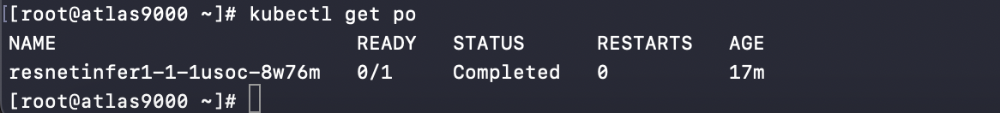
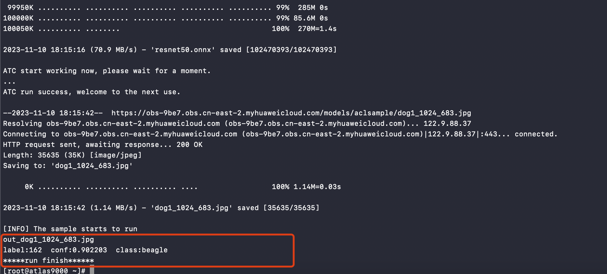
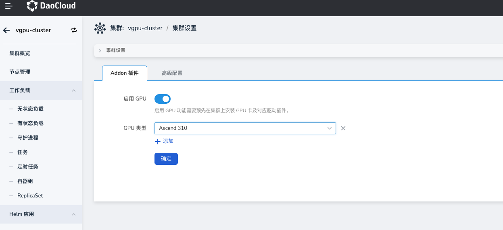
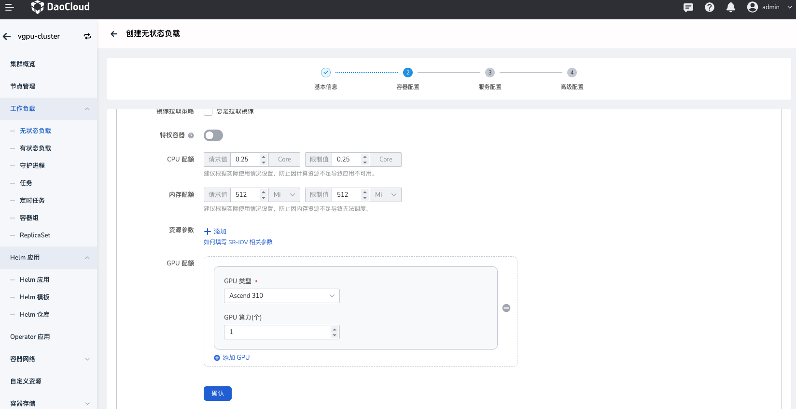

# 应用使用昇腾（Ascend）GPU

本节介绍如何在 DCE 5.0 平台使用昇腾 GPU。

## 前提条件

- 当前集群已[安装昇腾（Ascend） GPU 驱动](ascend_driver_install.md)。
- 当前集群内 GPU 卡未进行任何虚拟化操作或被其它应用占用。

## 快速使用

本文使用昇腾示例库中的 [AscentCL 图片分类应用](https://gitee.com/ascend/samples/tree/master/inference/modelInference/sampleResnetQuickStart/python)示例。

1. **下载昇腾代码库**

   运行以下命令下载昇腾 Demo 示例代码库，并且请记住代码存放的位置，后续需要使用。

   ```git
   git clone https://gitee.com/ascend/samples.git
   ```

2. **准备基础镜像**
   此例使用 Ascent-pytorch 基础镜像，可访问[昇腾镜像仓库](https://ascendhub.huawei.com/#/index)获取。

3. **准备 YAML**

   ```yaml
   apiVersion: batch/v1
   kind: Job
   metadata:
     name: resnetinfer1-1-1usoc
   spec:
     template:
       spec:
         containers:
           - image: ascendhub.huawei.com/public-ascendhub/ascend-pytorch:23.0.RC2-ubuntu18.04 # Inference image name
             imagePullPolicy: IfNotPresent
             name: resnet50infer
             securityContext:
               runAsUser: 0
             command:
               - "/bin/bash"
               - "-c"
               - |
                 source /usr/local/Ascend/ascend-toolkit/set_env.sh &&
                 TEMP_DIR=/root/samples_copy_$(date '+%Y%m%d_%H%M%S_%N') &&
                 cp -r /root/samples "$TEMP_DIR" &&
                 cd "$TEMP_DIR"/inference/modelInference/sampleResnetQuickStart/python/model &&
                 wget https://obs-9be7.obs.cn-east-2.myhuaweicloud.com/003_Atc_Models/resnet50/resnet50.onnx &&
                 atc --model=resnet50.onnx --framework=5 --output=resnet50 --input_shape="actual_input_1:1,3,224,224"  --soc_version=Ascend910 &&
                 cd ../data &&
                 wget https://obs-9be7.obs.cn-east-2.myhuaweicloud.com/models/aclsample/dog1_1024_683.jpg &&
                 cd ../scripts &&
                 bash sample_run.sh
             resources:
               requests:
                 huawei.com/Ascend910: 1 # Number of the Ascend 910 Processors.
               limits:
                 huawei.com/Ascend910: 1 # The value should be the same as that of requests .
             volumeMounts:
               - name: hiai-driver
                 mountPath: /usr/local/Ascend/driver
                 readOnly: true
               - name: slog
                 mountPath: /var/log/npu/conf/slog/slog.conf
               - name: localtime #The container time must be the same as the host time.
                 mountPath: /etc/localtime
               - name: dmp
                 mountPath: /var/dmp_daemon
               - name: slogd
                 mountPath: /var/slogd
               - name: hbasic
                 mountPath: /etc/hdcBasic.cfg
               - name: sys-version
                 mountPath: /etc/sys_version.conf
               - name: aicpu
                 mountPath: /usr/lib64/aicpu_kernels
               - name: tfso
                 mountPath: /usr/lib64/libtensorflow.so
               - name: sample-path
                 mountPath: /root/samples
         volumes:
           - name: hiai-driver
             hostPath:
               path: /usr/local/Ascend/driver
           - name: slog
             hostPath:
               path: /var/log/npu/conf/slog/slog.conf
           - name: localtime
             hostPath:
               path: /etc/localtime
           - name: dmp
             hostPath:
               path: /var/dmp_daemon
           - name: slogd
             hostPath:
               path: /var/slogd
           - name: hbasic
             hostPath:
               path: /etc/hdcBasic.cfg
           - name: sys-version
             hostPath:
               path: /etc/sys_version.conf
           - name: aicpu
             hostPath:
               path: /usr/lib64/aicpu_kernels
           - name: tfso
             hostPath:
               path: /usr/lib64/libtensorflow.so
           - name: sample-path
             hostPath:
               path: /root/samples
         restartPolicy: OnFailure
   ```

   以上 YAML 中有一些字段需要根据实际情况进行修改：

   1. __atc ... --soc_version=Ascend910__ 使用的是 __Ascend910__ ，请以实际情况为主。
      您可以使用 __npu-smi info__ 命令查看显卡型号然后加上 Ascend 前缀即可
   2. __samples-path__ 以实际情况为准。
   3. __resources__ 以实际情况为准。

4. **部署 Job 并查看结果**

   使用如下命令创建 Job：

   ```shell
   kubectl apply -f ascend-demo.yaml
   ```

   查看 Pod 运行状态：

   Pod 成功运行后，查看日志结果。在屏幕上的关键提示信息示例如下图，提示信息中的 Label 表示类别标识，Conf 表示该分类的最大置信度，Class 表示所属类别。这些值可能会根据版本、环境有所不同，请以实际情况为准：

   

   结果图片展示：

   

## 界面使用

1. 确认集群是否已检测 GPU 卡。点击对应 __集群__ -> __集群设置__ -> __Addon 插件__ ，查看是否已自动启用并自动检测对应 GPU 类型。
    目前集群会自动启用 __GPU__ ，并且设置 __GPU__ 类型为 __Ascend__ 。

    

2. 部署工作负载，点击对应 __集群__ -> __工作负载__ ，通过镜像方式部署工作负载，选择类型（Ascend）之后，需要配置应用使用的物理卡数量：

    **物理卡数量（huawei.com/Ascend910）** ：表示当前 Pod 需要挂载几张物理卡，输入值必须为整数且**小于等于**宿主机上的卡数量。
    

    > 如果上述值配置的有问题则会出现调度失败，资源分配不了的情况。
