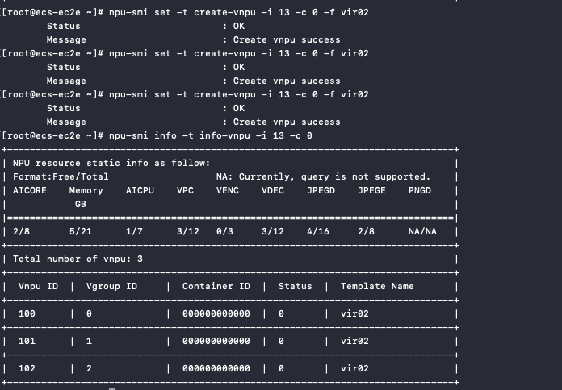
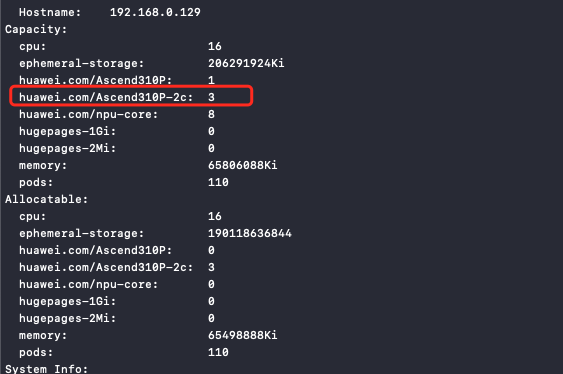

# 启用昇腾虚拟化

昇腾虚拟化分为动态虚拟化和静态虚拟化，本文介绍如何开启并使用昇腾静态虚拟化能力。

## 前提条件

- Kubernetes 集群环境搭建。
- 当前 NPU 节点已安装昇腾 （Ascend）驱动。
- 当前 NPU 节点已安装 Ascend-Docker-Runtime 组件。
- 当前集群已安装 NPU MindX DL 套件。
- 支持的 NPU 卡型号：

    - Ascend 310P，已验证
    - Ascend 910b（20 核），已验证
    - Ascend 910（32 核），官方介绍支持，未实际验证
    - Ascend 910（30 核），官方介绍支持，未实际验证
    
    更多细节参阅[官方虚拟化硬件说明](https://www.hiascend.com/document/detail/zh/mindx-dl/50rc1/AVI/cpaug/cpaug_0005.html)。

请参考[昇腾 NPU 组件安装文档](./ascend_driver_install.md)安装基础环境。

## 开启虚拟化能力

开启虚拟化能力需要手动修改 ascend-device-plugin-daemonset 组件的启动参数，参考下述命令：

```init
- device-plugin -useAscendDocker=true -volcanoType=false -presetVirtualDevice=true
- logFile=/var/log/mindx-dl/devicePlugin/devicePlugin.log -logLevel=0
```

### 切分 VNPU 实例

静态虚拟化需要手动对 VNPU 实例的切分，请参考下述命令：

``` bash
npu-smi set -t create-vnpu -i 13 -c 0 -f vir02
```

- `i` 指的是 card id
- `c` 指的是 chip id
- `vir02` 指的是切分规格模板

关于 card id 和 chip id，可以通过 npu-smi info 查询，切分规格可通过
[ascend 官方模板](https://www.hiascend.com/document/detail/zh/mindx-dl/500/AVI/cpaug/cpaug_006.html)进行查询。

切分实例过后可通过下述命令查询切分结果：

```bash
npu-smi info -t info-vnpu -i 13 -c 0
```

查询结果如下：



### 重启 ascend-device-plugin-daemonset

切分实例后手动重启 device-plugin pod，然后使用 `kubectl describe` 命令查看已注册 node 的资源：

```bash
kubectl describe node {{nodename}}
```



## 如何使用设备

在创建应用时，指定资源 key，参考下述 YAML：

```yaml
......
resources:
  requests:
    huawei.com/Ascend310P-2c: 1
  limits:
    huawei.com/Ascend310P-2c: 1
......
```
