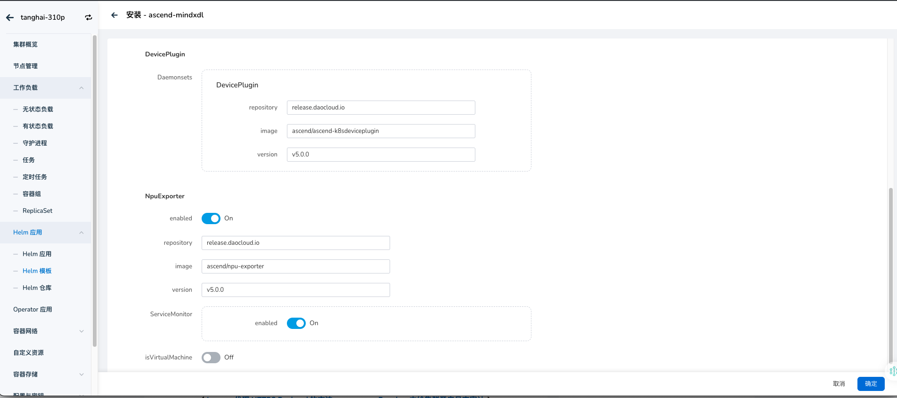
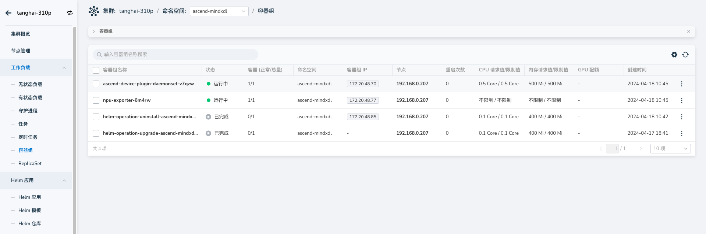
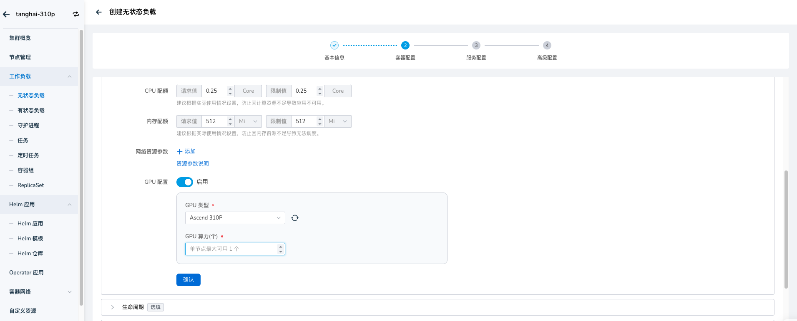

# 昇腾 NPU 组件安装

本章节提供昇腾 NPU 驱动、Device Plugin、NPU-Exporter 等组件的安装指导。

## 前提条件

1. 安装前请确认支持的 NPU 型号，详情请参考：[昇腾 NPU 矩阵](gpu_matrix.md)
2. 请确认 对应 NPU 型号所要求的内核版本是否匹配，详情请参考：[昇腾 NPU 矩阵](gpu_matrix.md)
3. 准备 Kubernetes 基础环境

## 安装步骤

使用 NPU 资源之前，需要完成固件安装、NPU 驱动安装、 Docker Runtime 安装、用户创建、日志目录创建以及 NPU Device Plugin 安装，详情参考如下步骤。

### 安装固件

1. 安装请请确认内核版本在“二进制安装”安装方式对应的版本范围内，则可以直接安装NPU驱动固件。
2. 固件与驱动下载请参考： [固件下载地址](https://www.hiascend.com/zh/hardware/firmware-drivers/community?product=2&model=15&cann=6.3.RC2.alpha005&driver=1.0.20.alpha)
3. 固件安装请参考：[安装NPU驱动固件](https://www.hiascend.com/document/detail/zh/quick-installation/23.0.RC2/quickinstg/800_3000/quickinstg_800_3000_0001.html)

### 安装 NPU 驱动

1. 如驱动未安装，请参考昇腾官方文档进行安装：例如 Ascend910，参考：[910 驱动安装文档](https://www.hiascend.com/document/detail/zh/Atlas%20200I%20A2/23.0.RC3/EP/installationguide/Install_87.html)。
2. 运行 __npu-smi info__ 命令，并且能够正常返回 npu 信息，表示 NPU 驱动与固件已就绪。

    

### 安装 Docker Runtime

1. 下载 Ascend Docker Runtime

   社区版下载地址：https://www.hiascend.com/zh/software/mindx-dl/community

   ```sh
   wget -c https://mindx.obs.cn-south-1.myhuaweicloud.com/OpenSource/MindX/MindX%205.0.RC2/MindX%20DL%205.0.RC2/Ascend-docker-runtime_5.0.RC2_linux-x86_64.run
   ```

   安装到指定路径下，依次执行以下两条命令，参数为指定的安装路径:

   ```sh
   chmod u+x Ascend-docker-runtime_5.0.RC2_linux-x86_64.run 
   ./Ascend-docker-runtime_{version}_linux-{arch}.run --install --install-path=<path>
   ```

2. 修改 containerd 配置文件

   containerd 无默认配置文件时，依次执行以下3条命令，创建配置文件：

   ```bash
   mkdir /etc/containerd 
   containerd config default > /etc/containerd/config.toml 
   vim /etc/containerd/config.toml
   ```

   containerd 有配置文件时：

   ```bash
   vim /etc/containerd/config.toml
   ```

   根据实际情况修改 runtime 的安装路径，主要修改 runtime 字段：

   ```toml
   ... 
   [plugins."io.containerd.monitor.v1.cgroups"]
       no_prometheus = false  
   [plugins."io.containerd.runtime.v1.linux"]
       shim = "containerd-shim"
       runtime = "/usr/local/Ascend/Ascend-Docker-Runtime/ascend-docker-runtime"
       runtime_root = ""
       no_shim = false
       shim_debug = false
     [plugins."io.containerd.runtime.v2.task"]
       platforms = ["linux/amd64"]
    ...
   ```

   执行以下命令，重启 containerd：

   ```bash
   systemctl restart containerd
   ```

### 用户创建

在对应组件安装的节点上执行以下命令创建用户。

```sh
# Ubuntu 操作系统
useradd -d /home/hwMindX -u 9000 -m -s /usr/sbin/nologin hwMindX
usermod -a -G HwHiAiUser hwMindX
# Centos 操作系统
useradd -d /home/hwMindX -u 9000 -m -s /sbin/nologin hwMindX
usermod -a -G HwHiAiUser hwMindX
```

### 日志目录创建

在对应节点创建组件日志父目录和各组件的日志目录，并设置目录对应属主和权限。执行下述命令，创建组件日志父目录。

```bash
mkdir -m 755 /var/log/mindx-dl
chown root:root /var/log/mindx-dl
```

执行下述命令，创建 Device Plugin 组件日志目录。

```bash
mkdir -m 750 /var/log/mindx-dl/devicePlugin
chown root:root /var/log/mindx-dl/devicePlugin
```

!!! note

    请分别为所需组件创建对应的日志目录，当前案例中只需要 Device Plugin 组件。
    如果有其他组件需求请参考[官方文档](https://www.hiascend.com/document/detail/zh/mindx-dl/50rc3/clusterscheduling/clusterschedulingig/dlug_installation_016.html)


### 创建节点 label

参考下述命令在对应节点上创建label

```
// 在安装了驱动的计算节点创建此标签
kubectl label node {nodename} huawei.com.ascend/Driver=installed
kubectl label node {nodename} node-role.kubernetes.io/worker=worker
kubectl label node {nodename} workerselector=dls-worker-node
kubectl label node {nodename} host-arch=huawei-arm //或者host-arch=huawei-x86 ，根据实际情况选择
kubectl label node {nodename} accelerator=huawei-Ascend910 //根据实际情况进行选择
// 在控制节点创建此标签
kubectl label node {nodename} masterselector=dls-master-node
```

### 安装 Device Plugin 和 NpuExporter
  
1. 功能模块路径： __容器管理__ -> __集群管理__ ，点击目标集群的名称，从左侧导航栏点击 __Helm 应用__ -> __Helm 模板__ -> 搜索 __ascend-mindxdl__ 。




-  __DevicePlugin__ ：通过提供通用设备插件机制和标准的设备API接口，供Kubernetes使用设备。建议使用默认的镜像及版本。
-  __NpuExporter__ ：基于Prometheus/Telegraf生态，该组件提供接口，帮助用户能够关注到昇腾系列AI处理器以及容器级分配状态。建议使用默认的镜像及版本。
-   __ServiceMonitor__ ：默认不开启，开启后可前往可观测性模块查看 NPU 相关监控。如需开启，请确保 insight-agent 已安装并处于运行状态，否则将导致 ascend-mindxdl 安装失败。
-   __isVirtualMachine__ ：默认不开启，如果 npu 节点为虚拟机场景，请开启 isVirtualMachine 参数。

安装成功后，对应命名空间下会出现两个组件，如下图展示：



同时节点信息上也会出现对应 npu 的信息：


一切就绪后，我们通过页面创建工作负载时，就能够选择到对应的 npu 设备，如下图展示：


 > 详细使用步骤，请参照[应用使用昇腾（Ascend）NPU](https://docs.daocloud.io/kpanda/user-guide/gpu/Ascend_usage/)


