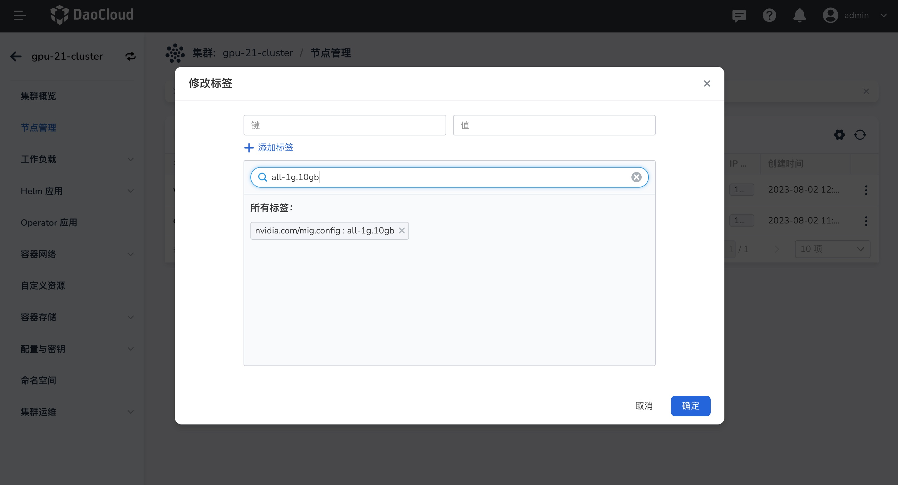

# 开启 MIG 功能

本章节介绍如何开启 NVIDIA MIG 功能方式，NVIDIA 当前提供两种在 Kubernetes 节点上公开 MIG 设备的策略： 

- **Single 模式**，节点仅在其所有 GPU 上公开单一类型的 MIG 设备。
- **Mixed 模式**，节点在其所有 GPU 上公开混合 MIG 设备类型。

详情参考：[NVIDIA GPU 卡使用模式](overvie_nvidia_gpu.md)

## 前提条件

- 待安装 GPU 驱动节点系统要求请参考：[GPU 支持矩阵](gpu_matrix.md)
- 确认集群节点上具有对应型号的 GPU 卡（[NVIDIA H100](https://www.nvidia.com/en-us/data-center/h100/)、 [A100](https://www.nvidia.com/en-us/data-center/a100/) 和 [A30](https://www.nvidia.com/en-us/data-center/products/a30-gpu/) Tensor Core GPU），详情参考：[GPU 支持矩阵](gpu_matrix.md)
- 节点上的所有 GPU 必须：属于同一产品线（例如 A100-SXM-40GB）

## 开启 GPU MIG Single 模式

1. [通过 Operator 开启](install_nvidia_driver_of_operator.md) MIG  Single 模式，在安装界面配置如下参数：

    1. `DevicePlugin` 设置为 `enable` 

    2.  `MIG strategy`设置为 `single` 

    3. `Mig Manager`下的`enabled`参数开启

    4. `MigManager Config` : 用于配置 MIG 切分配置参数和默认值

        - `default`: 默认为 `all-disbled`，可填入配置文件（`default-mig-parted-config`）中对应的规格（如：`all-1g.10gb`等）：
          -  **all-disbled** ： 所有节点设备默认禁用 MIG。
          -  **配置规格（如：all-1g.10gb）**：所有节点设备默认使用输入的规格切分。

        - `name` ：MIG 的切分策略配置，默认为 `default-mig-parted-config`。

        

    

2. 如需要按照某种规则切分，可以给对应节点(已插入对应 GPU 卡节点)打上 切分规格，如不执行此操作，将按照默认方式切分。

    **界面配置**：找到对应节点，选择 `修改标签` 添加 `nvidia.com/mig.config="all-1g.10gb"`

    

    **命令配置**：

    ```sh
    kubectl label nodes {node} nvidia.com/mig.config="all-1g.10gb" --overwrite
    ```

3. 查看配置结果

    ```sh
    kubectl get node 10.206.0.17 -o yaml|grep nvidia.com/mig.config
    ```

## 开启 GPU MIG Mixed 模式

1. [通过 Operator 开启](../nvidia/vgpu/install_nvidia_driver_of_operator.md)  MIG  Mixed 模式,在安装界面配置如下参数：

   1. `DevicePlugin` 设置为 `enable` 

   2.   `MIG strategy`设置为 `mixed` 

   3. `Mig Manager`下的`enabled` 参数开启

   4. `MigManager Config` :MIG 切分配置参数和默认值

      - `default`: 默认为 `all-disbled`，可填入配置文件中对应的规格（如：`all-1g.10gb`等）。

      - `name`: 默认为 `default-mig-parted-config`，可自定义切分策略配置文件。

        如下 YAML 为示例自定义配置 `custom-mig-parted-config`。创建的文件名称不能同默认（`default-mig-parted-config`) 相同。

        新建名为 `custom-mig-parted-config` 的配置文件，配置数据的 `key` 必须为如下 `config.yaml`中内容。

        ```
        ## 自定义切分 GI 实例配置
          all-disabled:
            - devices: all
              mig-enabled: false
          all-enabled:
            - devices: all
              mig-enabled: true
              mig-devices: {}
          all-1g.10gb:
            - devices: all
              mig-enabled: true
              mig-devices:
                1g.5gb: 7
          all-1g.10gb.me:
            - devices: all
              mig-enabled: true
              mig-devices:
                1g.10gb+me: 1
          all-1g.20gb:
            - devices: all
              mig-enabled: true
              mig-devices:
                1g.20gb: 4
          all-2g.20gb:
            - devices: all
              mig-enabled: true
              mig-devices:
                2g.20gb: 3
          all-3g.40gb:
            - devices: all
              mig-enabled: true
              mig-devices:
                3g.40gb: 2
          all-4g.40gb:
            - devices: all
              mig-enabled: true
              mig-devices:
                4g.40gb: 1
          all-7g.80gb:
            - devices: all
              mig-enabled: true
              mig-devices:
                7g.80gb: 1
          all-balanced:
            - device-filter: ["0x233110DE", "0x232210DE", "0x20B210DE", "0x20B510DE", "0x20F310DE", "0x20F510DE"]
              devices: all
              mig-enabled: true
              mig-devices:
                1g.10gb: 2
                2g.20gb: 1
                3g.40gb: 1
         # 设置后会按照设置规格切分 CI 实例 
          custom-config:    
            - devices: all
              mig-enabled: true
              mig-devices:
                3g.40gb: 2
        ```

          在上述的`YAML` 中设置 `custom-config`，设置后会按照规格切分 `CI` 实例。

        ```yaml
        custom-config:
             devices: all
            mig-enabled: true
            mig-devices:
              1c.3g.40gb: 6
        ```

        

2. 如需要按照自定义规则切分，可以给对应节点打上切分规格，如不执行此操作，将按照默认值切分。

   **界面配置**：找到对应节点，选择 `修改标签` 添加 `nvidia.com/mig.config="custom-config"`

   

   **命令配置**：

   ```sh
   kubectl label nodes {node} nvidia.com/mig.config="custom-config" --overwrite
   ```

3. 查看配置结果。

```sh
kubectl get node 10.206.0.17 -o yaml|grep nvidia.com/mig.config
```

 设置完成后，在确认部署应用时即可[使用 GPU MIG 资源](../nvidia/mig/mig_usage.md)。

