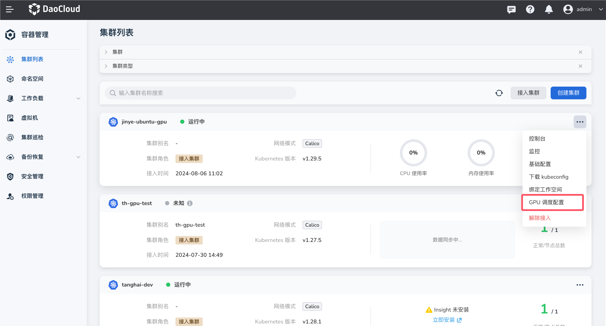

# GPU 调度配置（Binpack 和 Spread ）
  
本文介绍使用 NVIDIA vGPU 时，如何通过 Binpack 和 Spread 的 GPU 调度配置减少 GPU 资源碎片、防止单点故障等，实现 vGPU 的高级调度。
DCE 5.0 平台提供了集群和工作负载两种维度的 Binpack 和 Spread 调度策略，分别满足不同场景下的使用需求。

## 前置条件
  
- 集群节点上已正确安装 GPU 设备。
- 集群中已正确安装 [gpu-operator 组件](./nvidia/install_nvidia_driver_of_operator.md) 和
  [Nvidia-vgpu 组件](./nvidia/vgpu/vgpu_addon.md)。
- 集群节点列表中，GPU 模式下存在 NVIDIA-vGPU 类型。
  
## 使用场景

- 基于 GPU 卡维度调度策略

    - Binpack：优先选择节点的同一张 GPU 卡，适用于提高 GPU 利用率，减少资源碎片。
    - Spread：多个 Pod 会分散在节点的不同 GPU 卡上，适用于高可用场景，避免单卡故障。

- 基于节点维度的调度策略

    - Binpack： 多个 Pod 会优先选择同一个节点，适用于提高 GPU 利用率，减少资源碎片。
    - Spread：多个 Pod 会分散在不同节点上，适用于高可用场景，避免单节点故障。

## 集群维度使用 Binpack 和 Spread 调度配置

!!! note

    默认情况下，工作负载会遵循集群级别的 Binpack 和 Spread 调度配置。
    若工作负载单独设置了与集群不一致的 Binpack 和 Spread 调度策略，则该工作负载优先遵循其本身的调度策略。

1. 在 __集群列表__ 页选择需要调整 Binpack 和 Spread 调度策略的集群，点击右侧的 __┇__ 操作图标并在下拉列表中点击 __GPU 调度配置__ 。

    

2. 根据业务场景调整 GPU 调度配置，并点击 __确定__ 后保存。

    

## 工作负载维度使用 Binpack 和 Spread 调度配置

!!! note

    当工作负载维度的 Binpack 和 Spread 调度策略与集群级别的配置冲突时，优先遵循工作负载维度的配置。
  
参考以下步骤，使用镜像创建一个无状态负载，并在工作负载中配置 Binpack 和 Spread 调度策略 。

1. 点击左侧导航栏上的 __集群列表__ ，然后点击目标集群的名称，进入 __集群详情__ 页面。

    

2. 在集群详情页面，点击左侧导航栏的 __工作负载__ -> __无状态负载__ ，然后点击页面右上角的 __镜像创建__ 按钮。

    

3. 依次填写[基本信息](../workloads/create-deployment.md#_3)、[容器配置](../workloads/create-deployment.md#_4)，并在__容器配置__中启用 GPU 配置，选择 GPU 类型为 NVIDIA vGPU，
   点击__高级设置__，启用 Binpack / Spread 调度策略，根据业务场景调整 GPU 调度配置。配置完成后点击__下一步__ ，
   进入 [服务配置](../workloads/create-deployment.md#_5)、[高级配置](../workloads/create-deployment.md#_6)后，在页面右下角点击 __确定__ 完成创建。

    
