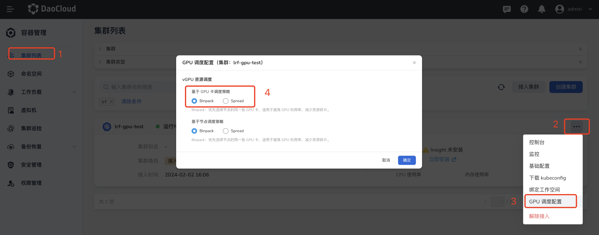

# GPU 调度配置

本文主要介绍 `GPU` 调度的配置，可以实现一些高级的调度策略，目前主要有 `vgpu` 的调度策略实现。

## vGPU 资源调度配置

`vGPU` 针对资源的使用提供了 `Binpack` 和 `Spread` 两种策略，分别对应到节点维度和 `GPU` 卡维度，使用场景是希望把工作负载更分散的调度到不同的节点不同的卡上，还是调度到相同的节点相同的卡上，让资源利用率更充分，减少资源碎片化的问题。
   
通过如下的四个步骤就可以修改集群中的调度策略：
- 进入容器管理的集群管理列表。
- 点击集群的设置按钮 `...`
- 点击`GPU 调度配置` 按钮
- 点击切换节点维度或者GPU卡维度的调度策略；默认节点维度是`binpack`策略，卡维度是`spread`维度



上述是集群维度的调度策略，用户还可以在工作负载维度指定自己的调度策略，改变调度结果，如下是一个在工作负载维度修改的例子：
```yaml
apiVersion: v1
kind: Pod
metadata:
  name: gpu-pod
  annotations:
    hami.io/node-scheduler-policy: "binpack"
    hami.io/gpu-scheduler-policy: "binpack"
spec:
  containers:
    - name: ubuntu-container
      image: ubuntu:18.04
      command: ["bash", "-c", "sleep 86400"]
      resources:
        limits:
          nvidia.com/gpu: 1
          nvidia.com/gpumem: 3000
          nvidia.com/gpucores: 30
```