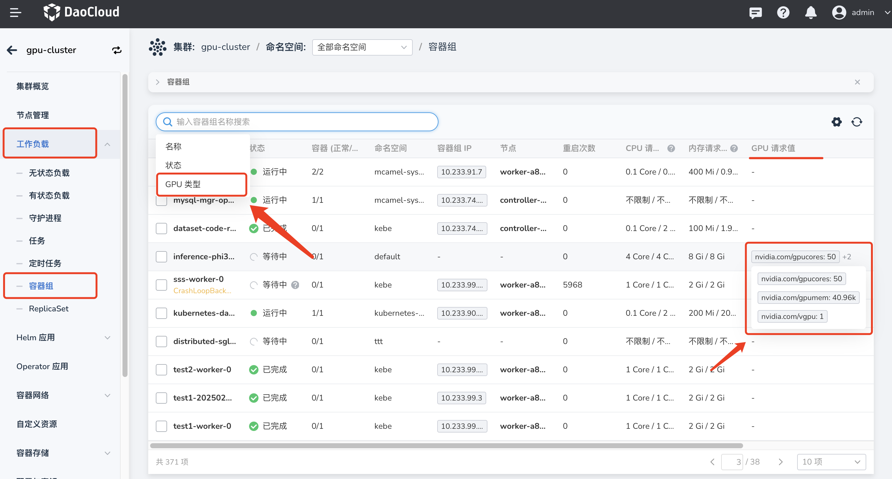
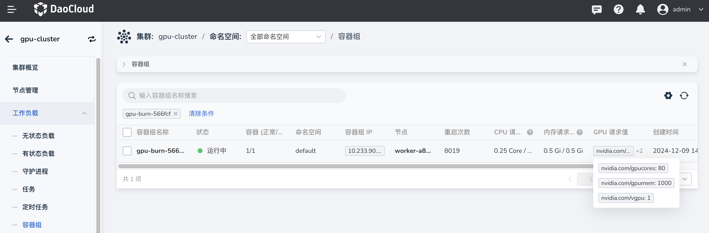
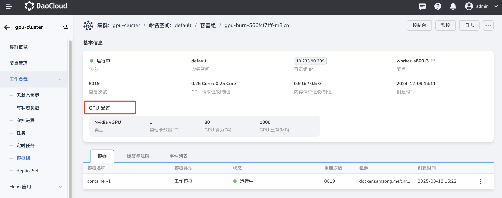

POD 与 GPU 卡的占用关系

本文介绍在容器管理使用 GPU 资源后，如何通过页面查看 POD 与 GPU 卡的占用关系

## 前置条件

- 集群上已安装 GPU 卡及对应驱动插件。
- 集群已启用 GPU。
- 已使用 GPU 资源正确部署了应用。

## 操作步骤

1. 进入相应的集群，展开工作负载菜单，进入**容器组**列表。在搜索栏中选择 GPU 类型，选择对应的类型进行过滤筛选，可看到哪些 pod 正在占用 GPU 资源。

2. 若已知该 pod 正在占用 GPU 资源，可通过搜索 pod 名称，在 pod 列表和详情中查看该 pod 占用的 GPU 类型及资源等。

