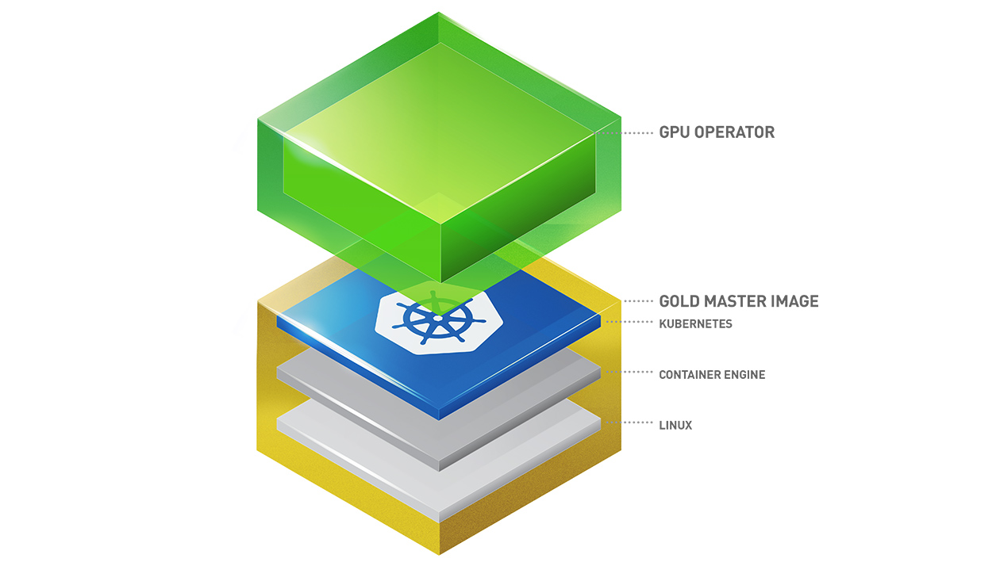

# 安装 Nvidia GPU 驱动

同普通计算机硬件一样，Nvidia GPU 卡作为物理硬件，必须安装 Nvidia GPU 驱动后才能使用。本文介绍如何安装 Nvidia 的 GPU 驱动。

## 使用 NVIDIA GPU Operator 安装 NVIDIA GPU 驱动

Kubernetes 通过 [Device Plugins](https://kubernetes.io/docs/concepts/extend-kubernetes/compute-storage-net/device-plugins/) 框架提供对特殊硬件资源的访问，如 GPU、NIC、Infiniband 适配器和其他设备。然而，使用这些硬件资源配置和管理节点需要配置多个软件组件，例如驱动程序、容器运行时或其它库，手动部署这些组件对于用户来说难度系数高且容易出错。

为了降低用户在 kuberneets 上使用 GPU 的成本，Nvidia 官方提供了 NVIDIA GPU Operator 组件来管理使用 Nvidia GPU 所依赖的各种组件。这些组件包括 NVIDIA 驱动程序（用于启用 CUDA）、NVIDIA 容器运行时、GPU 节点标记、基于 DCGM 的监控等。理论上来说用户只需要将 GPU 卡插在已经被 kubernetes 所纳管的计算设备上，然后通过 GPU Operator 就能使用 NVIDIA GPU 的所有能力了。了解更多 NVIDIA GPU Operator 相关信息，请参考 [NVIDIA 官方文档](https://docs.nvidia.com/datacenter/cloud-native/gpu-operator/latest/index.html)

NVIDIA GPU Operator 架构图：

    

#### 前提条件

- 已经[部署 DCE 5.0](https://docs.daocloud.io/install/index.html) 容器管理平台，且平台运行正常。
- 容器管理模块[已接入 Kubernetes 集群](../clusters/integrate-cluster.md)或者[已创建 Kubernetes 集群](../clusters/create-cluster.md)，且能够访问集群的 UI 界面。
- 待安装 GPU 驱动集群的节点操作系统（OS）必须一致。
- 能够使用 root 或具有 root 权限的用户登陆到待安装 GPU 驱动的集群任一控制（Master）节点。

经过验证的操作系统和内核版本：

    |    架构   | 操作系统      | 内核版本                         |
    | -------- | ------------ | ------------------------------- |
    | AMD      | CentOS 7     | Kernel 3.10.0-123 ~ 3.10.0-1160 |
    | AMD      | CentOS 8     | Kernel 4.18.0-80 ~ 4.18.0-348   |
    | AMD      | Ubuntu 20.04 | Kernel 5.4、5.19                |
    | AMD      | RHEL 7       | Kernel 3.10.0-123 ~ 3.10.0-1160 |
    | AMD      | RHEL 8       | Kernel 4.18.0-80 ~ 4.18.0-348   |

> 推荐使用 CentOS 7.9

#### 操作步骤

本文将使用 CentOS 7.9 为例，介绍如何安装 NVIDIA GPU 驱动。

1. 使用 root 或具有root 权限的用户登陆到待安装 GPU 驱动的集群任一控制（Master）节点。

2. 在 控制节点上执行如下命令，检查节点上的 GPU 卡是否正常挂载。

    ```shell
    $ lspci | grep -i nvidia
    1b:00.0 VGA compatible controller: NVIDIA Corporation GP102 [TITAN Xp] (rev a1)
    ```

3. 查看节点内核版本是否符合前提条件中内核版本要求。
 
    ```shell
    $ hostnamectl | grep Kernel
    Kernel: Linux 3.10.0-1160.el7.x86_64
    ```

5. 在控制（Master）节点执行如下命令安装 GPU Operator。

    ```shell
    $ helm repo add nvidia https://helm.ngc.nvidia.com/nvidia && helm repo update # 添加并更新 helm 仓库
    $ helm install --wait --generate-name \
        -n gpu-operator --create-namespace \
        nvidia/gpu-operator \
        --set driver.version=535.86.10
    ```
    > **参数说明**：
    > * `helm install`: 这是使用 Helm 进行安装的命令。
    > * `--wait`: 表示在安装完成之前等待，直到所有的资源都处于正常运行的状态。
    > * `--generate-name`: 表示生成一个唯一的名称来标识安装的资源。生成的名称将以 gpu-operator 开头。
    > * `-n gpu-operator`: 指定了要安装的 Chart 的名称，即 gpu-operator。
    > * `--create-namespace`: 表示在安装 Chart 之前创建一个新的命名空间。命名空间的名称将是gpu-operator。
    > * `nvidia/gpu-operator`: 这是要安装的 Chart 的名称和存储库地址。
    > * `--set driver.version=535.86.10`: 指定驱动版本。可前往 [NVIDIA GPU Driver](https://catalog.ngc.nvidia.com/orgs/nvidia/containers/driver/tags) 网站查看不同 OS 和内核对应的驱动版本。

!!!注意

    如果节点操作系统为 ubuntu 20.04，参数 `--set driver.version` 的镜像版本需要和节点内核版本强一致，包括小版本号，可前往 [NVIDIA GPU Driver](https://catalog.ngc.nvidia.com/orgs/nvidia/containers/driver/tags) 网站查看不同内核 的 ubuntu 系统对应的驱动版本。

