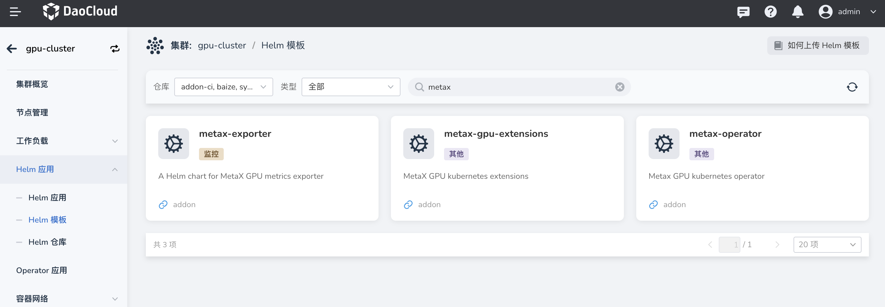
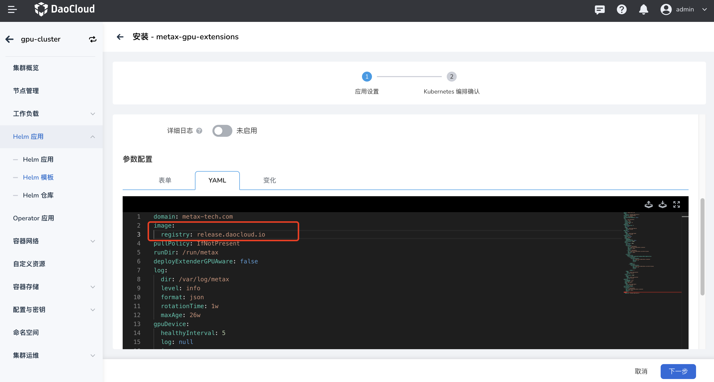
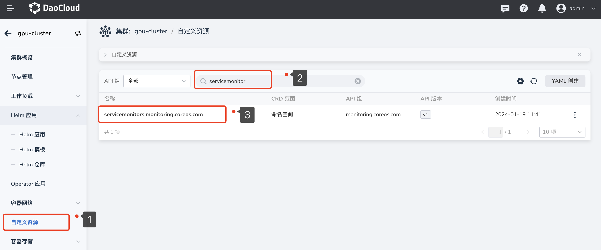
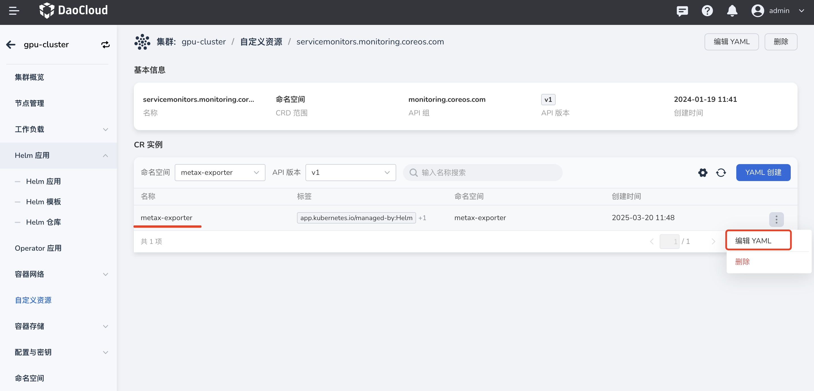
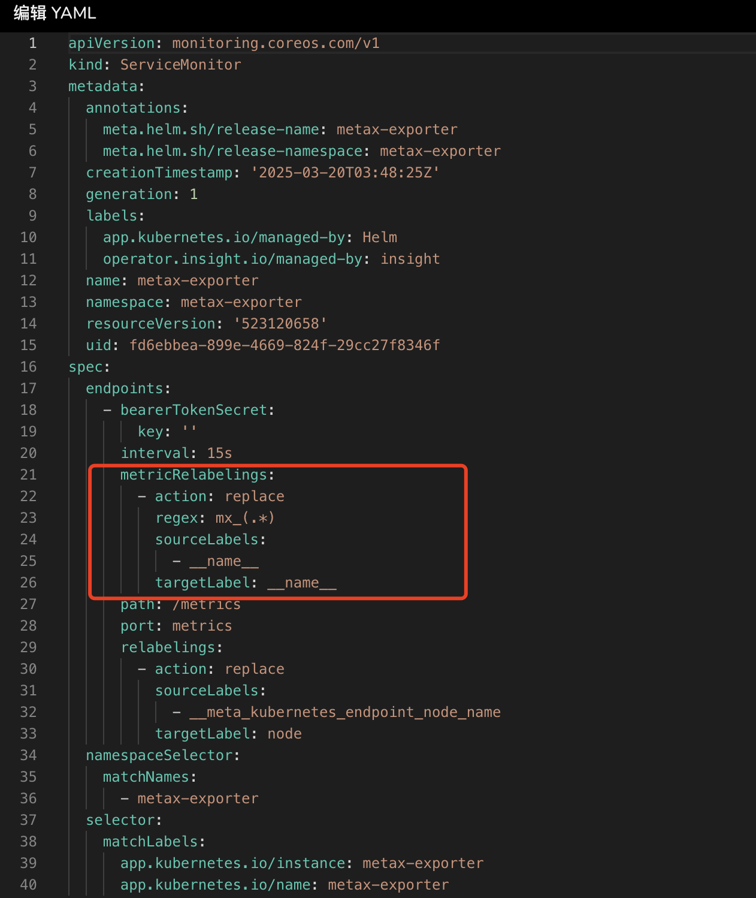

# 沐曦 GPU 组件离线安装与使用

本章节提供沐曦 metax-gpu-extensions、metax-operator、metax-exporter 等组件的离线安装指导和沐曦 GPU 卡的使用方法。

## 前提条件

- 已经[部署 DCE 5.0](../../../../install/index.md) 容器管理平台，且平台运行正常。
- 容器管理模块[已接入 Kubernetes 集群](../../clusters/integrate-cluster.md)或者[已创建 Kubernetes 集群](../../clusters/create-cluster.md)，且能够访问集群的 UI 界面。
- 当前集群内 GPU 卡未进行任何虚拟化操作且未被其它 App 占用。

## 组件说明

容器管理提供了三个 helm-chart 包，分别是 metax-gpu-extensions、metax-operator 和 metax-exporter，根据使用场景可选择安装不同的组件。
  
1. metax-gpu-extensions：包含 gpu-device 和 gpu-label 两个组件，且 Metax-extensions 仅适用于 GPU 整卡使用场景。
2. metax-operator ：包含 gpu-device、gpu-label、driver-manager、container-runtime、operator-controller 这些组件。gpu-operator 适用于 GPU 整卡和 vGPU 场景。
3. metax-exporter：包含 ServiceAccount、ConfigMap、Service、DaemonSet、和 ServiceMonitor，主要用于沐曦 GPU 卡的监控场景。

## 操作步骤

1. 通过左侧导航栏 __容器管理__ -> __集群管理__ ，点击目标集群的名称
1. 从左侧导航栏点击 __Helm 应用__ -> __Helm 模板__ -> 搜索 __metax__
1. 出现如下三个组件，根据需要选择性安装。
  


!!! bug "📢📢📢 安装注意事项"

    1. metax-gpu-extensions 和 metax-operator 安装问题：这两个 addon 设计有缺陷，其 registry 字段为独立字段，
       charts-syncer工具只能处理两层级字段，无法处理该类型字段。因此 **部署时需手动将两个 addon 中的 registry 字段值分别修改为 image.registry 字段的值** 。
    
        修改前示例：
    
        
    
        导致 charts-syncer 工具不能处理这种类型的字段，它只能处理两个层级的字段。因此需要修改成类似如下结构。
        
        修改后示例：
    
        
    
    1. Metax-exporter 0.5.0 面板问题
    
        因为 v0.5.0 版本的 name 多了一个 mx 的前缀，因此需要通过在 ServiceMonitor 中添加一个 replace 配置把它改回之前的配置：
    
        * 安装完成 metax-exporter v0.5.0 版本后，在相应集群的 __自定义资源__ 中搜索 servicemonitor，点击名称 `servicemonitors.monitoring.coreos.com` 进入详情
        
            
        
        * 编辑 metax-exporter 的 yaml，并在 yaml 的相应位置添加如下内容：
        
            
    
            添加的内容：
            
            ```yaml
            metricRelabelings:
              - action: replace
                regex: mx_(.*)
                sourceLabels:
                  - __name__
                targetLabel: __name__
            ```
            
            添加后的效果（需要保证格式和位置准确）：
            
            
