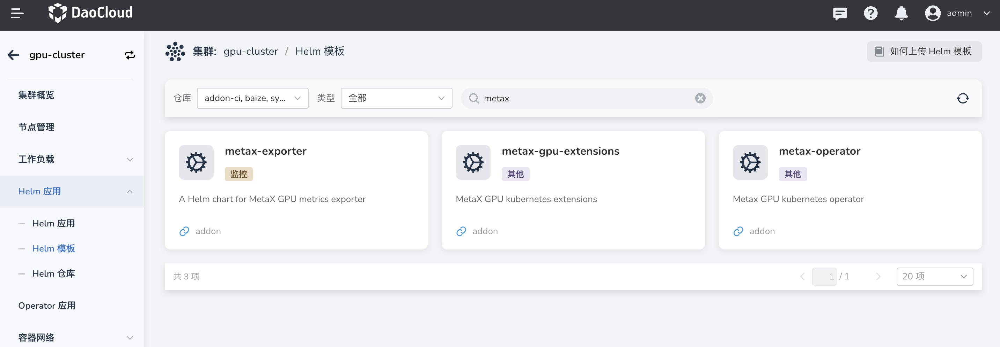

# 沐曦 GPU 组件离线安装与使用

本章节提供沐曦 metax-gpu-extensions、metax-operator 等组件的离线安装指导和沐曦 GPU 卡的使用方法。

## 前提条件

- 已经[部署 DCE 5.0](../../../../install/index.md) 容器管理平台，且平台运行正常。
- 容器管理模块[已接入 Kubernetes 集群](../../clusters/integrate-cluster.md)或者[已创建 Kubernetes 集群](../../clusters/create-cluster.md)，且能够访问集群的 UI 界面。
- 当前集群内 GPU 卡未进行任何虚拟化操作且未被其它 App 占用。
- 镜像仓库已经导入 [Addon 离线安装包](https://docs.daocloud.io/download/addon/history/), 它的使用方式请参考[Addon 离线安装包使用](https://docs.daocloud.io/download/addon/v0.40.0/#_3)。

## 组件说明

DCE 5.0 内置了两个 helm-chart 包，一个是 metax-gpu-extensions，一个是 metax-operator，根据使用场景可选择安装不同的组件。

1. metax-gpu-extensions：包含 gpu-device 和 gpu-label 两个组件。在使用 Metax-extensions 方案时，用户的应用容器镜像需要基于 MXMACA® 基础镜像构建。且仅适用于 GPU 整卡使用场景。
2. metax-operator：包含 gpu-device、gpu-label、driver-manager、container-runtime、operator-controller 这些组件。
   使用这个方案时，用户可选择制作不包含 MXMACA® SDK 的应用容器镜像。它适用于 GPU 整卡和 vGPU 场景。

## 操作步骤

1. 通过左侧导航栏 __容器管理__ -> __集群管理__ ，点击目标集群的名称
1. 从左侧导航栏点击 __Helm 应用__ -> __Helm 模板__ -> 搜索 __metax__
1. 出现如下两个组件，根据需要选择性安装。
  

!!! bug "📢📢📢 安装注意事项"

    1. 当前 metax-operator chart 已经默认内置 metax-exporter， 可以不用主动安装它。
    