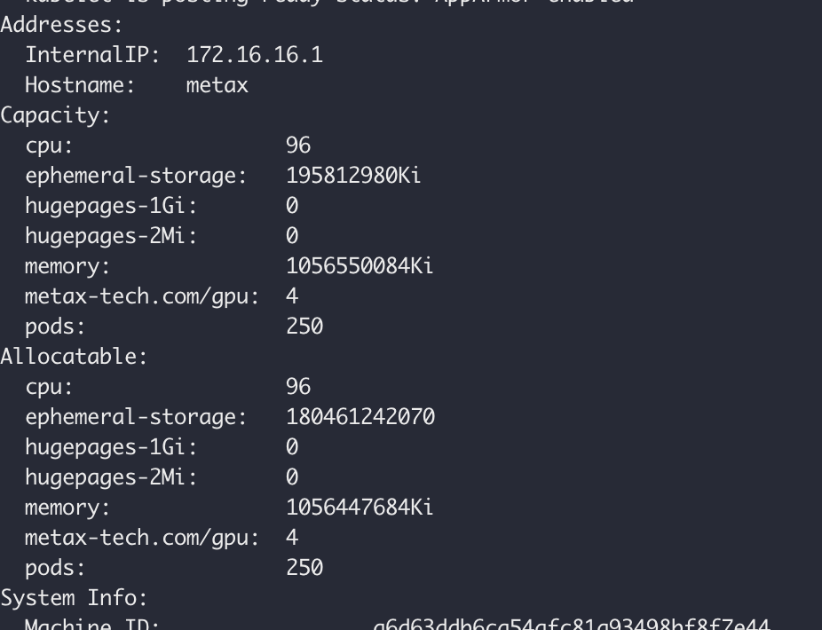

# 沐曦 GPU 组件安装与使用

本章节提供沐曦 gpu-extensions、gpu-operator 等组件的安装指导和沐曦 GPU 整卡和 vGPU 两种模式的使用方法。

## 前提条件

1. 已在[沐曦软件中心](https://sw-download.metax-tech.com/software-list)下载并安装所需的 tar 包，
   本文以 metax-gpu-k8s-package.0.7.10.tar.gz 为例。
1. 准备 Kubernetes 基础环境

## 组件介绍

Metax 提供了两个 helm-chart 包，一个是 metax-extensions，一个是 gpu-operator，根据使用场景可选择安装不同的组件。

1. Metax-extensions：包含 gpu-device 和 gpu-label 两个组件。在使用 Metax-extensions 方案时，用户的应用容器镜像需要基于 MXMACA® 基础镜像构建。且 Metax-extensions 仅适用于 GPU 整卡使用场景。
2. gpu-operator：包含 gpu-device、gpu-label、driver-manager、container-runtime、operator-controller 这些组件。
   使用 gpu-operator 方案时，用户可选择制作不包含 MXMACA® SDK 的应用容器镜像。gpu-operator 适用于 GPU 整卡和 vGPU 场景。

## 操作步骤

1. 从 `/home/metax/metax-docs/k8s/metax-gpu-k8s-package.0.7.10.tar.gz` 文件中解压出
  
    - deploy-gpu-extensions.yaml # 部署yaml 
    - metax-gpu-extensions-0.7.10.tgz、metax-operator-0.7.10.tgz # helm chart文件
    - metax-k8s-images.0.7.10.run # 离线镜像

2. 查看系统是否安装驱动

    ```bash
    $ lsmod | grep metax 
    metax 1605632 0 
    ttm 86016 3 drm_vram_helper,metax,drm_ttm_helper 
    drm 618496 7 drm_kms_helper,drm_vram_helper,ast,metax,drm_ttm_helper,ttm
    ```

    - 如没有内容显示，就表示没有安装过软件包。如有内容显示，则表示安装过软件包。
    - 使用 metax-opeartor 时，不推荐在工作节点预安装 MXMACA 内核态驱动，若已安装也无需卸载。

### gpu-extensions

1. 推送镜像
  
    ```bash
    tar -xf metax-gpu-k8s-package.0.7.10.tar.gz
    ./metax-k8s-images.0.7.10.run push {registry}/metax
    ```

2. 推送 Helm Chart
  
    ```bash
    helm plugin install https://github.com/chartmuseum/helm-push
    helm repo add  --username rootuser --password rootpass123  metax http://172.16.16.5:8081
    helm cm-push metax-operator-0.7.10.tgz metax
    helm cm-push metax-gpu-extensions-0.7.10.tgz metax
    ```

3. 在 DCE 5.0 平台上安装 metax-gpu-extensions
  
    部署成功之后，可以在节点上查看到资源。

    

  
4. 修改 DCE5.0 的配置，在 `kpanda-global-cluster` 集群中的 `kpanda-system` 命名空间下修改 gpu-type-config configmap，修改如下 gpu-type.json

    ```json
    {  
      "type": "metax-gpu",  
      "alias": "Metax GPU",  
      "resource": [  
        {  
          "key": "metax-tech.com/gpu",  
          "alias": "GPU Card Num(Core)",  
          "is_allocatable": true,  
          "alias_zh": "物理卡数量(个)",  
          "range": {  
           "min": 1,  
           "min_desc": "Min use 1 gpu",  
           "max": 128,  
           "max_desc": "Max use 128 gpu"  
          }  
        }  
      ]  
    }
    ```

5. 修改成功之后就可以在节点上看到带有 `Metax GPU` 的标签
  
    

### gpu-operator

安装 `gpu-opeartor` 时会遇到几个问题：

1. `metax-operator`、`gpu-label`、`gpu-device` 、`container-runtime` 这几个组件镜像要带有 `amd64` 后缀。
  
2. `metax-maca` 组件的镜像不在 `metax-k8s-images.0.7.13.run` 包里面，需要单独下载 `maca-mxc500-2.23.0.23-ubuntu20.04-x86_64.tar.xz` 这类镜像，`load` 之后重新修改 `metax-maca` 组件的镜像。
  
3. `metax-driver` 组件的镜像需要从 `https://pub-docstore.metax-tech.com:7001` 这个网站下载 `k8s-driver-image.2.23.0.25.run` 文件，然后执行 `k8s-driver-image.2.23.0.25.run push {registry}/metax` 命令把镜像推送到镜像仓库。推送之后修改 `metax-driver` 组件的镜像地址。
  

## 使用 GPU

### 整卡

在宿主机上下载 `vllm` 和 `olla3` 在宿主机目录下：`/home/daocloud/daocloud`

1. 下载 `vllm` : `git clone -b v0.4.0` `https://github.com/vllm-project/vllm.git`
  
2. [下载 `meta-llama-3-8b-instruct` 模型](https://modelscope.cn/models/llm-research/meta-llama-3-8b-instruct/files)：

    ```bash
    modelscope download --model llm-research/meta-llama-3-8b-instruct
    ```

3. 部署如下 YAML
  
    > 把宿主机上的 `/home/daocloud/daocloud` 目录挂载到容器中

    ```yaml
    apiVersion: apps/v1  
    kind: Deployment  
    metadata:  
      name: ubuntu-deployment  
    spec:  
      replicas: 1  
      selector:  
        matchLabels:  
          app: ubuntu  
      template:  
        metadata:  
          labels:  
            app: ubuntu  
        spec:  
          containers:  
          - name: ubuntu-container  
            image: release.daocloud.io/metax/metax-demo:v0.0.1  
            command: ["sleep", "100000000"]  
            resources:  
              limits:  
                metax-tech.com/gpu: 1  
            volumeMounts:  
            - name: inference-volume  
              mountPath: /workspace/inference  
          volumes:  
          - name: inference-volume  
            hostPath:  
              path: /home/daocloud/daocloud/  
              type: Directory
    ```

4. 在 `/home/daocloud/daocloud/vllm/examples` 目录下添加 `offline_inference_ollam3.py` 文件
  

    ```python
    from vllm import LLM, SamplingParams  
    # Sample prompts.  
    prompts = [  
        "Hello, my name is",  
        "The president of the United States is",  
        "The capital of France is",  
        "The future of AI is",  
    ]  
    # Create a sampling params object.  
    #sampling_params = SamplingParams(temperature=0.8, top_p=0.95)  
    sampling_params = SamplingParams(top_k=1, max_tokens=300)  
  
    if __name__ == "__main__":  
  
        # Create an LLM.  
        llm = LLM(model="/workspace/inference/meta-llama-3-8b-instruct",tensor_parallel_size=1,max_model_len=2048,trust_remote_code=True,dtype='float16'  
    )     

    #llm = LLM(model="/workspace/inference/Copilot_20240425_0000",tensor_parallel_size=8,max_model_len=2048,trust_remote_code=True,dtype = 'float16')  
        # Generate texts from the prompts. The output is a list of RequestOutput objects  
        # that contain the prompt, generated text, and other information.  
        for i in range(0, 10):  
            print(i)  
            outputs = llm.generate(prompts, sampling_params)  
          
            # Print the outputs.  
            for output in outputs:  
                prompt = output.prompt  
                generated_text = output.outputs[0].text  
                print(f"Prompt: {prompt!r}, Generated text: {generated_text!r}")
    ```

5. 进入容器中执行以下命令

    ```bash
    python /workspace/inference/vllm/examples/offline_inference_ollam3.py
    ```
 
    可以查看到在使用单张卡进行推理。

### vGPU

要使用 vGPU，需要使用 `metax-opeartor` 部署，在 `driver` 中可以通过配置 `vfnumsConfig` 来配置虚拟化：

```yaml
driver:  
  vfnumsConfig:  
    nodes:  
      metax:  
        vfnum: 4
```

1. 在 `nodes` 字段下针对每个 node 配置 vfnu；node 上的 Capacity 值在未开启虚拟化时与 GPU 物理设备数量相等；开启虚拟化后，预期资源数据为 `N(gpu) * M(vfnum)`
  
    查看内核是否支持虚拟化：执行 `mx-smi --show-vbios` 命令查看 `vbios` 是否支持虚拟化
  
2. 配置之后查看节点上注册的资源，发现已经达到 `N(gpu) * M(vfnum)`
  
    
  
3. 使用虚拟化

    ```yaml  
    apiVersion: apps/v1  
    kind: Deployment  
    metadata:  
      name: ubuntu-deployment  
    spec:  
      replicas: 1  
      selector:  
        matchLabels:  
          app: ubuntu  
      template:  
        metadata:  
          labels:  
            app: ubuntu  
        spec:  
          containers:  
          - name: ubuntu-container  
            image: release.daocloud.io/metax/metax-demo:v0.0.1  
            command: ["sleep", "100000000"]  
            resources:  
              limits:  
                metax-tech.com/gpu: 1  
            volumeMounts:  
            - name: inference-volume  
              mountPath: /workspace/inference  
          volumes:  
          - name: inference-volume  
            hostPath:  
              path: /home/daocloud/daocloud/  
              type: Directory
    ```

    使用虚拟化之后进入容器查看 `mx-smi` 命令可以查看到显存是 16384mib 就是 `16Gi`，一张卡是 `64Gi`，1/4 就是 `16Gi`。

    

4. 进入容器中执行以下命令

    ```bash
    python /workspace/inference/vllm/examples/offline_inference_ollam3.py
    ```

    发现 16g 不够用，重新切分为 32g 的规格。

    

    改为 32g 规格，验证服务可以启动。

    

## 常用命令

| 命令  | 说明  | 条件  |
| --- | --- | --- |
| mx-smi | 沐曦管理工具 | 安装驱动 |

## 沐曦 GPU 已知问题

1. `./metax-k8s-images.0.7.10.run` 这个命令只能使用 Docker，暂不兼容 containerd 等其他 CRI 的命令行工具。
  
2. 镜像推送到镜像仓库之后，镜像 tag 是带芯片架构的信息，但是拉取的时候又不带
  
    ```bash
    Loaded image: mxcr.io/cloud/gpu-label:0.7.10-amd64Loaded image: mxcr.io/cloud/gpu-label:0.7.10-arm64
    ```

    

    导致 Helm 部署的应用都拉不到镜像，需要手动修改镜像 tag。
  

3. gpu-operator 中的 `deployPolicy` 字段文档错误
  
    

4. 镜像离线包里面没有 node-feature-discovery 这个镜像；需要用户自己解决

    

    修改后使用如下自定义镜像：

    

    node-feature-discovery 没有把 CRD 部署起来：

    
