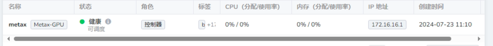
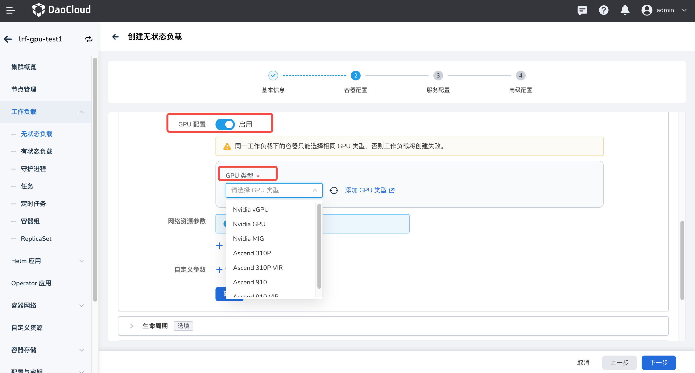

# 沐曦 GPU 组件安装与使用

本章节提供沐曦 gpu-extensions、gpu-operator 等组件的安装指导和沐曦 GPU 整卡和 vGPU 两种模式的使用方法。

## 前提条件

1. 已在[沐曦软件中心](https://sw-download.metax-tech.com/software-list)下载并安装所需的 tar 包，
   本文以 metax-gpu-k8s-package.0.7.10.tar.gz 为例。
1. 准备 Kubernetes 基础环境

## 组件介绍

Metax 提供了两个 helm-chart 包，一个是 metax-extensions，一个是 gpu-operator，根据使用场景可选择安装不同的组件。

1. Metax-extensions：包含 gpu-device 和 gpu-label 两个组件。在使用 Metax-extensions 方案时，用户的应用容器镜像需要基于 MXMACA® 基础镜像构建。且 Metax-extensions 仅适用于 GPU 整卡使用场景。
2. gpu-operator：包含 gpu-device、gpu-label、driver-manager、container-runtime、operator-controller 这些组件。
   使用 gpu-operator 方案时，用户可选择制作不包含 MXMACA® SDK 的应用容器镜像。gpu-operator 适用于 GPU 整卡和 vGPU 场景。

## 操作步骤

1. 从 `/home/metax/metax-docs/k8s/metax-gpu-k8s-package.0.7.10.tar.gz` 文件中解压出
  
    - deploy-gpu-extensions.yaml # 部署yaml 
    - metax-gpu-extensions-0.7.10.tgz、metax-operator-0.7.10.tgz # helm chart文件
    - metax-k8s-images.0.7.10.run # 离线镜像

2. 查看系统是否安装驱动

    ```bash
    $ lsmod | grep metax 
    metax 1605632 0 
    ttm 86016 3 drm_vram_helper,metax,drm_ttm_helper 
    drm 618496 7 drm_kms_helper,drm_vram_helper,ast,metax,drm_ttm_helper,ttm
    ```

    - 如没有内容显示，就表示没有安装过软件包。如有内容显示，则表示安装过软件包。
    - 使用 metax-opeartor 时，不推荐在工作节点预安装 MXMACA 内核态驱动，若已安装也无需卸载。

### gpu-extensions

1. 推送镜像
  
    ```bash
    tar -xf metax-gpu-k8s-package.0.7.10.tar.gz
    ./metax-k8s-images.0.7.10.run push {registry}/metax
    ```

2. 推送 Helm Chart
  
    ```bash
    helm plugin install https://github.com/chartmuseum/helm-push
    helm repo add  --username rootuser --password rootpass123  metax http://172.16.16.5:8081
    helm cm-push metax-operator-0.7.10.tgz metax
    helm cm-push metax-gpu-extensions-0.7.10.tgz metax
    ```

3. 在 DCE 5.0 平台上安装 metax-gpu-extensions
  
    部署成功之后，可以在节点上查看到资源。

    

  
4. 修改 DCE5.0 的配置，在 `kpanda-global-cluster` 集群中的 `kpanda-system` 命名空间下修改 gpu-type-config configmap，修改如下 gpu-type.json

    ```json
    {  
      "type": "metax-gpu",  
      "alias": "Metax GPU",  
      "resource": [  
        {  
          "key": "metax-tech.com/gpu",  
          "alias": "GPU Card Num(Core)",  
          "is_allocatable": true,  
          "alias_zh": "物理卡数量(个)",  
          "range": {  
           "min": 1,  
           "min_desc": "Min use 1 gpu",  
           "max": 128,  
           "max_desc": "Max use 128 gpu"  
          }  
        }  
      ]  
    }
    ```

5. 修改成功之后就可以在节点上看到带有 `Metax GPU` 的标签
  
    

### gpu-operator

安装 `gpu-opeartor` 时的已知问题：

1. `metax-operator`、`gpu-label`、`gpu-device` 、`container-runtime` 这几个组件镜像要带有 `amd64` 后缀。
  
2. `metax-maca` 组件的镜像不在 `metax-k8s-images.0.7.13.run` 包里面，需要单独下载 `maca-mxc500-2.23.0.23-ubuntu20.04-x86_64.tar.xz` 这类镜像，`load` 之后重新修改 `metax-maca` 组件的镜像。
  
3. `metax-driver` 组件的镜像需要从 `https://pub-docstore.metax-tech.com:7001` 这个网站下载 `k8s-driver-image.2.23.0.25.run` 文件，然后执行 `k8s-driver-image.2.23.0.25.run push {registry}/metax` 命令把镜像推送到镜像仓库。推送之后修改 `metax-driver` 组件的镜像地址。
  

## 使用 GPU
安装后可在工作负载中[使用沐曦GPU](https://docs.daocloud.io/kpanda/user-guide/workloads/create-deployment/#_5)
 


