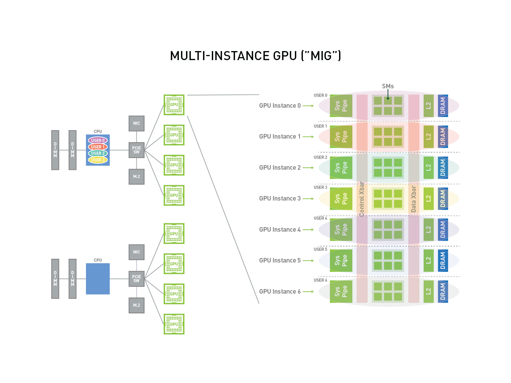
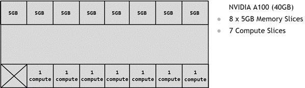
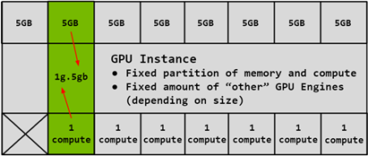
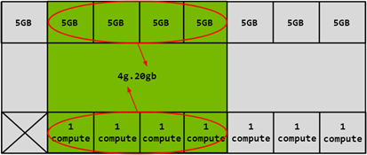
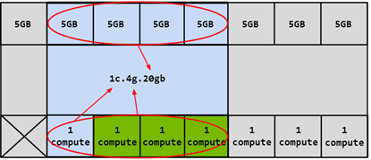
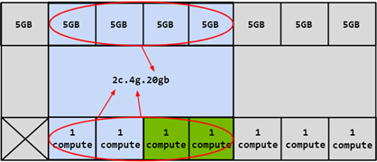

# NVIDIA 多实例 GPU(MIG) 概述

NVIDIA 多实例 GPU（Multi-Instance GPU，简称 MIG）是 NVIDIA 在 H100，A100，A30 系列 GPU 卡上推出的一项新特性，
旨在将一块物理 GPU 分割为多个 GPU 实例，以提供更细粒度的资源共享和隔离。MIG 最多可将一块 GPU 划分成七个 GPU 实例，
使得一个 物理 GPU 卡可为多个用户提供单独的 GPU 资源，以实现最佳 GPU 利用率。

这个功能使得多个应用程序或用户可以同时共享GPU资源，提高了计算资源的利用率，并增加了系统的可扩展性。

通过 MIG，每个 GPU 实例的处理器在整个内存系统中具有独立且隔离的路径——芯片上的交叉开关端口、L2
高速缓存组、内存控制器和 DRAM 地址总线都唯一分配给单个实例。

这确保了单个用户的工作负载能够以可预测的吞吐量和延迟运行，并具有相同的二级缓存分配和 DRAM 带宽。
MIG 可以划分可用的 GPU 计算资源（包括流多处理器或 SM 和 GPU 引擎，如复制引擎或解码器）进行分区，
以便为不同的客户端（如虚拟机、容器或进程）提供定义的服务质量（QoS）和故障隔离）。
MIG 使多个 GPU 实例能够在单个物理 GPU 上并行运行。

MIG 允许多个 vGPU（以及虚拟机）在单个 GPU 实例上并行运行，同时保留 vGPU 提供的隔离保证。
有关使用 vGPU 和 MIG 进行 GPU 分区的详细信息，请参阅
[NVIDIA Multi-Instance GPU and NVIDIA Virtual Compute Server](https://www.nvidia.com/content/dam/en-zz/Solutions/design-visualization/solutions/resources/documents1/TB-10226-001_v01.pdf)。

## MIG 使用场景

如下是一个 MIG 的概述图，可以看出 MIG 将一张物理 GPU 卡虚拟化成了 7 个 GPU 实例，这些 GPU 实例能够可以被多个 User 使用。

**重要概念：**

* `SM`：流式多处理器（Streaming Multiprocessor），GPU 的核心计算单元，负责执行图形渲染和通用计算任务。
  每个 SM 包含一组 CUDA 核心，以及共享内存、寄存器文件和其他资源，可以同时执行多个线程。
  每个 MIG 实例都拥有一定数量的 SM 和其他相关资源，以及被划分出来的显存。
* `GPU Memory Slice`：GPU 内存切片，GPU 内存切片是 GPU 内存的最小部分，包括相应的内存控制器和缓存。
  GPU 内存切片大约是 GPU 内存资源总量的八分之一，包括容量和带宽。
* `GPU SM Slice`：GPU SM 切片是 GPU 上 SM 的最小计算单位。在 MIG 模式下配置时，
  GPU SM 切片大约是 GPU 中可用 SMS 总数的七分之一。
* `GPU Slice `：GPU 切片是 GPU 中由单个 GPU 内存切片和单个 GPU SM 切片组合在一起的最小部分。
* `GPU Instance`：GPU 实例 （GI） 是 GPU 切片和 GPU 引擎（DMA、NVDEC 等）的组合。
  GPU 实例中的任何内容始终共享所有 GPU 内存切片和其他 GPU 引擎，但它的 SM 切片可以进一步细分为计算实例（CI）。
  GPU 实例提供内存 QoS。每个 GPU 切片都包含专用的 GPU 内存资源，这些资源会限制可用容量和带宽，并提供内存 QoS。
  每个 GPU 内存切片获得总 GPU 内存资源的 1/8，每个 GPU SM 切片获得 SM 总数的 1/7。
* `Compute Instance `：GPU 实例的计算切片可以进一步细分为多个计算实例 （CI），其中 CI 共享父
  GI 的引擎和内存，但每个 CI 都有专用的 SM 资源。

## GPU 实例（GI）

本节介绍如何在 GPU 上创建各种分区。将使用 A100-40GB 作为示例演示如何对单个 GPU 物理卡上进行分区。

GPU 的分区是使用内存切片进行的，因此可以认为 A100-40GB GPU 具有 8x5GB 内存切片和 7 个 GPU SM 切片，如下图所示，展示了 A100 上可用的内存切片。

如上所述，创建 GPU 实例 （GI） 需要将一定数量的内存切片与一定数量的计算切片相结合。在下图中，一个 5GB 内存切片与 1 个计算切片相结合，以创建 `1g.5gb` GI 配置文件：

同样，4x5GB 内存切片可以与 4x1 计算切片结合使用以创建 `4g.20gb` 的 GI 配置文件：

#### 计算实例（CI）

GPU 实例的计算切片(GI)可以进一步细分为多个计算实例（CI），其中 CI 共享父 GI 的引擎和内存，但每个 CI 都有专用的 SM 资源。使用上面的相同 `4g.20gb` 示例，可以创建一个 CI 以仅使用第一个计算切片的 `1c.4g.20gb` 计算配置，如下图蓝色部分所示：

在这种情况下，可以通过选择任何计算切片来创建 4 个不同的 CI。还可以将两个计算切片组合在一起以创建 `2c.4g.20gb` 的计算配置）：

除此之外，还可以组合 3 个计算切片以创建计算配置文件，或者可以组合所有 4 个计算切片以创建 `3c.4g.20gb`、`4c.4g.20gb` 计算配置文件。合并所有 4 个计算切片时，配置文件简称为 `4g.20gb`。

## 支持 MIG 特性的 GPU 卡

从 NVIDIA Ampere 一代开始的 GPU（即具有计算能力 >= 8.0）的 GPU）支持 MIG。下表提供了支持 MIG 的 GPU 列表：

| GPU 型号            | **架构**      | **微架构** | **计算能力** | **内存大小** | **最大 GI 实例数** |
| ------------------- | ------------- | ---------- | ------------ | ------------ | ------------------ |
| H100-SXM5 H100-SXM5 | Hopper        | GH100      | 9.0          | 80GB         | 7                  |
| H100-PCIE H100-PCIE | Hopper        | GH100      | 9.0          | 80GB         | 7                  |
| A100-SXM4 A100-SXM4 | NVIDIA Ampere | GA100      | 8.0          | 40GB         | 7                  |
| A100-SXM4 A100-SXM4 | NVIDIA Ampere | GA100      | 8.0          | 80GB         | 7                  |
| A100-PCIE A100-PCIE | NVIDIA Ampere | GA100      | 8.0          | 40GB         | 7                  |
| A100-PCIE A100-PCI  | NVIDIA Ampere | GA100      | 8.0          | 80GB         | 7                  |
| A30                 | NVIDIA Ampere | GA100      | 8.0          | 24GB         | 4                  |
