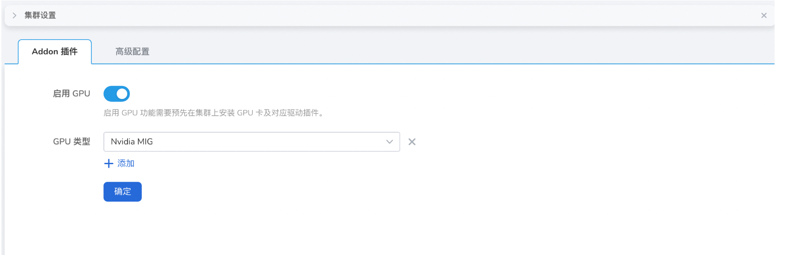
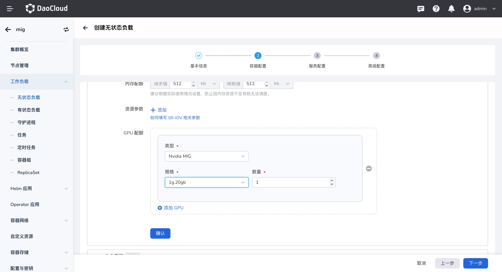
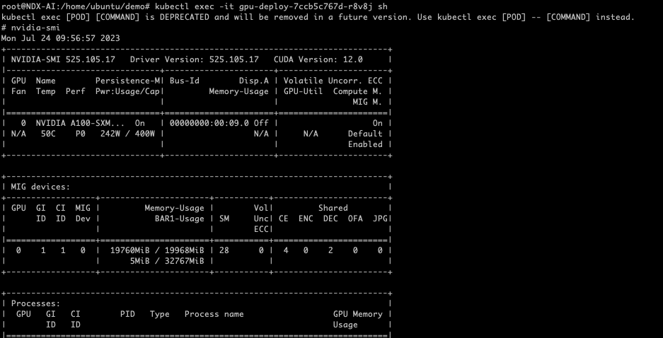

# 应用使用 MIG GPU

本节介绍应用如何使用 MIG GPU 资源。

## 前提条件

- 已安装 Nvidia Driver，可参考 [Nvidia GPU 驱动安装](driver.md)
- 已开启 MIG 能力 [GPU Operator 创建 MIG](create_mig.md)
- 集群节点已插入 GPU MIG 卡

## 通过界面使用 MIG GPU

1. 确认集群是否已识别 GPU 卡类型

    进入`集群详情` -> `集群设置` -> `Addon 设置`，查看是否已正确识别，自动识别频率为 `10 分钟` 。

    

2. 通过镜像部署应用可选择并使用 Nvidia MIG 资源。

   

   - 开启 `MIG  Single` 模式时，添加的资源信息应为：

       ```yaml
       resources:
         limits:
         nvidia.com/gpu: 2
       ```

   - 开启 `MIG  Mixed` 模式时，添加的资源信息应为：

        ```yaml
        resources:
          limits:
          nvidia.com/mig-4g.20gb: 1 # 通过 nvidia.com/mig-<slice_count>g.<memory_size>gb 的资源类型公开各个 MIG 设备
        ```

4. 进入容器后可以查看只使用了一个 MIG 设备。

    
