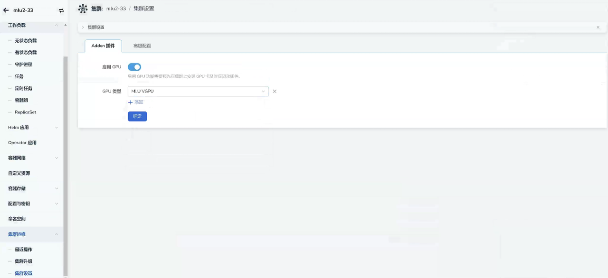
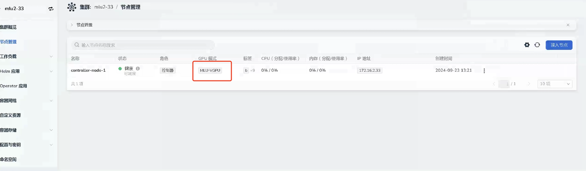
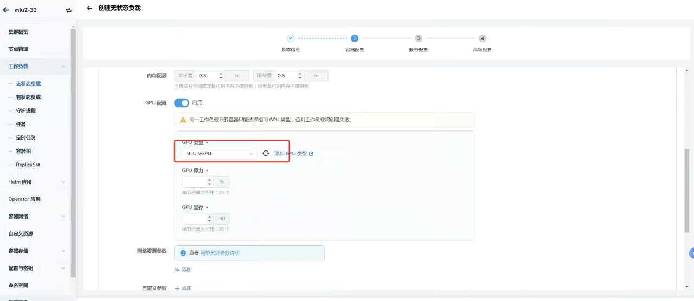

# 使用寒武纪 GPU

本文介绍如何在 DCE 5.0 中使用寒武纪 GPU。

## 前置条件

- 已经[部署 DCE 5.0](https://docs.daocloud.io/install/index.html) 容器管理平台，且平台运行正常。
- 容器管理模块[已接入 Kubernetes 集群](https://docs.daocloud.io/kpanda/user-guide/clusters/integrate-cluster.html)或者[已创建 Kubernetes 集群](https://docs.daocloud.io/kpanda/user-guide/clusters/create-cluster.html)，且能够访问集群的 UI 界面。
- 当前集群已安装寒武纪固件、驱动以及DevicePlugin组件，安装详情请参考官方文档：
    - [驱动固件安装](https://www.cambricon.com/docs/sdk_1.15.0/driver_5.10.22/user_guide/index.html)
    - [DevicePlugin 安装](https://github.com/Cambricon/cambricon-k8s-device-plugin/blob/master/device-plugin/README.md)
    
在安装 DevicePlugin 时请关闭 **--enable-device-type** 参数，否则 DCE5.0 将无法正确识别寒武纪 GPU。

## 寒武纪 GPU 模式介绍

寒武纪 GPU 有以下几种模式：

- 整卡模式：将寒武纪GPU以整卡的方式注册到集群当中进行使用。
- Share 模式：可以将一张寒武纪GPU共享给多个 Pod 进行使用，可以通过 virtualization-num 参数进行设置可共享容器的数量。
- Dynamic smlu 模式：进一步对资源进行了细化，可以控制分配给容器的显存、算力的大小。
- Mim 模式：可以将寒武纪 GPU 按照固定的规格切分成多张 GPU 进行使用。

## DCE 5.0 使用寒武纪

这里以 Dynamic smlu 模式为例：

1. 在正确安装 DevicePlugin 等组件后，点击对应 **集群** -> **集群运维**-> **集群设置** -> **Addon 插件** ，查看是否已自动启用并自动检测对应 GPU 类型。
  
    

1. 点击节点管理页面，查看节点是否已经正确识别到对应的GPU类型。
  
    

1. 部署工作负载。点击对应 **集群** -> **工作负载** ，通过镜像方式部署工作负载，选择类型（MLU VGPU）之后，需要配置 App 使用的 GPU 资源：

    - GPU 算力（cambricon.com/mlu.smlu.vcore）：表示当前 Pod 需要使用核心的百分比数量。 
    - GPU 显存（cambricon.com/mlu.smlu.vmemory）：表示当前Pod需要使用显存的大小，单位是MB。
    
    

## 使用 YAML 配置

参考 YAML 文件如下：

```yaml
apiVersion: v1  
kind: Pod  
metadata:  
  name: pod1  
spec:  
  restartPolicy: OnFailure  
  containers:  
    - image: ubuntu:16.04  
      name: pod1-ctr  
      command: ["sleep"]  
      args: ["100000"]  
      resources:  
        limits:  
          cambricon.com/mlu: "1" # use this when device type is not enabled, else delete this line.  
          #cambricon.com/mlu: "1" #uncomment to use when device type is enabled  
          #cambricon.com/mlu.share: "1" #uncomment to use device with env-share mode  
          #cambricon.com/mlu.mim-2m.8gb: "1" #uncomment to use device with mim mode  
          #cambricon.com/mlu.smlu.vcore: "100" #uncomment to use device with mim mode  
          #cambricon.com/mlu.smlu.vmemory: "1024" #uncomment to use device with mim mode
```
