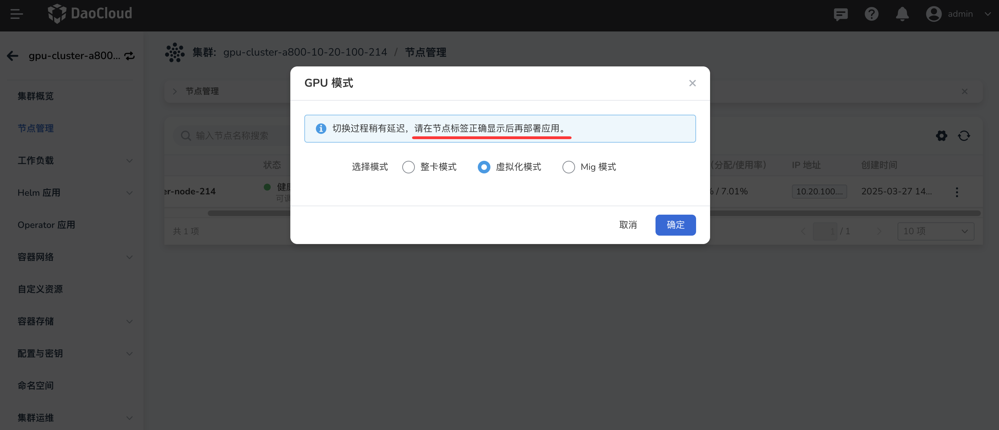

# GPU 模式切换

本文介绍如何切换 GPU 整卡模式、虚拟化模式和 Mig 模式

## 前置条件

- 集群节点上已正确安装 GPU 设备。
- 集群中已正确安装 [gpu-operator 组件](https://docs.daocloud.io/kpanda/user-guide/gpu/nvidia/install_nvidia_driver_of_operator.html)和[Nvidia-vgpu 组件](https://docs.daocloud.io/kpanda/user-guide/gpu/nvidia/vgpu/vgpu_addon.html)。
- 集群节点列表中，GPU 模式下存在 NVIDIA-vGPU、NVIDIA GPU 或 NVIDIA MIG 类型。

## 各模式使用场景

|  | 场景对比 | 功能对比 |
| -------- | -------- | -------- |
| NVIDIA 整卡模式     | 整卡使用，用在资源消耗较多的场景，如 AI 训练    | 资源被独占，没有额外的开销。可以使用 NVLink 连接多块 GPU 卡     |
| NVIDIA Mig     | 最多可以虚拟化为 7 个实例，因为是物理隔离，服务 QOS 较高，可用于 AI 推理场景     | 进行 MIG 切割会存在显存被浪费的情况     |
| NVIDIA 虚拟化模式    | 可以虚拟化的数量由用户自己指定，可用在 AI 开发或者AI推理场景     | 虚拟化的数量越多，用户多后会出现资源消耗较多，大部分时间在用户切换。可用在卡少用户多的场景去测试和使用。可支持超分，让使用用户数增加     |

## GPU 模式切换

!!! note

NVIDIA 的 vGPU 能力支持节点级别的 GPU 模式切换（整卡/vGPU/mig 模式），满足同一集群中不同工作负载对 GPU 模式的不同需求。

1. 在**集群列表**页选择目标集群，点击集群名称进入集群详情。从左侧导航栏点击 __节点管理__ ，找到目标节点，点击右侧的**┇**操作图标并在下拉列表中点击**GPU 模式**。

2. 切换模式并点击 __确定__ 后，节点状态会变为 __GPU 模式切换中__ ，等待节点列表中的 GPU 模式标签正确显示后则表示切换完成（也就是 vGPU 的 hami-nvidia-vgpu-device-plugin pod 启动完毕）。

  
3. 节点 GPU 模式切换成功后，[部署应用可使用 vGPU 资源](vgpu_user.md)。注意：切换过程稍有延迟，请在节点标签正确显示后再部署应用。