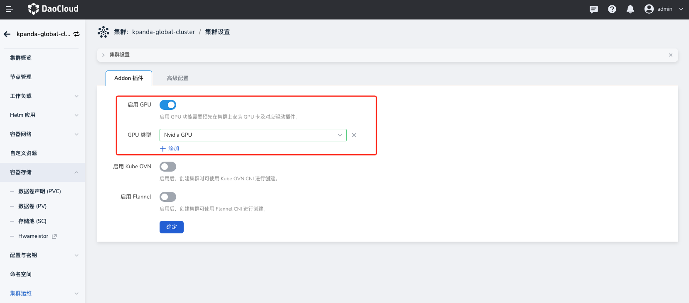
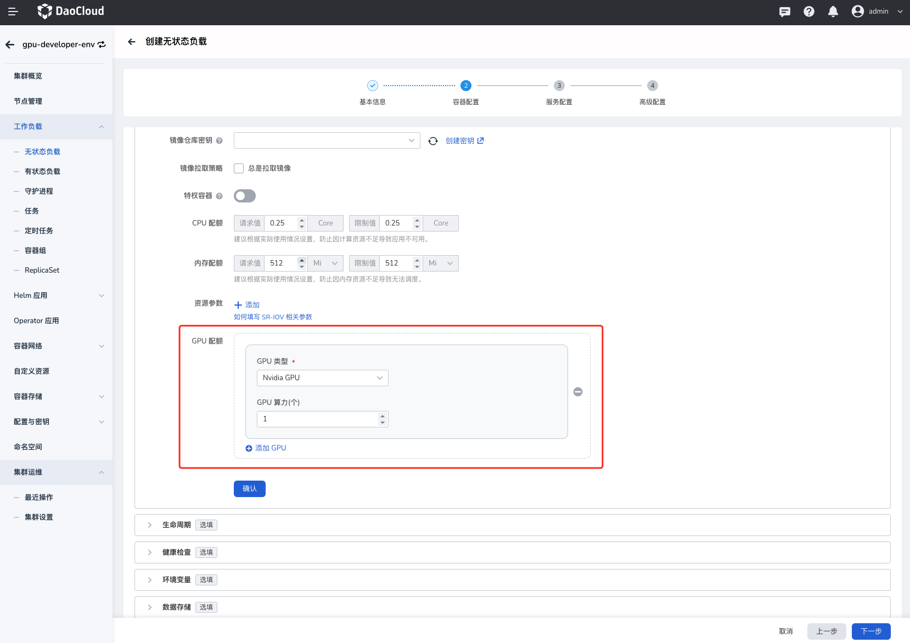

# 应用使用 GPU 整卡

本节介绍如何在 DCE 5.0 平台将整个 NVIDIA GPU 卡分配给单个应用。

## 前提条件

- 已经[部署 DCE 5.0](https://docs.daocloud.io/install/index.html) 容器管理平台，且平台运行正常。
- 容器管理模块[已接入 Kubernetes 集群](../../clusters/integrate-cluster.md)或者[已创建 Kubernetes 集群](../../clusters/create-cluster.md)，且能够访问集群的 UI 界面。
- 当前集群已离线安装 GPU Operator 并已启用 Nvidia DevicePlugin ，可参考 [GPU Operator 离线安装](install_nvidia_driver_of_operator.md)。
- 当前集群内 GPU 卡未进行任何虚拟化操作或被其它应用占用。

## 操作步骤

### 使用界面配置

1. 确认集群是否已检测 GPU 卡。点击对应`集群` -> `集群设置` -> `Addon 插件`，查看是否已自动启用并自动检测对应 GPU 类型。
    目前集群会自动启用 `GPU`，并且设置`GPU` 类型为 `Nvidia GPU`。

    

2. 部署工作负载，点击对应`集群` -> `工作负载`，通过镜像方式部署工作负载，选择类型（Nvidia GPU）之后，需要配置应用使用的物理卡数量：

    **物理卡数量（nvidia.com/vgpu）**：表示当前 Pod 需要挂载几张物理卡，输入值必须为整数且**小于等于**宿主机上的卡数量。

    
    
    > 如果上述值配置的有问题则会出现调度失败，资源分配不了的情况。

### 使用 YAML 配置

创建工作负载申请 GPU 资源，在资源申请和限制配置中增加 `nvidia.com/gpu: 1` 参数配置应用使用物理卡的数量。

```yaml
apiVersion: apps/v1
kind: Deployment
metadata:
  name: full-gpu-demo
  namespace: default
spec:
  replicas: 1
  selector:
    matchLabels:
      app: full-gpu-demo
  template:
    metadata:
      labels:
        app: full-gpu-demo
    spec:
      containers:
      - image: chrstnhntschl/gpu_burn
        name: container-0
        resources:
          requests:
            cpu: 250m
            memory: 512Mi
            nvidia.com/gpu: 1   # 申请GPU的数量
          limits:
            cpu: 250m
            memory: 512Mi
            nvidia.com/gpu: 1   # GPU数量的使用上限
      imagePullSecrets:
      - name: default-secret
```

!!! note

    使用 `nvidia.com/gpu` 参数指定GPU数量时，requests 和 limits 值需要保持一致。
