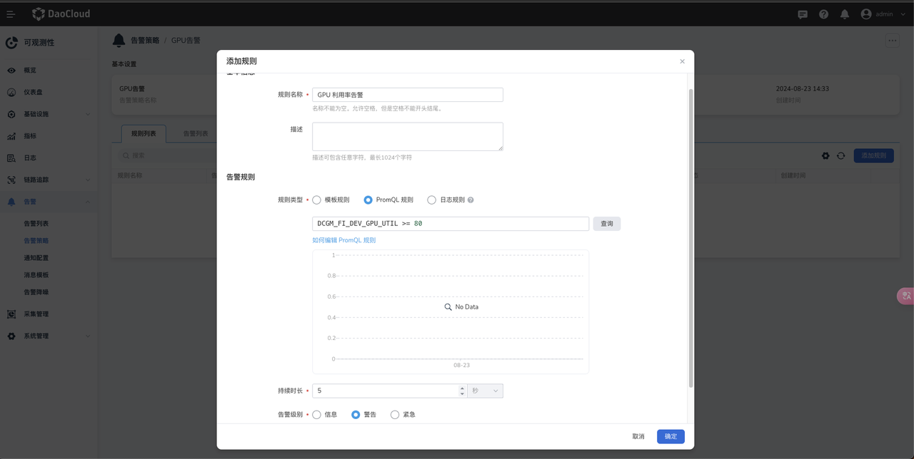

# GPU 告警规则

本文介绍如何在 DCE 5.0 平台设置 GPU 相关的告警规则。

## 前置条件

- 集群节点上已正确安装 GPU 设备
- 集群中已正确安装 [gpu-operator 组件](../install_nvidia_driver_of_operator.md)
- 如果用到了 vGPU 还需要在集群中安装 [Nvidia-vgpu 组件](../vgpu/vgpu_addon.md)，并且开启 servicemonitor
- 集群正确安装了 insight-agent 组件

## 告警常用 GPU 指标

本节介绍 GPU 告警常用的指标，分为两个部分：

- GPU 卡纬度的指标，主要反应单个 GPU 设备的运行状态。
- 应用纬度的指标，主要反应 Pod 在 GPU 上的运行状态。

### GPU 卡指标

| 指标名称 | 指标单位 | 说明 |
| --- | --- | --- |
| DCGM_FI_DEV_GPU_UTIL | % | GPU 利用率 |
| DCGM_FI_DEV_MEM_COPY_UTIL | % | 显存利用率 |
| DCGM_FI_DEV_ENC_UTIL | % | 编码器利用率 |
| DCGM_FI_DEV_DEC_UTIL | % | 解码器利用率 |
| DCGM_FI_DEV_FB_FREE | MB | 表示显存剩余量 |
| DCGM_FI_DEV_FB_USED | MB | 表示显存使用量 |
| DCGM_FI_DEV_GPU_TEMP | 摄氏度 | 表示当前 GPU 的温度度数 |
| DCGM_FI_DEV_POWER_USAGE | W | 设备电源使用情况 |
| DCGM_FI_DEV_XID_ERRORS | - | 表示一段时间内，最后发生的 XID 错误号。XID 提供 GPU 硬件、NVIDIA 软件或应用中的错误类型、错误位置、错误代码等信息，更多 [XID 信息](./gpu-metrics.md#_2) |

### 应用维度的指标

| 指标名称 | 指标单位 | 说明 |
| --- | --- | --- |
| kpanda_gpu_pod_utilization | % | 表示 Pod 对 GPU 的使用率 |
| kpanda_gpu_mem_pod_usage | MB  | 表示 Pod 对 GPU 显存的使用量 |
| kpanda_gpu_mem_pod_utilization | % | 表示 Pod 对 GPU 显存的使用率 |

## 设置告警规则

这里会介绍如何设置 GPU 告警规则，使用 GPU 卡利用率指标作为案例，请用户根据实际的业务场景选择指标以及编写 promql。

目标：当GPU卡利用率在五秒钟内一直保持 80% 的利用率时发出告警

1. 在可观测页面，点击 __告警__ -> __告警策略__ -> __创建告警策略__
  
    

2. 填写基本信息

    

3. 添加规则

    

4. 选择通知方式
  
    

5. 设置完成后，当一个 GPU 在 5s 内一直保持 80% 的利用率，会收到如下的告警信息。

    
