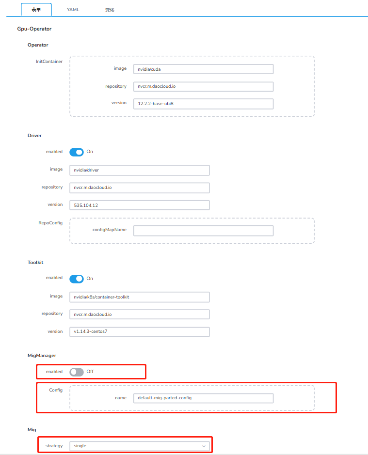

# 开启 MIG 功能

本章节介绍如何开启 NVIDIA MIG 功能方式，NVIDIA 当前提供两种在 Kubernetes 节点上公开 MIG 设备的策略： 

- **Single 模式**，节点仅在其所有 GPU 上公开单一类型的 MIG 设备。
- **Mixed 模式**，节点在其所有 GPU 上公开混合 MIG 设备类型。

!!! tip

    MIG 模式 Disable 之后需要重新启动物理节点，才能正常的使用整卡模式。

详情参考：[NVIDIA GPU 卡使用模式](../index.md)

## 前提条件

- 待安装 GPU 驱动节点系统要求请参考：[GPU 支持矩阵](../../gpu_matrix.md)
- 确认集群节点上具有对应型号的 GPU 卡（[NVIDIA H100](https://www.nvidia.com/en-us/data-center/h100/)、
  [A100](https://www.nvidia.com/en-us/data-center/a100/) 和
  [A30](https://www.nvidia.com/en-us/data-center/products/a30-gpu/) Tensor Core GPU），
  详情参考：[GPU 支持矩阵](../../gpu_matrix.md)
- 节点上的所有 GPU 必须：属于同一产品线（例如 A100-SXM-40GB）

## 开启 GPU MIG Single 模式

1. [通过 Operator 开启](../install_nvidia_driver_of_operator.md) MIG Single 模式，在安装界面配置参数：

    

    - __DevicePlugin__ 设置为 __enable__ 
    - __MIG strategy__ 设置为 __single__ 
    - __Mig Manager__ 下的 __enabled__ 参数开启
    - __MigManager Config__ ：MIG 的切分策略配置，默认为 __default-mig-parted-config__

1. 安装完成后需要给对应节点（已插入对应 GPU 卡节点）打上切分规格的 label，如不执行此操作，将按照默认不切分。

    !!! tip

        Single 模式只能按照单一模式进行切分。建议使用默认策略，也可以[自定义切分策略](#_2)。

    **界面配置** ：
   
    1. 在 ConfigMap 中搜索 `default-mig-parted-config` ，进入详情找到 GPU 卡型号对应的切分规格。
   
        
  
    2. 找到对应节点，选择 __修改标签__ 添加 __nvidia.com/mig.config="all-1g.10gb"__ 。若选择其他规格，则按照其他规格进行切分。

        

    **命令配置**：

    ```sh
    kubectl label nodes {node} nvidia.com/mig.config="all-1g.10gb" --overwrite
    ```

1. 查看配置结果

    ```sh
    kubectl get node 10.206.0.17 -o yaml|grep nvidia.com/mig.config
    ```
​
设置完成后，在确认部署应用时即可[使用 GPU MIG 资源](mig_usage.md)。

## 开启 GPU MIG Mixed 模式

1. [通过 Operator 开启](../install_nvidia_driver_of_operator.md) MIG Mixed 模式，在安装界面配置如下参数：

    

    - __DevicePlugin__ 设置为 __enable__ 
    - __MIG strategy__ 设置为 __mixed__ 
    - __Mig Manager__ 下的 __enabled__ 参数开启
    - __MigManager Config__ ：MIG 的切分策略配置，默认为 __default-mig-parted-config__ .

1. 安装完成后需要给对应节点(已插入对应 GPU 卡节点)打上切分规格的 label，如不执行此操作，将按照默认不切分。

    !!! tip

        建议使用默认策略,也可以[自定义切分策略](#_2)。

    **界面配置** ：
   
    1. 在 ConfigMap 中搜索 default-mig-parted-config ，进入详情找到 GPU 卡型号对应的切分规格。
   
        
  
    2. 找到对应节点，选择 __修改标签__ 添加 __nvidia.com/mig.config="all-1g.10gb"__ 。若选择其他规格，则按照其他规格进行切分。

        

    **命令配置** ：

    ```sh
    kubectl label nodes {node} nvidia.com/mig.config="all-1g.10gb" --overwrite
    ```

1. 查看配置结果

    ```sh
    kubectl get node 10.206.0.17 -o yaml|grep nvidia.com/mig.config
    ```

​设置完成后，在确认部署应用时即可[使用 GPU MIG 资源](mig_usage.md)。

## 自定义切分策略 

可自定义切分策略配置文件，单张卡最多可切分为 7 个实例。需在安装 GPU Operator 前创建，并在安装时指定该 ConfigMap 名称。

1. 在 ConfigMap 中创建自定义切分策略，部署时需要和 GPU operator 部署在同一个命名空间下。
   同时您创建的文件名称不能与默认 __default-mig-parted-config__ 相同。配置数据可参考如下 yaml。

    

    ??? note "点击查看详细的 YAML 配置说明"

        如下 YAML 为示例自定义配置 __custom-mig-parted-config__ ，配置数据的 __key__ 为如下 __config.yaml__ 中内容，您可以自定义添加其他切分策略。

        ```yaml title="config.yaml"
          # 自定义切分 GI 实例配置
          version: v1
          mig-configs:
            all-disabled:
              - devices: all
                mig-enabled: false

            # A100-40GB, A800-40GB
            all-1g.5gb:
              - devices: all
                mig-enabled: true
                mig-devices:
                  "1g.5gb": 7

            all-1g.5gb.me:
              - devices: all
                mig-enabled: true
                mig-devices:
                  "1g.5gb+me": 1

            all-2g.10gb:
              - devices: all
                mig-enabled: true
                mig-devices:
                  "2g.10gb": 3

            all-3g.20gb:
              - devices: all
                mig-enabled: true
                mig-devices:
                  "3g.20gb": 2

            all-4g.20gb:
              - devices: all
                mig-enabled: true
                mig-devices:
                  "4g.20gb": 1

            all-7g.40gb:
              - devices: all
                mig-enabled: true
                mig-devices:
                  "7g.40gb": 1

            # H100-80GB, H800-80GB, A100-80GB, A800-80GB, A100-40GB, A800-40GB
            all-1g.10gb:
              # H100-80GB, H800-80GB, A100-80GB, A800-80GB
              - device-filter: ["0x233010DE", "0x233110DE", "0x232210DE", "0x20B210DE", "0x20B510DE", "0x20F310DE", "0x20F510DE"]
                devices: all
                mig-enabled: true
                mig-devices:
                  "1g.10gb": 7

              # A100-40GB, A800-40GB
              - device-filter: ["0x20B010DE", "0x20B110DE", "0x20F110DE", "0x20F610DE"]
                devices: all
                mig-enabled: true
                mig-devices:
                  "1g.10gb": 4

            # H100-80GB, H800-80GB, A100-80GB, A800-80GB
            all-1g.10gb.me:
              - devices: all
                mig-enabled: true
                mig-devices:
                  "1g.10gb+me": 1

            # H100-80GB, H800-80GB, A100-80GB, A800-80GB
            all-1g.20gb:
              - devices: all
                mig-enabled: true
                mig-devices:
                  "1g.20gb": 4

            all-2g.20gb:
              - devices: all
                mig-enabled: true
                mig-devices:
                  "2g.20gb": 3

            all-3g.40gb:
              - devices: all
                mig-enabled: true
                mig-devices:
                  "3g.40gb": 2

            all-4g.40gb:
              - devices: all
                mig-enabled: true
                mig-devices:
                  "4g.40gb": 1

            all-7g.80gb:
              - devices: all
                mig-enabled: true
                mig-devices:
                  "7g.80gb": 1

            # A30-24GB
            all-1g.6gb:
              - devices: all
                mig-enabled: true
                mig-devices:
                  "1g.6gb": 4

            all-1g.6gb.me:
              - devices: all
                mig-enabled: true
                mig-devices:
                  "1g.6gb+me": 1

            all-2g.12gb:
              - devices: all
                mig-enabled: true
                mig-devices:
                  "2g.12gb": 2

            all-2g.12gb.me:
              - devices: all
                mig-enabled: true
                mig-devices:
                  "2g.12gb+me": 1

            all-4g.24gb:
              - devices: all
                mig-enabled: true
                mig-devices:
                  "4g.24gb": 1

            # H100 NVL, H800 NVL
            all-1g.12gb:
              - devices: all
                mig-enabled: true
                mig-devices:
                  "1g.12gb": 7

            all-1g.12gb.me:
              - devices: all
                mig-enabled: true
                mig-devices:
                  "1g.12gb+me": 1

            all-2g.24gb:
              - devices: all
                mig-enabled: true
                mig-devices:
                  "2g.24gb": 3

            all-3g.47gb:
              - devices: all
                mig-enabled: true
                mig-devices:
                  "3g.47gb": 2

            all-4g.47gb:
              - devices: all
                mig-enabled: true
                mig-devices:
                  "4g.47gb": 1

            all-7g.94gb:
              - devices: all
                mig-enabled: true
                mig-devices:
                  "7g.94gb": 1

            # H100-96GB, PG506-96GB
            all-3g.48gb:
              - devices: all
                mig-enabled: true
                mig-devices:
                  "3g.48gb": 2

            all-4g.48gb:
              - devices: all
                mig-enabled: true
                mig-devices:
                  "4g.48gb": 1

            all-7g.96gb:
              - devices: all
                mig-enabled: true
                mig-devices:
                  "7g.96gb": 1

            # H100-96GB, H100 NVL, H800 NVL, H100-80GB, H800-80GB, A800-40GB, A800-80GB, A100-40GB, A100-80GB, A30-24GB, PG506-96GB
            all-balanced:
              # H100 NVL, H800 NVL
              - device-filter: ["0x232110DE", "0x233A10DE"]
                devices: all
                mig-enabled: true
                mig-devices:
                  "1g.12gb": 1
                  "2g.24gb": 1
                  "3g.47gb": 1

              # H100-80GB, H800-80GB, A100-80GB, A800-80GB
              - device-filter: ["0x233010DE", "0x233110DE", "0x232210DE", "0x20B210DE", "0x20B510DE", "0x20F310DE", "0x20F510DE"]
                devices: all
                mig-enabled: true
                mig-devices:
                  "1g.10gb": 2
                  "2g.20gb": 1
                  "3g.40gb": 1

              # A100-40GB, A800-40GB
              - device-filter: ["0x20B010DE", "0x20B110DE", "0x20F110DE", "0x20F610DE"]
                devices: all
                mig-enabled: true
                mig-devices:
                  "1g.5gb": 2
                  "2g.10gb": 1
                  "3g.20gb": 1

              # A30-24GB
              - device-filter: "0x20B710DE"
                devices: all
                mig-enabled: true
                mig-devices:
                  "1g.6gb": 2
                  "2g.12gb": 1

              # H100-96GB, PG506-96GB
              - device-filter: ["0x233D10DE", "0x20B610DE"]
                devices: all
                mig-enabled: true
                mig-devices:
                  "1g.12gb": 2
                  "2g.24gb": 1
                  "3g.48gb": 1

            # 设置后会按照设置规格切分 CI 实例 
            custom-config:    
              - devices: all
                mig-enabled: true
                mig-devices:
                  "1g.10gb": 4
                  "1g.20gb": 2

        ```

        在上述的 __YAML__ 中设置 `custom-config`，设置后会按照规格切分 __CI__ 实例。

        ```yaml
        custom-config:
             devices: all
            mig-enabled: true
            mig-devices:
              1c.3g.40gb: 6
        ```

1. 在安装 GPU Operator 时，指定该 ConfigMap。

    
