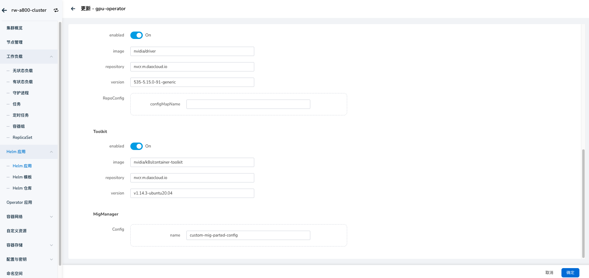
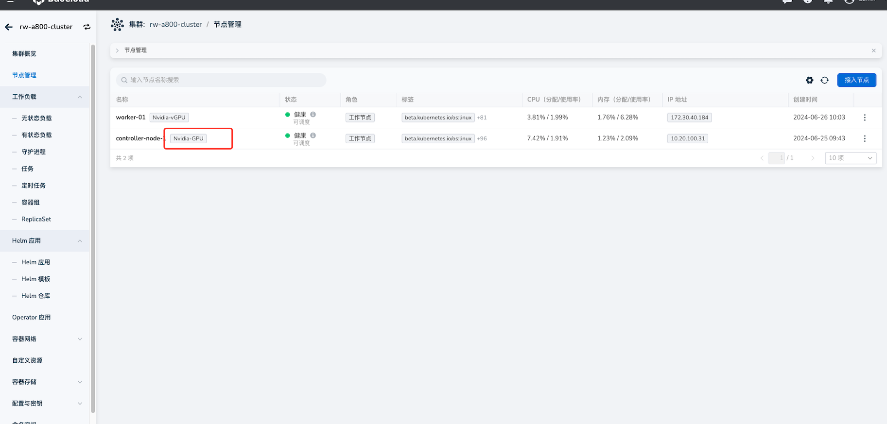
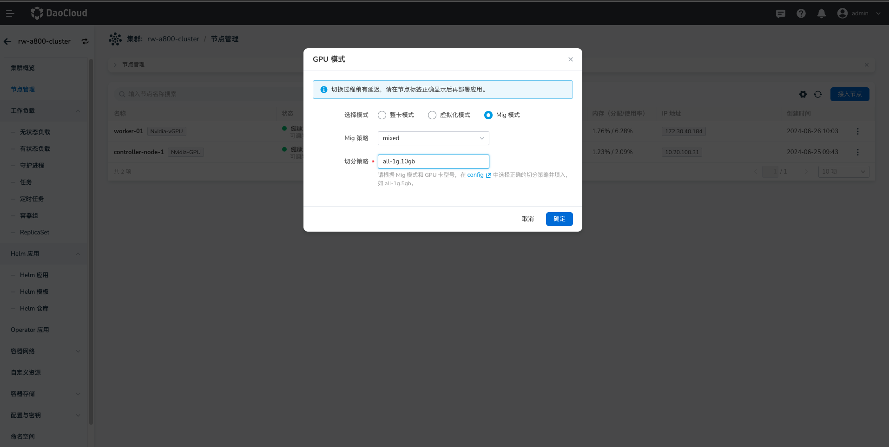

# 开启 MIG 功能

本章节介绍如何开启 NVIDIA MIG 功能方式，NVIDIA 当前提供两种在 Kubernetes 节点上公开 MIG 设备的策略： 

- **Single 模式**，节点仅在其所有 GPU 上公开单一类型的 MIG 设备。
- **Mixed 模式**，节点在其所有 GPU 上公开混合 MIG 设备类型。

详情参考：[NVIDIA GPU 卡使用模式](../index.md)

## 前提条件

- 待安装 GPU 驱动节点系统要求请参考：[GPU 支持矩阵](../../gpu_matrix.md)
- 确认集群节点上具有对应型号的 GPU 卡（[NVIDIA H100](https://www.nvidia.com/en-us/data-center/h100/)、
  [A100](https://www.nvidia.com/en-us/data-center/a100/) 和
  [A30](https://www.nvidia.com/en-us/data-center/products/a30-gpu/) Tensor Core GPU），
  详情参考：[GPU 支持矩阵](../../gpu_matrix.md)
- 节点上的所有 GPU 必须：属于同一产品线（例如 A100-SXM-40GB）

## 安装 GPU Operator Addon

### 参数配置

[安装 Operator ](../install_nvidia_driver_of_operator.md) 时需要对应设置 MigManager Config 参数，默认为 **default-mig-parted-config**，同时也可以自定义切分策略配置文件：



### 自定义切分策略

```yaml
  ## 自定义切分 GI 实例配置
  all-disabled:
    - devices: all
      mig-enabled: false
  all-enabled:
    - devices: all
      mig-enabled: true
      mig-devices: {}
  all-1g.10gb:
    - devices: all
      mig-enabled: true
      mig-devices:
        1g.5gb: 7
  all-1g.10gb.me:
    - devices: all
      mig-enabled: true
      mig-devices:
        1g.10gb+me: 1
  all-1g.20gb:
    - devices: all
      mig-enabled: true
      mig-devices:
        1g.20gb: 4
  all-2g.20gb:
    - devices: all
      mig-enabled: true
      mig-devices:
        2g.20gb: 3
  all-3g.40gb:
    - devices: all
      mig-enabled: true
      mig-devices:
        3g.40gb: 2
  all-4g.40gb:
    - devices: all
      mig-enabled: true
      mig-devices:
        4g.40gb: 1
  all-7g.80gb:
    - devices: all
      mig-enabled: true
      mig-devices:
        7g.80gb: 1
  all-balanced:
    - device-filter: ["0x233110DE", "0x232210DE", "0x20B210DE", "0x20B510DE", "0x20F310DE", "0x20F510DE"]
      devices: all
      mig-enabled: true
      mig-devices:
        1g.10gb: 2
        2g.20gb: 1
        3g.40gb: 1
 # 设置后会按照设置规格切分 CI 实例 
  custom-config:    
    - devices: all
      mig-enabled: true
      mig-devices:
        3g.40gb: 2
```

在上述的 **YAML** 中设置 **custom-config** ，设置后会按照规格切分 **CI** 实例。

```yaml
custom-config:
  - devices: all
    mig-enabled: true
    mig-devices:
      1c.3g.40gb: 6
```

设置完成后，在确认部署应用时即可[使用 GPU MIG 资源](mig_usage.md)。

## 切换节点 GPU 模式

当我们成功安装 gpu operator 之后，节点默认是整卡模式，在节点管理页面会有标识，如下图所示：



我们需要点击节点旁的按钮，选择 GPU 模式切换，然后选择对应的MIG模式，以及切分的策略，这里以 MIXED 模式为例：



这里一共有两个配置：

1. MIg 策略：Mixed 以及 Single 。
2. 切分策略：这里的策略需要与 **default-mig-parted-config**（或者用户自定义的切分策略） 配置文件中的 key 保持一致。

点击确认按钮后，等待约一分钟左右刷新页面，MIG 模式切换成：


