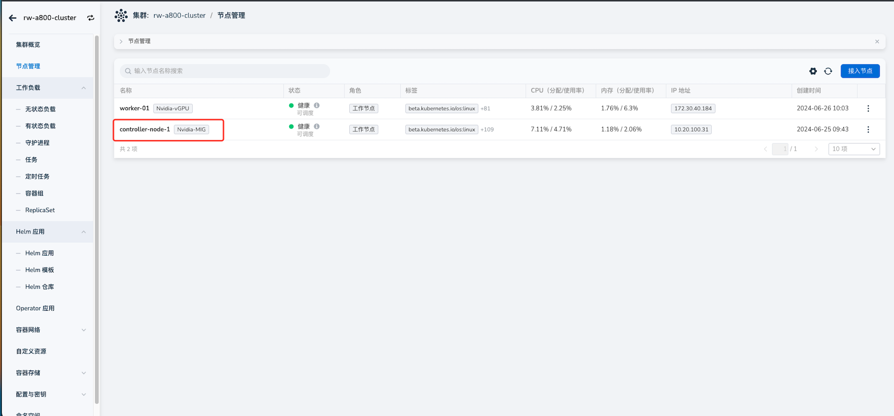
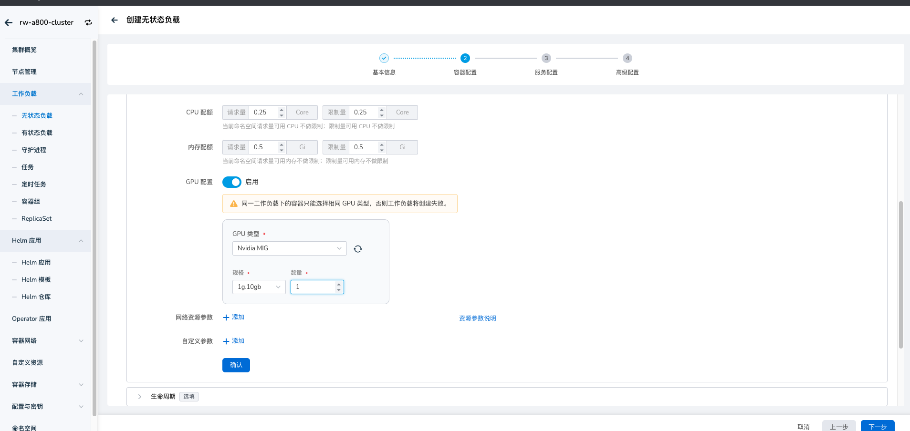

# 使用 MIG GPU 资源

本节介绍应用如何使用 MIG GPU 资源。

## 前提条件

- 已经[部署 DCE 5.0](https://docs.daocloud.io/install/index.html) 容器管理平台，且平台运行正常。
- 容器管理模块[已接入 Kubernetes 集群](../../../clusters/integrate-cluster.md)或者[已创建 Kubernetes 集群](../../../clusters/create-cluster.md)，且能够访问集群的 UI 界面。
- 已启用 NVIDIA DevicePlugin 和 MIG 能力，可参考 [GPU Operator 离线安装](../install_nvidia_driver_of_operator.md)。
- 集群节点上具有[对应型号的 GPU 卡](../../gpu_matrix.md)

## 界面使用 MIG GPU

1. 确认集群是否已识别 GPU 卡类型

    进入 __集群详情__ -> __节点管理__ ，查看是否已正确识别为 MIG 模式。

    

1. 通过镜像部署应用可选择并使用 NVIDIA MIG 资源。

    

## YAML 配置使用 MIG

** __MIG Single__ 模式：**

```yaml
apiVersion: apps/v1
kind: Deployment
metadata:
  name: mig-demo
  namespace: default
spec:
  replicas: 1
  selector:
    matchLabels:
      app: mig-demo
  template:
    metadata:
      creationTimestamp: null
      labels:
        app: mig-demo
    spec:
      containers:
        - name: mig-demo1
          image: chrstnhntschl/gpu_burn
          resources:
            limits:
              nvidia.com/gpu: 2 # 申请 MIG GPU 的数量
          imagePullPolicy: Always
      restartPolicy: Always
```

** __MIG  Mixed__ 模式：**

```yaml
apiVersion: apps/v1
kind: Deployment
metadata:
  name: mig-demo
  namespace: default
spec:
  replicas: 1
  selector:
    matchLabels:
      app: mig-demo
  template:
    metadata:
      creationTimestamp: null
      labels:
        app: mig-demo
    spec:
      containers:
        - name: mig-demo1
          image: chrstnhntschl/gpu_burn
          resources:
            limits:
              nvidia.com/mig-4g.20gb: 1 # 通过 nvidia.com/mig-g.gb 的资源类型公开各个 MIG 设备
          imagePullPolicy: Always
      restartPolicy: Always
```

进入容器后可以查看只使用了一个 MIG 设备。


