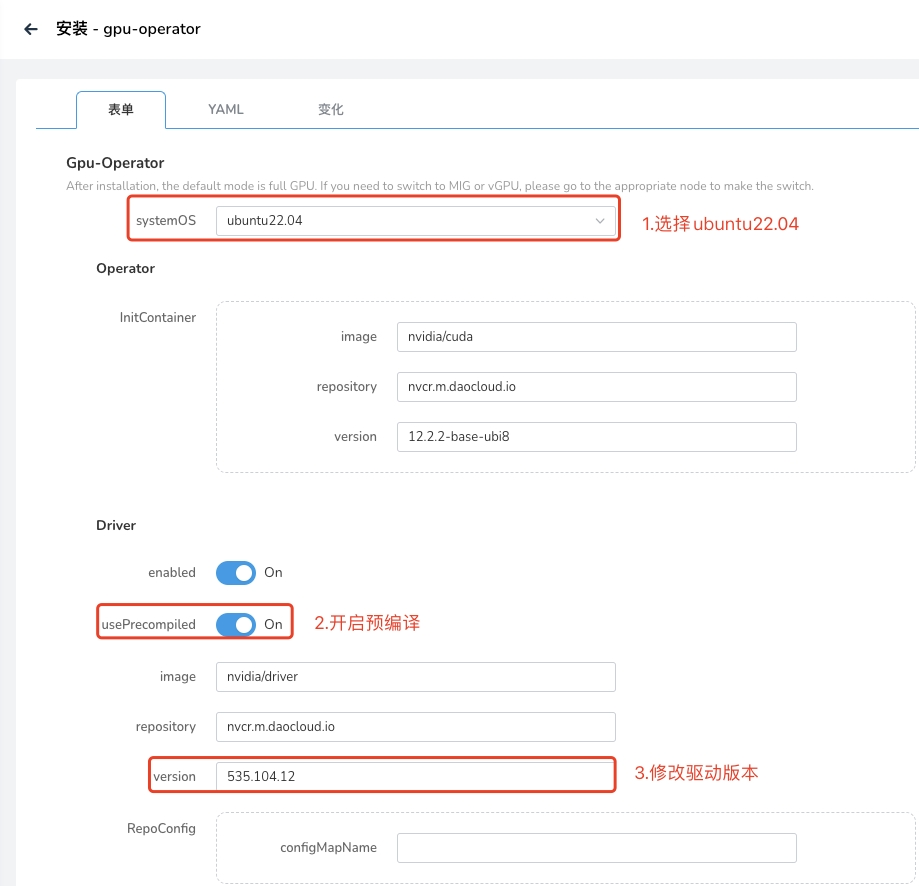

# Ubuntu22.04 离线GPU-Operator驱动安装

> 前提：安装gpu-operator v23.9.0+2 以及之后的版本

## 准备离线镜像

1. 查看内核版本

```
$ uname -r
5.15.0-78-generic
```

2. 查看内核对应的 GPU Driver 镜像版本, `https://catalog.ngc.nvidia.com/orgs/nvidia/containers/driver/tags` 使用内核查询镜像版本, 使用 `ctr export` 保存镜像.
```
$ ctr i pull nvcr.io/nvidia/driver:535-5.15.0-78-generic-ubuntu22.04
$ ctr i export --all-platforms driver.tar.gz nvcr.io/nvidia/driver:535-5.15.0-78-generic-ubuntu22.04 
```

3. 把镜像导入到火种集群的镜像仓库中

```
$ ctr i import driver.tar.gz
$ ctr i tag nvcr.io/nvidia/driver:535-5.15.0-78-generic-ubuntu22.04 {火种registry}/nvcr.m.daocloud.io/nvidia/driver:535-5.15.0-78-generic-ubuntu22.04
$ ctr i push {火种registry}/nvcr.m.daocloud.io/nvidia/driver:535-5.15.0-78-generic-ubuntu22.04 --skip-verify=true
```

## 安装驱动

1. 安装 gpu-operator addon，设置 driver.usePrecompiled=true
2. 设置driver.version=535 # 这里要注意是写535，不是 535.104.12.

