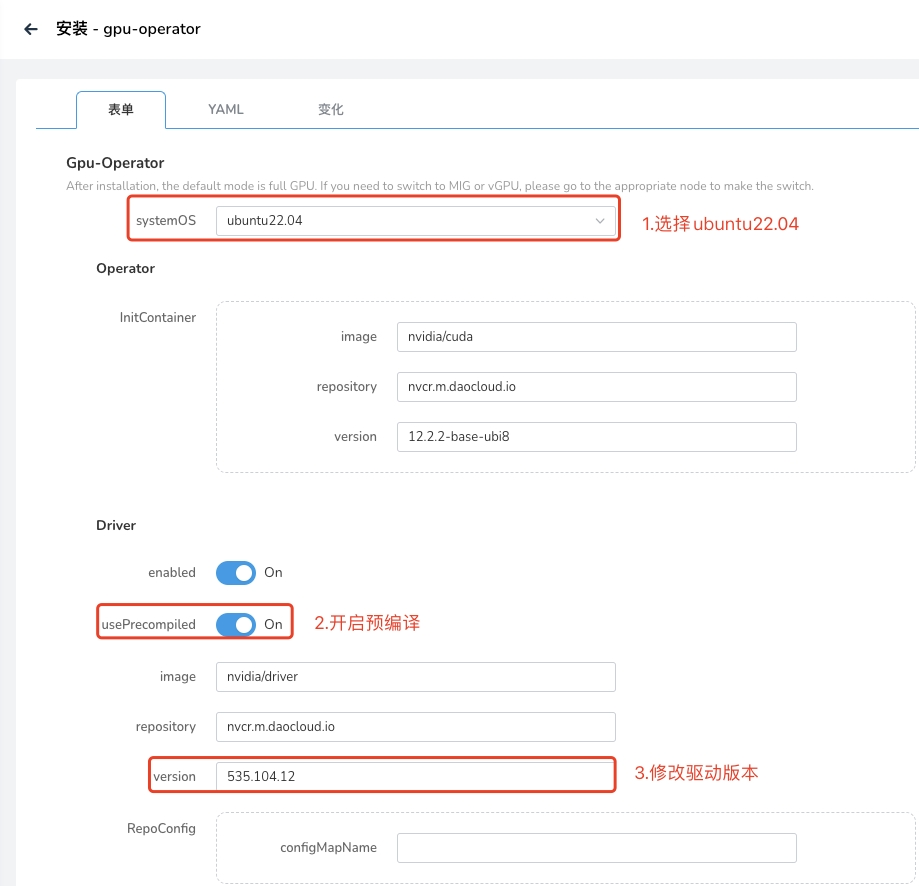

# Ubuntu22.04 离线安装 gpu-operator 驱动

前提条件：已安装 gpu-operator v23.9.0+2 及更高版本

## 准备离线镜像

1. 查看内核版本

    ```bash
    $ uname -r
    5.15.0-78-generic
    ```

1. 查看内核对应的 GPU Driver 镜像版本，
   `https://catalog.ngc.nvidia.com/orgs/nvidia/containers/driver/tags`。
   使用内核查询镜像版本，通过 `ctr export` 保存镜像。

    ```bash
    ctr i pull nvcr.io/nvidia/driver:535-5.15.0-78-generic-ubuntu22.04
    ctr i export --all-platforms driver.tar.gz nvcr.io/nvidia/driver:535-5.15.0-78-generic-ubuntu22.04 
    ```

1. 把镜像导入到火种集群的镜像仓库中

    ```bash
    ctr i import driver.tar.gz
    ctr i tag nvcr.io/nvidia/driver:535-5.15.0-78-generic-ubuntu22.04 {火种registry}/nvcr.m.daocloud.io/nvidia/driver:535-5.15.0-78-generic-ubuntu22.04
    ctr i push {火种registry}/nvcr.m.daocloud.io/nvidia/driver:535-5.15.0-78-generic-ubuntu22.04 --skip-verify=true
    ```

## 安装驱动

1. 安装 gpu-operator addon
2. 若使用预编译模式，则设置 `driver.usePrecompiled=true`,并设置 `driver.version=535`，这里要注意，写的是 535，不是 535.104.12。（非预编译模式跳过此步，直接安装即可）


