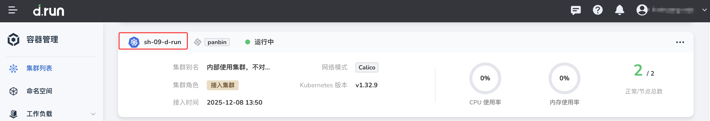
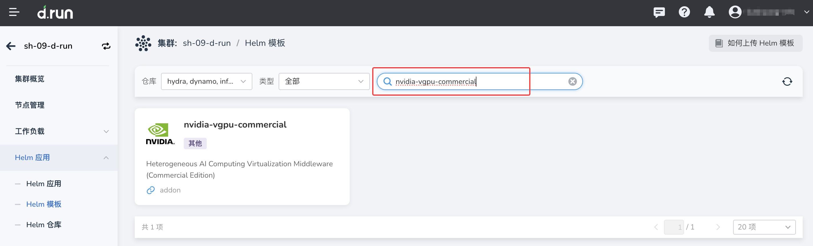

# 安装商业版 HAMi NVIDIA vGPU Addon

商业版 HAMi NVIDIA vGPU Addon 用于在 Kubernetes 集群中将 NVIDIA GPU 虚拟化为多个 vGPU，并按需分配给不同工作负载使用。

商业版与[开源版 NVIDIA vGPU Addon](vgpu_addon.md)的安装流程基本一致，主要区别在于：商业版安装完成后，需要导入有效 License 并完成激活，相关商业能力才可正常使用。

## 商业版与开源版区别

### 安装区别

| 对比项 | 开源版 | 商业版 |
| --- | --- | --- |
| 安装入口 | Helm 模板安装 | Helm 模板安装 |
| Helm 模板 | `nvidia-vgpu` | `nvidia-vgpu-commercial` |
| 安装参数 | 基本一致 | 基本一致 |
| GPU 模式切换 | 支持切换到 vGPU 模式 | 支持切换到 vGPU 模式 |
| License | 不需要 | 必须导入 License 并激活 |
| 激活方式 | 无 | 通过 Kubernetes Secret 导入 License |

### 功能区别

| 功能项 | 开源版 | 商业版 | 说明 |
| --- | --- | --- | --- |
| vGPU 资源切分 | 支持 | 支持 | — |
| 调度能力 | 支持 | 支持 | 商业版提供企业级调度增强能力 |
| 监控能力 | 支持 | 支持 | 可通过 ServiceMonitor 接入可观测性模块 |
| 企业级支持 | 社区支持 | 商业支持 | 商业版由 HAMi 提供企业级技术支持 |
| License 管理 | 不涉及 | 支持 | 商业版需完成 License 激活 |

## 前提条件

安装前请确认：

- 参考 [GPU 支持矩阵](../../gpu_matrix.md) 确认集群节点上具有对应型号的 NVIDIA GPU 卡。
- 当前集群已通过 Helm 应用部署 GPU Operator，具体参考 [GPU Operator 离线安装](../install_nvidia_driver_of_operator.md)。
- 商业版 HAMi 需提前向 HAMi 方[申请 License](https://github.com/dynamia-ai/workshop/blob/main/lab1-load-license.md)。

## 安装步骤

商业版 Addon 的安装方式与开源版一致，区别在于 Helm 模板名称和安装后的 License 激活。

1. 进入目标集群。

    路径：**容器管理** -> **集群管理** -> 点击目标集群名称。

    

2. 进入 Helm 模板页面并选择商业版 Addon。

    路径：**Helm 应用** -> **Helm 模板**，搜索并选择 `nvidia-vgpu-commercial` 对应 Addon。

    

3. 配置安装参数。

    常用参数如下：

    | 参数 | 说明 |
    | --- | --- |
    | `deviceCoreScaling` | GPU 算力使用比例，默认值为 1。大于 1 时表示启用虚拟算力。若配置为 S，则单张 GPU 切分出的 vGPU 总算力为 S × 100%。 |
    | `deviceMemoryScaling` | GPU 显存使用比例，默认值为 1。大于 1 时表示启用虚拟显存。若 GPU 物理显存为 M，配置为 S 时，切分出的 vGPU 总显存为 S × M。 |
    | `deviceSplitCount` | 单张 GPU 最大可切分任务数，默认值为 10。每个 GPU 上最多同时存在 N 个任务（N 为该参数值）。 |
    | `Resources` | vgpu-device-plugin、vgpu-scheduler 等组件的资源请求与限制。 |
    | `ServiceMonitor` | 默认不开启。开启后可前往可观测性模块查看 vGPU 相关监控。如需开启，请确保 insight-agent 已安装并处于运行状态，否则将导致 NVIDIA vGPU Addon 安装失败。 |

    如需修改高级参数，可在 YAML 列中直接编辑。

4. 提交安装。

5. 确认 Addon 相关 Pod 正常运行。

    ```bash
    kubectl get pod -n <HAMi 所在命名空间>
    ```

    预期结果：HAMi scheduler、device plugin 等组件 Pod 均处于 Running 状态。

6. 切换节点 GPU 模式为 vGPU。

    从左侧导航栏点击 **节点管理**，找到目标节点，点击 **GPU 模式切换**，切换为 vGPU 模式。

    !!! note

        NVIDIA 的 vGPU 能力支持节点级别的 GPU 模式切换（整卡/vGPU/MIG 模式），满足同一集群中不同工作负载对 GPU 模式的不同需求。

    点击 **确定** 后，节点状态会变为 **GPU 模式切换中**。等待切换完成（即 vGPU 的 hami-nvidia-vgpu-device-plugin Pod 启动完毕）后，节点状态会变为 **Nvidia-vGPU**。

    节点 GPU 模式切换成功后，可参考[应用使用 Nvidia vGPU](vgpu_user.md)部署工作负载。切换过程稍有延迟，请在节点标签正确显示后再部署应用。

## 导入 License 并激活

商业版 HAMi 安装后，必须导入 License 才能激活商业能力。

### 获取 License 申请信息

安装前或安装后，需按 HAMi 要求准备 License 申请信息（如 GPU UUID 等）。详细步骤请参考 [获取商业版 HAMi License 信息](https://github.com/dynamia-ai/workshop/blob/main/lab1-load-license.md)。

### 导入 License

收到 License 文件后，通过 Kubernetes Secret 导入并激活：

1. 在 HAMi 所在命名空间创建 Secret，将 License 内容写入 Secret。

    ```bash
    kubectl create secret generic hami-license \
      -n <HAMi 所在命名空间> \
      --from-file=license=<License 文件路径>
    ```

2. 若 Helm 安装参数中提供 License Secret 相关配置项，请在 Addon 配置中将 Secret 名称指向 `hami-license`（或您自定义的名称），保存后等待 Pod 重新加载。

3. 确认 device plugin 等组件 Pod 重启后处于 Running 状态，且无 License 相关报错。

!!! tip

    License 的具体字段名称、Secret 挂载方式可能随 Addon 版本变化。如安装界面或 YAML 中有 `licenseSecret` 等参数，请以 Helm 模板中的参数说明为准。

## 验证安装

完成安装、GPU 模式切换和 License 激活后，可通过以下方式验证：

1. 在 **节点管理** 中确认目标节点 GPU 模式为 **Nvidia-vGPU**。
2. 执行 `kubectl get pod -n <HAMi 所在命名空间>`，确认相关组件均为 Running。
3. 部署测试工作负载，确认可正常申请 `nvidia.com/vgpu` 等资源。
