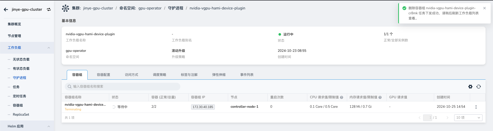
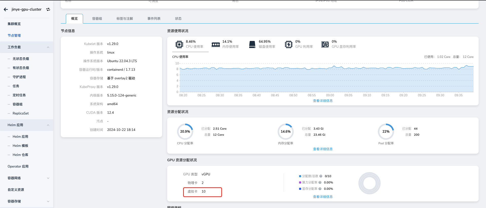

如何让集群纳管指定的 GPU 卡

本文介绍如何让集群纳管指定的 GPU 卡。

## 使用场景

1. 客户服务器资源有限，且部分应用不支持容器部署模式的情况下，需要兼顾传统应用部署和容器化应用部署需求，允许客户纳管一部分的 GPU 卡，并预留一部分 GPU 卡供其传统应用使用。

2. 在故障隔离机制中，device-plugin 能够自动识别并隔离出现故障的 GPU 卡，以确保这些故障卡不会再被调度用于执行任何任务。对于某些可能未被 device-plugin 自动检测到的故障 GPU 卡，可以通过选择性纳管的方式手动隔离。

## 前提条件

- 已经[部署 DCE 5.0](https://docs.daocloud.io/install/index.html)容器管理平台，且平台运行正常。
- 容器管理模块[已接入 Kubernetes 集群](https://docs.daocloud.io/kpanda/user-guide/clusters/integrate-cluster/)或者[已创建 Kubernetes 集群](https://docs.daocloud.io/kpanda/user-guide/clusters/create-cluster/)，且能够访问集群的 UI 界面。
- 当前集群已安装 [GPU operator](https://docs.daocloud.io/kpanda/user-guide/gpu/nvidia/install_nvidia_driver_of_operator/)
- 当前集群已安装[ NVIDIA-vGPU](https://docs.daocloud.io/kpanda/user-guide/gpu/nvidia/vgpu/vgpu_addon/)，且 NVIDIA-vGPU 在 2.4.0+1 及以上版本

## 操作步骤

!!! note

    仅 vGPU 模式支持纳管指定的 GPU 卡。

1. 修改 nvidia-vgpu-hami-device-plugin。点击对 __集群__ -> __配置与密钥__-> __配置项__，搜索 __nvidia-vgpu-hami-device-plugin__，点击名称进入详情。

2. 编辑 YAML，填写被过滤的 GPU 卡的 uuid 或者 index 码。过滤后，pod 不会被调度到这些 GPU 卡上。

- `filterdevices`：设备实例的过滤设备。过滤设备可以是以下值之一：  
  - `uuid`：设备的UUID。  
  - `index`：设备索引。

3. 重启 nvidia-vgpu-hami-device-plugin

4. 部署工作负载并查看调度情况。

