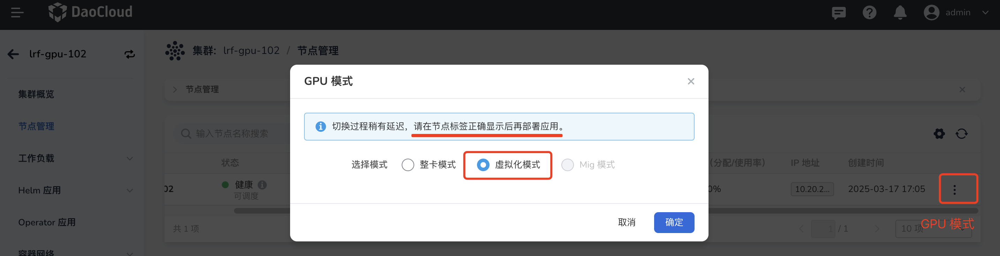
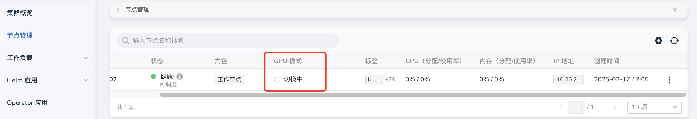
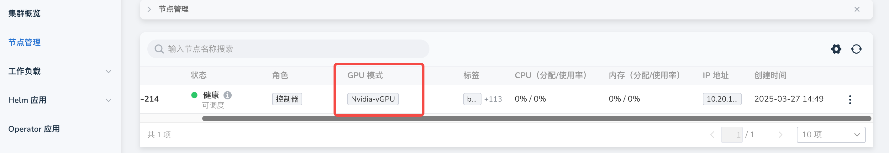

# 安装 NVIDIA vGPU Addon

如需将一张 NVIDIA 虚拟化成多个虚拟 GPU，并将其分配给不同的虚拟机或用户，您可以使用 NVIDIA 的 vGPU 能力。
本节介绍如何在 DCE 5.0 平台中安装 vGPU 插件，并根据需求切换 GPU 模式。
## 前提条件

- 参考 [GPU 支持矩阵](../../gpu_matrix.md) 确认集群节点上具有对应型号的 GPU 卡。
- 当前集群已通过 helm 应用部署 GPU Operator ，具体参考 [GPU Operator 离线安装](../install_nvidia_driver_of_operator.md)。

## 安装步骤

1. 功能模块路径： __容器管理__ -> __集群管理__ ，点击目标集群的名称，从左侧导航栏点击 __Helm 应用__ -> __Helm 模板__ -> 搜索 __nvidia-vgpu__ 。

    

2. 在安装 vGPU 的过程中提供了几个基本修改的参数，如果需要修改高级参数点击 YAML 列进行修改：

    - __deviceCoreScaling__ ：NVIDIA 装置算力使用比例，预设值是 1。可以大于 1（启用虚拟算力，实验功能）。
      如果我们配置 __devicePlugin.deviceCoreScaling__ 参数为 S，在部署了我们装置插件的 Kubernetes 集群中，这张 GPU 分出的 vGPU 将总共包含 __S * 100%__ 算力。

    - __deviceMemoryScaling__ ：NVIDIA 装置显存使用比例，预设值是 1。可以大于 1（启用虚拟显存，实验功能）。
      对于有 M 显存大小的 NVIDIA GPU，如果我们配置 __devicePlugin.deviceMemoryScaling__ 参数为 S，
      在部署了我们装置插件的 Kubernetes 集群中，这张 GPU 分出的 vGPU 将总共包含 __S * M__ 显存。

    - __deviceSplitCount__ ：整数类型，预设值是 10。GPU 的分割数，每一张 GPU 都不能分配超过其配置数目的任务。
      若其配置为 N 的话，每个 GPU 上最多可以同时存在 N 个任务。

    - __Resources__ ：就是对应 vgpu-device-plugin 和 vgpu-schedule pod 的资源使用量。

    - __ServiceMonitor__ ：默认不开启，开启后可前往可观测性模块查看 vGPU 相关监控。如需开启，请确保 insight-agent 已安装并处于运行状态，否则将导致 NVIDIA vGPU Addon 安装失败。

    

3. 安装成功之后会在指定 __Namespace__ 下出现如下两个类型的 Pod，即表示 NVIDIA vGPU 插件已安装成功。

    
  
4. 随后，从左侧导航栏点击 __节点管理__ ，找到目标节点，点击 __GPU 模式切换__ ，切换为 vGPU 模式。

    !!! note
    
        NVIDIA 的 vGPU 能力支持节点级别的 GPU 模式切换（整卡/vGPU/mig 模式），满足同一集群中不同工作负载对 GPU 模式的不同需求。
    
    
    
    点击 __确定__ 后，节点状态会变为 __GPU 模式切换中__ ，等待节点切换完成（也就是 vGPU 的 hami-nvidia-vgpu-device-plugin pod 启动完毕）。切换完成之后状态会变为 __Nvidia-vGPU__ 。
    
    
    
    

5. 节点 GPU 模式切换成功后，[部署应用可使用 vGPU 资源](vgpu_user.md)。注意：切换过程稍有延迟，请在节点标签正确显示后再部署应用。

## 升级注意事项

### 从 2.6.1+1 升级到 2.7.1+1

> `+1` 指的是对应版本的第 1 次构建，比如 2.6.1+1 指的是 v2.6.1 的第 1 次打包构建

NVIDIA vGPU Addon 从 2.6.1+1 升级到 2.7.1+1 前需要删除 clusterrolebinding 资源 `nvidia-vgpu-hami-scheduler`。在控制台执行：

```shell
kubectl delete clusterrolebinding nvidia-vgpu-hami-scheduler
```

### 从 v2.0.0 升级到 v2.0.0+1

NVIDIA vGPU Addon 不支持从 v2.0.0 直接升级到 v2.0.0+1。如需升级，请卸载老版本后重新安装。
