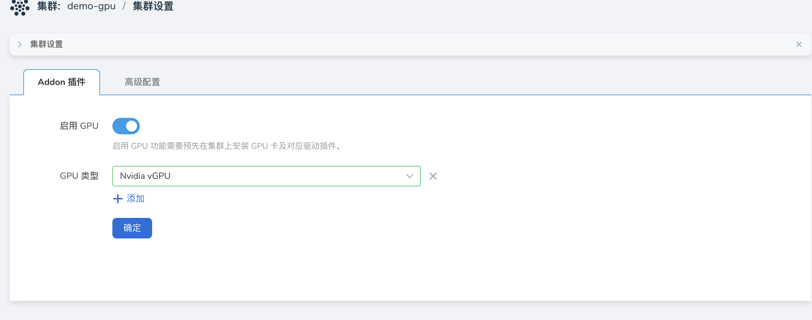

# vGPU Addon 安装

本节介绍如何在 `DCE5.0` 平台使用 `vGPU` 能力。

## 前提条件

- `GPU` 驱动推荐通过 `GPU Operator` 来进行安装，具体使用[参考文档](./install_nvidia_driver_of_operator.md)
- 集群节点已插入 GPU  卡

## 操作步骤

1. 功能模块路径：容器管理 => 集群管理 => 点击目标集群 => Helm应用 => Helm 仓库 => 搜索 nvidia-vgpu。

    

    在安装 vGPU 的过程中提供了几个基本修改的参数，如果需要修改高级参数点击 YAML 列进行修改：

    - `deviceMemoryScaling`：浮点数类型，预设值是1。NVIDIA装置显存使用比例（超配比例），可以大于 1（启用虚拟显存，实验功能）。
      对于有*M*显存大小的NVIDIA GPU，如果我们配置`devicePlugin.deviceMemoryScaling`参数为*S*，在部署了我们装置插件的Kubenetes集群中，这张GPU分出的vGPU将总共包含 `S * M` 显存。
    - `deviceSplitCount`：整数类型，预设值是10。GPU的分割数，每一张GPU都不能分配超过其配置数目的任务。
      若其配置为N的话，每个GPU上最多可以同时存在N个任务。
    - `Resources`：就是对应 vgpu-device-plugin 和 vgpu-schedule pod 的资源使用量。

    

    安装成功之后会在指定 `Namespace` 下出现如下两个类型的 `Pod`：

    

2. 集群设置，目前集群会根据集群 GPU 资源类型自动检测并启用 `GPU`， 并且设置 `GPU` 类型为 `Nvidia vGPU`。检测间隔时长为 10 分钟。

    
