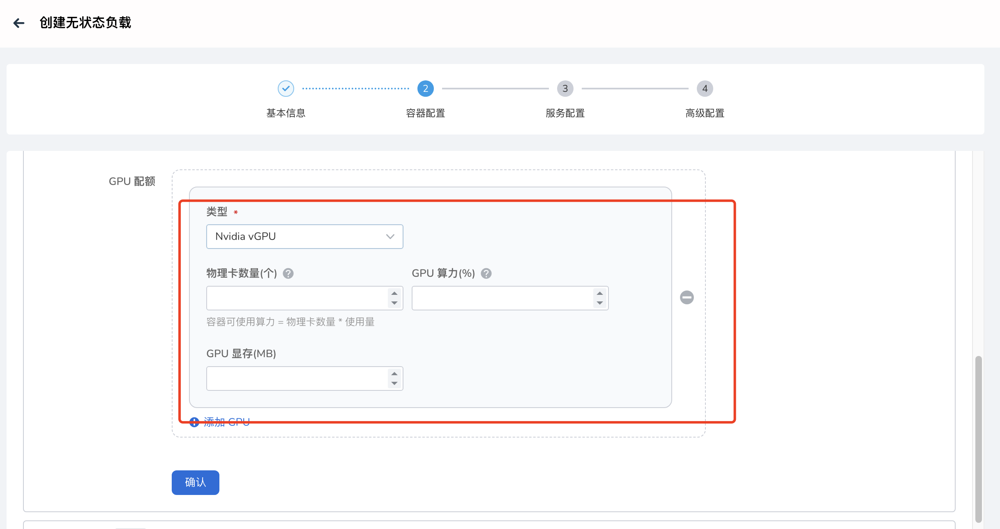
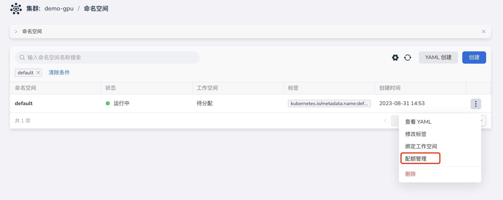

# vGPU 完整使用文档

本节介绍如何在 `DCE5.0` 平台使用 `vGPU` 能力。

## GPU 驱动安装

`GPU` 驱动推荐通过 `GPU Operator` 来进行安装，具体使用[参考文档](https://docs.daocloud.io/kpanda/user-guide/gpu/driver.html)

## vGPU addon 安装

功能模块路径：容器管理 => 集群管理 => 点击目标集群 => Helm应用 => Helm 仓库 => 搜索 nvidia-vgpu。

在安装 vGPU 的过程中提供了几个基本修改的参数，如果需要修改高级参数点击 YAML 列进行修改：

- `deviceMemoryScaling`：浮点数类型，预设值是1。NVIDIA装置显存使用比例，可以大于1（启用虚拟显存，实验功能）。对于有*M*显存大小的NVIDIA GPU，如果我们配置`devicePlugin.deviceMemoryScaling`参数为*S*，在部署了我们装置插件的Kubenetes集群中，这张GPU分出的vGPU将总共包含 `S * M` 显存。
- `deviceSplitCount`:
整数类型，预设值是10。GPU的分割数，每一张GPU都不能分配超过其配置数目的任务。若其配置为N的话，每个GPU上最多可以同时存在N个任务。
- `Resources`：就是对应 vgpu-device-plugin 和 vgpu-schedule pod 的资源使用量。

安装成功之后会在指定 `Namespace` 下出现如下两个类型的 `Pod`：

## vGPU 使用
### 集群设置
目前集群会自动启用 `GPU`， 并且设置 `GPU` 类型为 `Nvidia vGPU`。

### 部署工作负载
通过镜像方式部署工作负载，选择类型（Nvidia vGPU）之后，会自动出现如下几个参数需要填写：
- 物理卡数量（nvidia.com/vgpu）：表示当前POD需要挂载几张物理卡，并且要 小于等于 宿主机上的卡数量。
- GPU算力（nvidia.com/gpucores）: 表示每张卡占用的 GPU 算力，值范围为 0-100；如果配置为 0， 则认为不强制隔离；配置为100，则认为独占整张卡。
- GPU显存（nvidia.com/gpumem）: 表示每张卡占用的 GPU 显存，值单位为 MB，最小值为1，最大值为整卡的显存值。

> 如果上述值配置的有问题则会出现调度失败，资源分配不了的情况。

如果使用自定义 `Yaml` 部署工作负载请使用如上文字后对应的资源 `Key`。

### Namespace 配额
进入 Namespaces 中，点击配额管理可以配置当个 Namespace 可以使用的 vGPU 资源。

配额管理页面就是配置具体可以使用的配额，会创建 ResourcesQuota CR：

- 物理卡数量（nvidia.com/vgpu）：表示当前POD需要挂载几张物理卡，并且要 小于等于 宿主机上的卡数量。
- GPU算力（nvidia.com/gpucores）: 表示每张卡占用的 GPU 算力，值范围为 0-100；如果配置为 0， 则认为不强制隔离；配置为100，则认为独占整张卡。
- GPU显存（nvidia.com/gpumem）: 表示每张卡占用的 GPU 显存，值单位为 MB，最小值为1，最大值为整卡的显存值。

