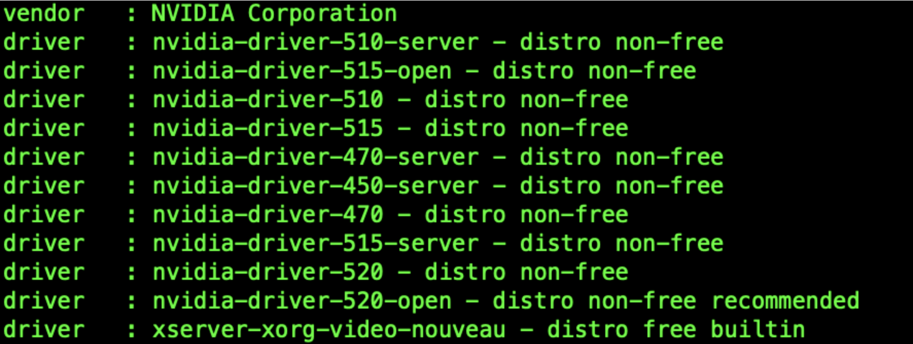
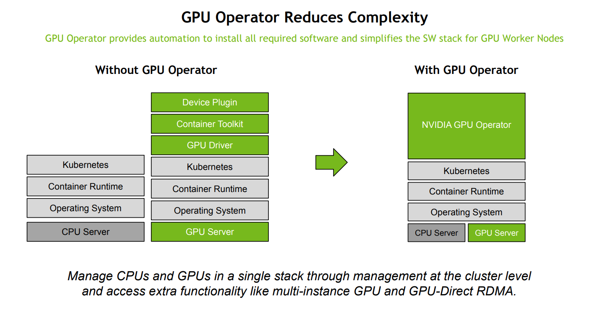
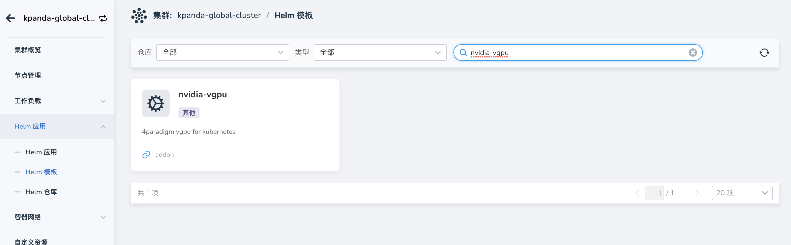

# Nvidia GPU 驱动安装

> 提供了手动安装和使用 gpu-operator 两种安装方式，使用 gpu-operator 安装会简化很多，
> 推荐使用 gpu-operator 模式。

在 K8s 上使用 GPU 需要安装相关的驱动和程序，其中需要涉及到如下几个步骤：

- [ ] 安装 GPU 物理设备驱动
- [ ] 安装 cuda toolkit 工具
- [ ] 修改 container-runtime
- [ ] 安装 device-plugin

### 手动安装

1. 物理设备驱动安装

    - 添加 PPA 镜像源

        ```shell
        add-apt-repository ppa:graphics-drivers/ppa
        apt-get update
        ```

    - 查看可用的驱动版本

        ```shell
        ubuntu-drivers devices
        ```

        

    - 选择合适的版本进行安装

    - 安装建议版本：

        ```shell
        ubuntu-drivers autoinstall
        ```

    - 安装指定版本：

        ```shell
        apt-get install nvidia-driver-XXX
        ```

    - 安装 CUDA

        ```shell
        # https://docs.nvidia.com/cuda/cuda-installation-guide-linux/index.html#ubuntu
        $ apt-get install cuda
        ```

    - 安装完成后重启

        ```shell
        nvidia-smi
        nvcc -V
        ```

    - 查看驱动版本

        ```shell
        $ cat /proc/driver/nvidia/version
        NVRM version: NVIDIA UNIX x86_64 Kernel Module  525.105.17  Tue Mar 28 18:02:59 UTC 2023
        ```

2. 安装 `cuda toolkit`

    - https://github.com/NVIDIA/nvidia-container-toolkit
    - https://docs.nvidia.com/datacenter/cloud-native/container-toolkit/latest/install-guide.html

    - 运行 `nvidia- container-toolkit` 的条件：
        - 操作系统内核版本 > 3.10
        - Docker >= 19.03 或者使用 Containerd.
        - NVIDIA GPU 卡架构在 3.0 版本之上
        - NVIDIA Linux drivers >= 418.81.07
    - 下面以 containerd 来演示如何安装：

        - 设置 nvidia-container-runtime 到 /etc/containerd/config.toml 配置中，然后重启

            ```toml title="/etc/containerd/config.toml"
                [plugins."io.containerd.grpc.v1.cri".containerd]
                default_runtime_name = "nvidia"
                [plugins."io.containerd.grpc.v1.cri".containerd.runtimes]
                [plugins."io.containerd.grpc.v1.cri".containerd.runtimes.runc.options]
                        SystemdCgroup = true
                [plugins."io.containerd.grpc.v1.cri".containerd.runtimes.nvidia]
                    privileged_without_host_devices = false
                    runtime_engine = ""
                    runtime_root = ""
                    runtime_type = "io.containerd.runc.v1"
                    [plugins."io.containerd.grpc.v1.cri".containerd.runtimes.nvidia.options]
                        BinaryName = "/usr/bin/nvidia-container-runtime"
                        SystemdCgroup = true
            ```

        - 设置包仓库 nvidia-container-toolkit

            ```shell
            $ distribution=$(. /etc/os-release;echo $ID$VERSION_ID) && curl -s -L https://nvidia.github.io/libnvidia-container/gpgkey | sudo apt-key add - && curl -s -L https://nvidia.github.io/libnvidia-container/$distribution/libnvidia-container.list | sudo tee /etc/apt/sources.list.d/nvidia-container-toolkit.list
            ```

        - 安装：

            ```shell
            sudo apt-get update && sudo apt-get install -y nvidia-container-toolkit
            ```

3. 安装 device-plugin

    ```shell
    kubectl create -f https://raw.githubusercontent.com/NVIDIA/k8s-device-plugin/v0.14.0/nvidia-device-plugin.yml
    ```

### gpu-operator 安装



GPU Operator 能够在 K8s 基础上进行 GPU 相关底层依赖的的操作，这其中就包括 GPU 驱动、Container ToolKit、
Device Plugin 资源自动上报等等能力，再也不用额外关注驱动这些糟心的事情了，理论上只要 GPU 卡插好，装上 K8s，
然后通过 GPU Operator 就能使用 所有的能力了。

- 检查 GPU 卡正常挂载

    ```shell
    $ lspci | grep -i nvidia
    1b:00.0 VGA compatible controller: NVIDIA Corporation GP102 [TITAN Xp] (rev a1)
    ```

- 确定 kernel 版本（这一步很重要，nvidia driver 镜像版本需要和节点内核版本强一致，包括小版本号）

    > 内核对应的驱动版本是否存在请去如下网站确认：
    > <https://catalog.ngc.nvidia.com/orgs/nvidia/containers/driver/tags>

    ```shell
    $ hostnamectl | grep Kernel
    Kernel: Linux 5.15.0-75-generic
    ```

- GPU Operator 安装

    ```shell
    $ helm repo add nvidia https://helm.ngc.nvidia.com/nvidia && helm repo update
    $ helm install --wait --generate-name \
        -n gpu-operator --create-namespace \
        nvidia/gpu-operator \
        --set driver.version=525-5.15.0-69-generic
    ```

## 安装 vGPU 驱动

上述两个方案安装之后 pod 使用 GPU 时只能使用整卡资源，不能使用 vGPU 功能，如果需要使用 vGPU 需要在
DCE 5.0 容器管理的 Helm 仓库中查找 nvidia-vgpu 模块，并进行安装。


