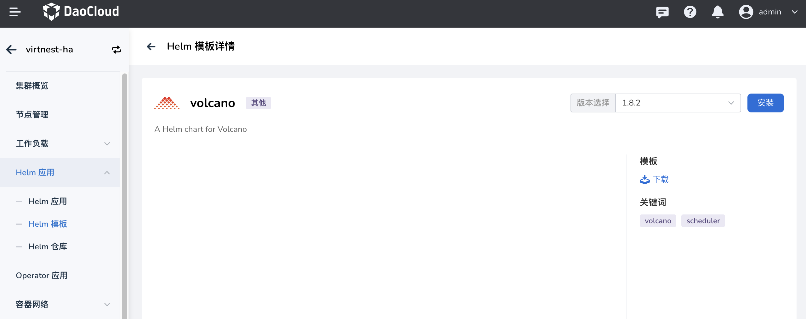

# Volcano 安装和使用

Volcano 是 CNCF 下首个基于 Kubernetes 的容器批处理计算平台，专注于高性能计算场景。
它填补了 Kubernetes 在机器学习、大数据、科学计算等领域缺失的功能，为这些高性能工作负载提供了必要的支持。

Volcano 与主流计算框架无缝对接，如 Spark、TensorFlow、PyTorch 等，并支持异构设备的混合调度，包括 CPU 和 GPU。

本文介绍如何安装和使用 Volcano。

## 安装 Volcano

1. 在 **集群详情** -> **Helm 应用** -> **Helm 模板** 中找到 Volcano 并安装。

    
   
    

2. 检查并确认 Volcano 是否安装完成，即 volcano-admission、volcano-controllers、volcano-scheduler 组件是否正常运行。

    

## Volcano 使用场景

### 使用 Volcano 调度 Job 资源

- Volcano 是单独的调度器，在创建工作负载的时候指定调度器的名称（schedulerName: volcano）。
- volcanoJob 资源是 Volcano 对 Job 的扩展，它将 job 拆分成更小的工作单位 task，这些 task 之间可以相互作用。

使用示例：

```yaml
apiVersion: batch.volcano.sh/v1alpha1
kind: Job
metadata:
  name: nginx-job
spec:
  minAvailable: 2
  schedulerName: volcano
  tasks:
    - replicas: 1
      name: master
      template:
        spec:
          containers:
            - image: docker.m.daocloud.io/library/nginx:latest
              name: mpimaster
    - replicas: 2
      name: worker
      template:
        spec:
          containers:
            - image: docker.m.daocloud.io/library/nginx:latest
              name: mpiworker
```

### 并行计算 mpi

使用示例：

```yaml
apiVersion: batch.volcano.sh/v1alpha1
kind: Job
metadata:
  name: lm-mpi-job
  labels:
    "volcano.sh/job-type": "MPI" # (1)!
spec:
  minAvailable: 4
  schedulerName: volcano
  plugins:
    ssh: [] # (2)!
    svc: [] # (3)!
  policies:
    - event: PodEvicted
      action: RestartJob
  tasks:
    - replicas: 1
      name: mpimaster
      policies:
        - event: TaskCompleted
          action: CompleteJob
      template:
        spec:
          containers:
            - command:
                - /bin/sh
                - -c
                - |
                  MPI_HOST=`cat /etc/volcano/mpiworker.host | tr "\n" ","`;
                  mkdir -p /var/run/sshd; /usr/sbin/sshd;
                  mpiexec --allow-run-as-root --host ${MPI_HOST} -np 3 mpi_hello_world;
              image: docker.m.daocloud.io/volcanosh/example-mpi:0.0.1
              name: mpimaster
              ports:
                - containerPort: 22
                  name: mpijob-port
              workingDir: /home
              resources:
                requests:
                  cpu: "500m"
                limits:
                  cpu: "500m"
          restartPolicy: OnFailure
          imagePullSecrets:
            - name: default-secret
    - replicas: 3
      name: mpiworker
      template:
        spec:
          containers:
            - command:
                - /bin/sh
                - -c
                - |
                  mkdir -p /var/run/sshd; /usr/sbin/sshd -D;
              image: docker.m.daocloud.io/volcanosh/example-mpi:0.0.1
              name: mpiworker
              ports:
                - containerPort: 22
                  name: mpijob-port
              workingDir: /home
              resources:
                requests:
                  cpu: "1000m"
                limits:
                  cpu: "1000m"
          restartPolicy: OnFailure
          imagePullSecrets:
            - name: default-secret
```

1. Volcano 原生支持 MPI 的调度作业
2. Volcano 插件，master 和 worker 之间可以免密登录
3. master 和 worker 之间通过网络访问，自动创建 headless svc 资源

### Volcano 支持 TensorFlow

使用示例：

```yaml
apiVersion: batch.volcano.sh/v1alpha1
kind: Job
metadata:
  name: tensorflow-benchmark
  labels:
    "volcano.sh/job-type": "Tensorflow" # (1)!
spec:
  minAvailable: 3
  schedulerName: volcano
  plugins:
    env: []
    svc: []
  policies:
    - event: PodEvicted
      action: RestartJob
  tasks:
    - replicas: 1
      name: ps
      template:
        spec:
          imagePullSecrets:
            - name: default-secret
          containers:
            - command:
                - sh
                - -c
                - |
                  PS_HOST=`cat /etc/volcano/ps.host | sed 's/$/&:2222/g' | tr "\n" ","`;
                  WORKER_HOST=`cat /etc/volcano/worker.host | sed 's/$/&:2222/g' | tr "\n" ","`;
                  python tf_cnn_benchmarks.py --batch_size=32 --model=resnet50 --variable_update=parameter_server --flush_stdout=true --num_gpus=1 --local_parameter_device=cpu --device=cpu --data_format=NHWC --job_name=ps --task_index=${VK_TASK_INDEX} --ps_hosts=${PS_HOST} --worker_hosts=${WORKER_HOST}
              image: docker.m.daocloud.io/volcanosh/example-tf:0.0.1
              name: tensorflow
              ports:
                - containerPort: 2222
                  name: tfjob-port
              resources:
                requests:
                  cpu: "1000m"
                  memory: "2048Mi"
                limits:
                  cpu: "1000m"
                  memory: "2048Mi"
              workingDir: /opt/tf-benchmarks/scripts/tf_cnn_benchmarks
          restartPolicy: OnFailure
    - replicas: 2
      name: worker
      policies:
        - event: TaskCompleted
          action: CompleteJob
      template:
        spec:
          imagePullSecrets:
            - name: default-secret
          containers:
            - command:
                - sh
                - -c
                - |
                  PS_HOST=`cat /etc/volcano/ps.host | sed 's/$/&:2222/g' | tr "\n" ","`;
                  WORKER_HOST=`cat /etc/volcano/worker.host | sed 's/$/&:2222/g' | tr "\n" ","`;
                  python tf_cnn_benchmarks.py --batch_size=32 --model=resnet50 --variable_update=parameter_server --flush_stdout=true --num_gpus=1 --local_parameter_device=cpu --device=cpu --data_format=NHWC --job_name=worker --task_index=${VK_TASK_INDEX} --ps_hosts=${PS_HOST} --worker_hosts=${WORKER_HOST}
              image: docker.m.daocloud.io/volcanosh/example-tf:0.0.1
              name: tensorflow
              ports:
                - containerPort: 2222
                  name: tfjob-port
              resources:
                requests:
                  cpu: "2000m"
                  memory: "2048Mi"
                limits:
                  cpu: "2000m"
                  memory: "4096Mi"
              workingDir: /opt/tf-benchmarks/scripts/tf_cnn_benchmarks
          restartPolicy: OnFailure
```

1. Volcano 原生支持 tensorflow 的调度作业

如果您想了解 Volcano 更多功能特性和使用场景，可以参考 [Volcano 介绍](https://volcano.sh/zh/docs/)。
