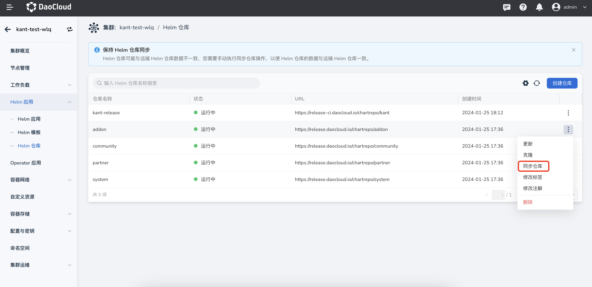

---
hide:
  - toc
---

# 上传 Helm 模板

本文介绍如何上传 Helm 模板，操作步骤见下文。

1. 引入 Helm 仓库，操作步骤参考[引入第三方 Helm 仓库](./helm-repo.md)。

2. 上传 Helm Chart 到 Helm 仓库。

    === "客户端上传"

        !!! note

            此方式适用于 Harbor、ChartMuseum、JFrog 类型仓库。

        1. 登录一个可以访问到 Helm 仓库的节点，将 Helm 二进制文件上传到节点，并安装 cm-push 插件。

            安装插件流程参考[安装 cm-push 插件](https://github.com/chartmuseum/helm-push)。

        2. 推送 Helm Chart 到 Helm 仓库，执行如下命令；

            ```shell
            helm cm-push ${charts-dir} ${HELM_REPO_URL} --username ${username} --password ${password}
            ```

            字段说明：

            - `charts-dir`：Helm Chart 的目录，这里也可以直接推送打包好的 Chart（即 .tgz 文件）。
            - `HELM_REPO_URL`：Helm 仓库的 URL。
            - `username`/`password`：有推送权限的 Helm 仓库用户名和密码。
            - 如果采用 https 访问，需要参加参数 `--insecure`

    === "页面上传"

        !!! note

            此方式仅适用于 Harbor 类型仓库。

        1. 登录网页 Harbor 仓库，请确保登录用户有推送权限；

        2. 进入到对应项目，选择 __Helm Charts__ 页签，点击页面 __上传__ 按钮，完成 Helm Chart 上传。

            

3. 同步远端仓库数据

    如果集群设置未开启 __Helm 仓库自动刷新__ 设置，需要执行手动同步操作，大致步骤为：

    进入 __Helm 应用__ -> __Helm 仓库__ ，点击对应仓库列表右侧操作按钮 __同步仓库__ ，完成仓库数据同步。

    
