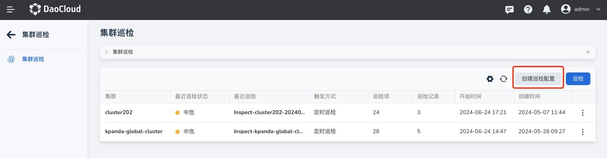
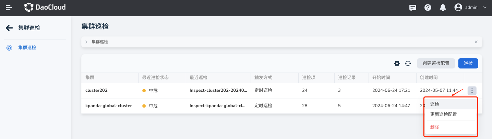

---
hide:
  - toc
---

# 创建巡检配置

DCE 5.0 容器管理模块提供集群巡检功能，支持从集群维度、节点维度、容器组维度进行巡检。

- 集群维度：检查集群中系统组件的运行情况，包括集群状态、资源使用情况，以及控制节点特有的巡检项等，例如 __kube-apiserver__ 和 __etcd__ 的状态。
- 节点维度：包括控制节点和工作节点通用的检查项，例如节点资源使用情况、句柄数、PID 状态、网络状态。
- 容器组维度：检查 Pod 的 CPU 和内存使用情况、运行状态、PV 和 PVC 的状态等。

下面介绍如何创建巡检配置。

## 前提条件

- 在容器管理模块中[接入](../clusters/integrate-cluster.md)或[创建集群](../clusters/create-cluster.md)
- 所选集群处于 __运行中__ 状态且已经在集群中[安装了 insight 组件](../../../insight/quickstart/install/install-agent.md)

## 操作步骤

1. 在左侧导航栏点击 __集群巡检__ 。

    

2. 在页面右侧点击 __巡检配置__ 。

    

3. 参考以下说明填写巡检配置，然后在页面底部点击 __确定__ 即可。

    - 集群：下拉选择要对哪些集群进行巡检。**如果选择多个集群，则自动生成多个巡检配置（仅巡检的集群不一致，其他配置都完全一致）**
    - 定时巡检：启用后可根据事先设置的巡检频率定期自动执行集群巡检
    - 巡检频率：设置自动巡检的周期，例如每周二上午十点。支持自定义 CronExpression，可参考 [Cron 时间表语法](https://kubernetes.io/zh-cn/docs/concepts/workloads/controllers/cron-jobs/#cron-schedule-syntax)
    - 巡检记录保留条数：累计最多保留多少条巡检记录，包括所有集群的巡检记录
    - 参数配置：参数配置分为集群维度、节点维度、容器组维度三部分，可以根据场景需求启用或禁用某些巡检项。

        

巡检配置创建完成后，会自动显示在巡检配置列表中。在配置右侧点击更多操作按钮可以立即执行巡检、修改巡检配置、删除巡检配置和巡检记录。

- 点击 __巡检__ 可以根据该配置立即执行一次巡检。
- 点击 __巡检配置__ 可以修改巡检配置。
- 点击 __删除__ 可以删除该巡检配置和历史的巡检记录

    

!!! note

    - 巡检配置创建完成后，如果启用了 __定时巡检__ 配置，则会在指定时间自动执行巡检。
    - 如未启用 __定时巡检__ 配置，则需要手动[触发巡检](inspect.md)。
