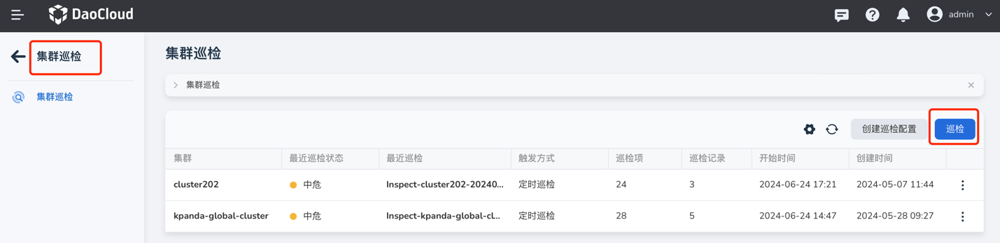
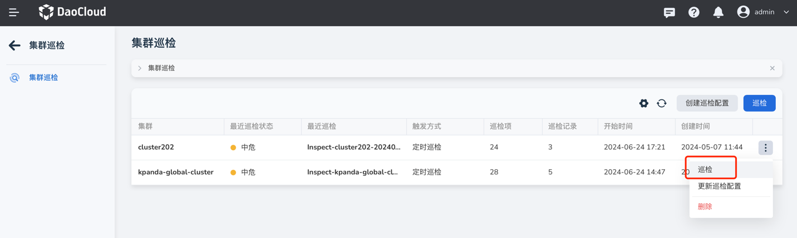

---
hide:
  - toc
---

# 执行集群巡检

巡检配置创建完成后，如果启用了 __定时巡检__ 配置，则会在指定时间自动执行巡检。如未启用 __定时巡检__ 配置，则需要手动触发巡检。

此页介绍如何手动执行集群巡检。

## 前提条件

- 在容器管理模块中[接入](../clusters/integrate-cluster.md)或[创建集群](../clusters/create-cluster.md)
- 已[创建巡检配置](config.md)
- 所选集群处于 __运行中__ 状态且已经在集群中[安装了 insight 组件](../../../insight/quickstart/install/install-agent.md)

## 操作步骤

执行巡检时，支持勾选多个集群进行批量巡检，或者仅对某一个集群进行单独巡检。

=== "批量巡检"

    1. 在容器管理模块的一级导航栏点击 __集群巡检__ ，然后在页面右侧点击 __巡检__ 。
    
        
    
    2. 勾选需要巡检的集群，然后在页面底部点击 __确定__ 即可。
      
        - 若选择多个集群进行同时巡检，系统将根据不同集群的巡检配置进行巡检。
        - 如未设置集群巡检配置，将使用系统默认配置。

            

=== "单独巡检"

    1. 进入集群巡检页面。
    2. 在对应巡检配置的右侧点击 __ⵗ__ 更多操作按钮，然后在弹出的菜单中选择 __巡检__ 即可。
    
        
