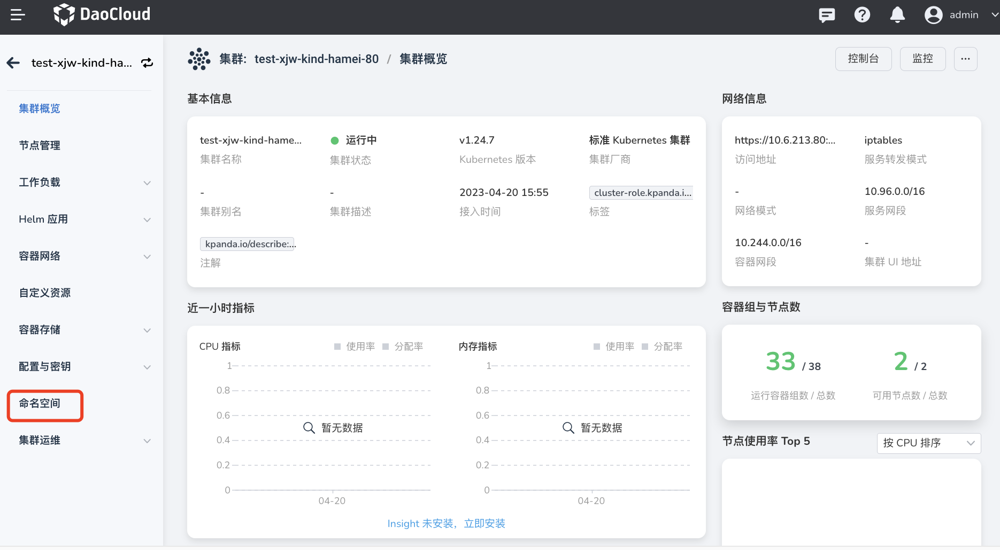
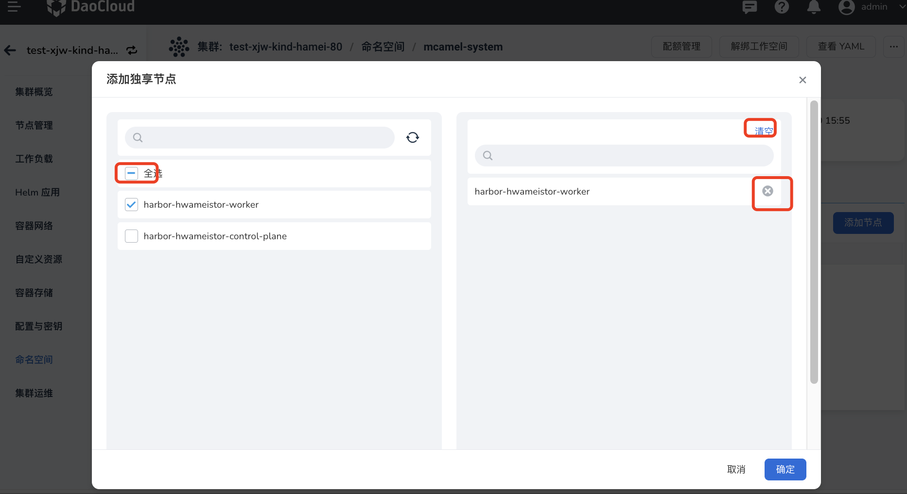
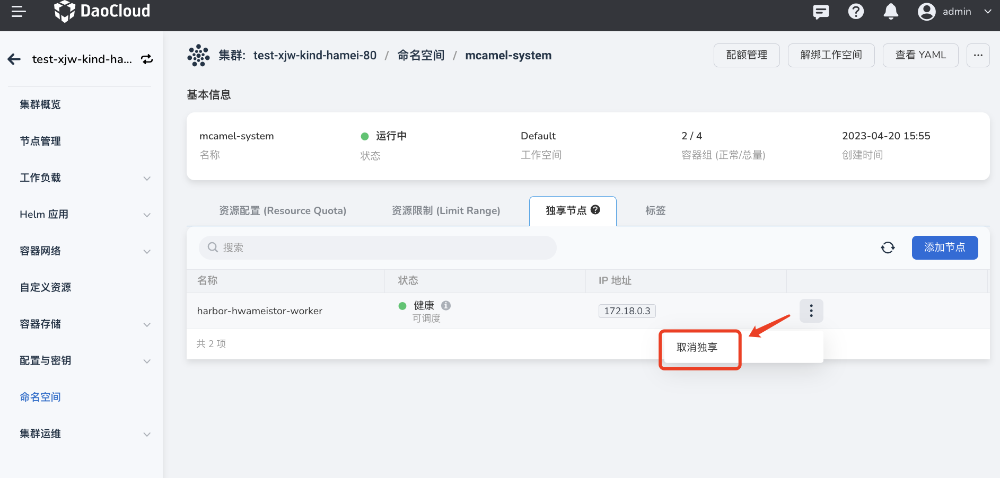

# 命名空间独享节点

命名空间独享节点指，通过为节点设置污点并为命名空间设置污点容忍，实现只有该命名空间下的 Pod 才能部署到设置了对应污点的节点。这样的节点称之为该命名空间的独享节点。使用独享节点可以让重要应用独享一部分计算资源，从而和其他应用实现物理隔离。

为命名空间设置独享节点的步骤如下：

1. 在集群列表页面点击集群名称，然后在左侧导航栏点击`命名空间`。

    

2. 点击命名空间名称，然后点击`独享节点` 页签，在下方右侧点击`添加节点`。

    

3. 在页面左侧选择让该命名空间独享哪些节点，在右侧可以清空或删除某个已选节点，最后在底部点击`确定`。

    

4. 可以在列表中查看此命名空间的已有的独享节点，在节点右侧可以选择`取消独享`。

    > 取消独享之后，其他命名空间下的 Pod 也可以被调度到该节点上。

    