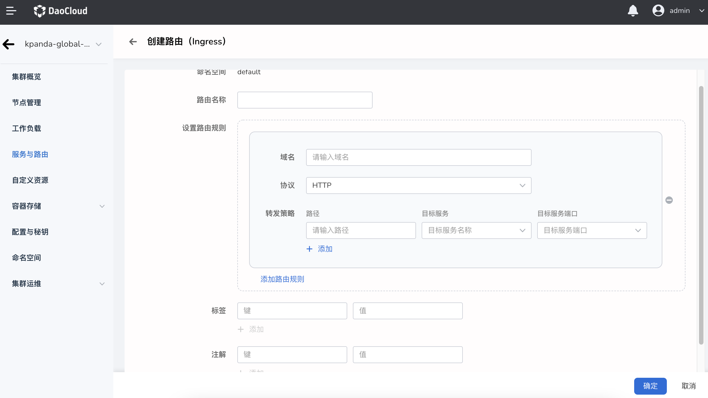

# 创建路由（Ingress）

在 Kubernetes 集群中，[Ingress](https://kubernetes.io/docs/reference/generated/kubernetes-api/v1.24/#ingress-v1beta1-networking-k8s-io) 公开从集群外部到集群内服务的 HTTP 和 HTTPS 路由。
流量路由由 Ingress 资源上定义的规则控制。下面是一个将所有流量都发送到同一 Service 的简单 Ingress 示例：

Ingress 是对集群中服务的外部访问进行管理的 API 对象，典型的访问方式是 HTTP。Ingress 可以提供负载均衡、SSL 终结和基于名称的虚拟托管。

## 前提条件

- 容器管理模块[已接入 Kubernetes 集群](../clusters/integrate-cluster.md)或者[已创建 Kubernetes](../clusters/create-cluster.md)，且能够访问集群的 UI 界面。
- 已完成一个[命名空间的创建](../namespaces/createns.md)、[用户的创建](../../../ghippo/user-guide/access-control/user.md)，并将用户授权为 [`NS Edit`](../permissions/permission-brief.md#ns-edit) 角色 ，详情可参考[命名空间授权](../permissions/cluster-ns-auth.md)。
- 已经完成 [Ingress 实例的创建](../../../network/modules/ingress-nginx/install.md)，已[部署应用工作负载](../workloads/create-deployment.md)，并且已[创建对应 Service](create-services.md)
- 单个实例中有多个容器时，请确保容器使用的端口不冲突，否则部署会失效。

## 创建路由

1. 以 `NS Edit` 用户成功登录后，点击左上角的`集群列表`进入`集群列表`页面。在集群列表中，点击一个集群名称。

    

2. 在左侧导航栏中，点击`容器网络`->`路由`进入服务列表，点击右上角`创建路由`按钮。

    

    !!! note

        也可以通过 `YAML 创建`一个路由。

3. 打开`创建路由`页面，进行配置。可选择两种协议类型，参考以下两个参数表进行配置。

### 创建 HTTP 协议路由

  输入如下参数：
  
  
- `路由名称`:必填，输入新建路由的名称。
- `命名空间`：必填，选择新建服务所在的命名空间。关于命名空间更多信息请参考命名空间概述。
- `设置路由规则`：
  - `域名`：必填，使用域名对外提供访问服务。默认为集群的域名。
  - `协议`：必填，指授权入站到达集群服务的协议，支持 HTTP （不需要身份认证）或 HTTPS（需需要配置身份认证） 协议。这里选择 HTTP 协议的路由。
  - `转发策略`:选填，指定 Ingress 的访问策略。`路径`：指定服务访问的URL路径，默认为根路径；`目标服务`：进行路由的服务名称；`目标服务端口`：服务对外暴露的端口。
- `负载均衡器类型`:必填，[Ingress 实例的使用范围](../../../network/modules/ingress-nginx/scope.md)
  - `平台级负载均衡器`：同一个集群内，共享同一个 Ingress 实例，其中 Pod 都可以接收到由该负载均衡分发的请求。
  - `租户级负载均衡器`：租户负载均衡器，Ingress 实例独属于当前命名空，或者独属于某一工作空间，并且设置的工作空间中包含当前命名空间，其中 Pod 都可以接收到由该负载均衡分发的请求。
- `Ingress Class`:选填，选择对应的 Ingress 实例，选择后将流量导入到指定的 Ingress 实例。
  - 为 None 时使用默认的 DefaultClass，请在创建 Ingress 实例时设置 DefaultClass，更多信息，请参考 [Ingress Class](../../../network/modules/ingress-nginx/ingressclass.md)。
  - 若选择其他实例（如`ngnix`），则会出现高级配置，可设置`会话保持`，`路径重写`，`重定向`，和`流量分发`。
- `会话保持`：选填，会话保持分为 三种类型：`L4 源地址哈希`，`Cookie Key` ，`L7 Header Name`,开启后根据对应规则进行会话保持。
  - `L4 源地址哈希`: :开启后默认在 Annotation 中加入如下标签：nginx.ingress.kubernetes.io/upstream-hash-by: "$binary_remote_addr"
  - `Cookie Key` ：开启后来自特定客户端的连接将传递至相同 Pod，开启后 默认在 Annotation 中增加如下参数：nginx.ingress.kubernetes.io/affinity: "cookie"。nginx.ingress.kubernetes.io/affinity-mode: persistent
  - `L7 Header Name`:开启后默认在 Annotation 中加入如下标签：nginx.ingress.kubernetes.io/upstream-hash-by: "$http_x_forwarded_for"
- `路径重写`:选填，`rewrite-target`，某些场景中后端服务暴露的URL与Ingress规则中指定的路径不同，如果不进行URL重写配置，访问会出现错误。
- `重定向`：选填，`permanent-redirect`，永久重定向，输入重写路径后，访问路径重定向至设置的地址。
- `流量分发`：选填，开启后并设置后，根据设定条件进行流量分发。
  - `基于权重`：设定权重后，在创建的 Ingress 添加如下：Annotation:`nginx.ingress.kubernetes.io/canary-weight: "10"`。
  - `基于 Cookie`：设定 Cookie 规则后，流量根据设定的 Cookie 条件进行流量分发。
  - `基于 Header`： 设定 Header 规则后，流量根据设定的 Header 条件进行流量分发。
- `标签`：选填，为路由添加标签。
- `注解`：选填，为路由添加注解。
### 创建 HTTPS 协议路由

  输入如下参数：
  

   !!! note

        注意：与 HTTP 协议`设置路由规则`不同，增加密钥选择证书，其他基本一致。

- `协议`:必填指授权入站到达集群服务的协议，支持 HTTP （不需要身份认证）或 HTTPS（需需要配置身份认证） 协议。这里选择 HTTPS 协议的路由。
- `密钥`：必填，Https TLS 证书，[创建秘钥](../configmaps-secrets/create-secret.md)。

### 完成路由创建

配置完所有参数后，点击`确定`按钮，自动返回路由列表。在列表右侧，点击 `︙`，可以修改或删除所选路由。

