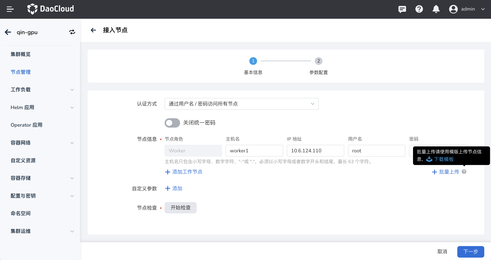

---
hide:
  - toc
---

# 集群节点扩容

随着业务应用不断增长，集群资源日趋紧张，这时可以基于 kubean 对集群节点进行扩容。扩容后，应用可以运行在新增的节点上，缓解资源压力。

只有通过容器管理模块[创建的集群](../clusters/create-cluster.md)才支持节点扩缩容，从外部接入的集群不支持此操作。本文主要介绍同种架构下工作集群的 **工作节点** 扩容。

1. 在 __集群列表__ 页面点击目标集群的名称。

    若 __集群角色__ 中带有 __接入集群__ 的标签，则说明该集群不支持节点扩缩容。

    

2. 在左侧导航栏点击 __节点管理__ ，然后在页面右上角点击 __接入节点__ 。

    

3. 填写接入节点的基本信息，然后在在页面底部点击 __节点检查__ ，检查通过后点击 __下一步__ 。如果检查未通过，则更新 __节点信息__ 并再次执行检查。
    
    - 认证方式：选择通过用户名/密码还是公私钥访问节点。

        > 如果使用公私钥方式访问节点，需要预先配置节点的 SSH 密钥。参阅[使用 SSH 密钥认证节点](../nodes/node-authentication.md)。

    - 使用统一的密码：开启后集群中所有节点的访问密码都相同，需要在下方输入访问所有节点的统一密码。如果关闭，则可以为每个节点设置单独的用户名和密码。
    - 节点信息：填写主机名、IP地址、用户名和密码。
    - 批量上传：下载提供的 CSV 模板（包含字段：主机名、IP地址、用户名、密码、节点角色），填写需要接入的节点信息，上传后新节点信息将自动添加到列表末尾。

    

4. 填写参数配置信息，并点击 __确定__ 。

    - __kubelet_max_pods__ ：设置每个节点的最大 Pod 数量，默认为 110 个。
    - __override_system_hostname__ ：重置主机名，采用系统默认生成的名称作为主机名称，建议您关闭此选项。
    - __Insecure_registries__ ：私有镜像仓库配置。使用私有镜像仓库创建集群时，为了避免证书问题导致容器引擎拒绝访问，需要在这里填写私有镜像仓库地址，以绕过容器引擎的证书认证而获取镜像。
    - __os_package_repos__ ：填写操作系统软件包仓库地址，请根据实际情况填写。
    - __enable_node_sysctl_tuning__ ：节点内核参数调优，通过调整系统内核参数来提高系统的稳定性、可靠性、安全性和性能。

    

!!! note

    接入节点大约需要 20 分钟，请您耐心等待。

## 参考文档

- [对工作集群的控制节点扩容](../../best-practice/add-master-node.md)
- [为工作集群添加异构节点](../../best-practice/multi-arch.md)
- [为全局服务集群的工作节点扩容](../../best-practice/add-worker-node-on-global.md)
- [替换工作集群的首个控制节点](../../best-practice/replace-first-master-node.md)
