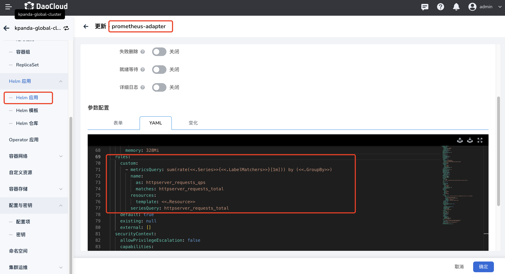

# 基于自定义指标创建 HPA

当系统内置的 CPU 和内存两种指标不能满足您业务的实际需求时，您可以通过配置 ServiceMonitoring 来添加自定义指标，
并基于自定义指标实现弹性伸缩。本文将介绍如何为工作负载配置基于自定义指标进行弹性伸缩。

!!! note

    1. HPA 仅适用于 Deployment 和 StatefulSet，每个工作负载只能创建一个 HPA。
    2. 如果同时使用内置指标和多种自定义指，HPA 会根据多项指标分别计算所需伸缩副本数，取较大值（但不会超过设置 HPA 策略时配置的最大副本数）进行弹性伸缩。

## 前提条件

在为工作负载配置自定义指标弹性伸缩策略之前，需要满足以下前提条件：

- [已接入 Kubernetes 集群](../clusters/integrate-cluster.md)或者[已创建 Kubernetes 集群](../clusters/create-cluster.md)，
  且能够访问集群的 UI 界面
- 已完成一个[命名空间的创建](../namespaces/createns.md)、[无状态工作负载的创建](../workloads/create-deployment.md)或[有状态工作负载的创建](../workloads/create-statefulset.md)
- 当前操作用户应具有 [NS Editor](../permissions/permission-brief.md#ns-editor) 或更高权限，
  详情可参考[命名空间授权](../namespaces/createns.md)
- 已安装 [metrics-server 插件](install-metrics-server.md)
- 已安装 [insight-agent 插件](../../../insight/quickstart/install/install-agent.md)
- 已安装 Prometheus-adapter 插件

## 操作步骤

参考以下步骤，为工作负载配置指标弹性伸缩策略。

1. 点击左侧导航栏上的 __集群列表__ 进入集群列表页面。点击一个集群名称，进入 __集群详情__ 页面。

    

2. 在集群详情页面，点击左侧导航栏的 __工作负载__ 进入工作负载列表后，点击一个负载名称，进入 __工作负载详情__ 页面。

    

3. 点击 __弹性伸缩__ 页签，查看当前集群的弹性伸缩配置情况。

    

4. 确认集群已[安装了 __metrics-server__ ](install-metrics-server.md)、Insight、Prometheus-adapter 插件且插件运行状态为正常后，即可点击 __新建伸缩__ 按钮。

    !!! note

        如果相关插件未安装或插件处于异常状态，您在页面上将无法看见创建自定义指标弹性伸缩入口。

    

5. 创建自定义指标弹性伸缩策略参数。

    

    - 策略名称：输入弹性伸缩策略的名称，请注意名称最长 63 个字符，只能包含小写字母、数字及分隔符（“-”），且必须以小写字母或数字开头及结尾，例如 hpa-my-dep。
    - 命名空间：负载所在的命名空间。
    - 工作负载：执行弹性伸缩的工作负载对象。
    - 资源类型：进行监控的自定义指标类型，包含 Pod 和 Service 两种类型。
    - 指标：使用 ServiceMonitoring 创建的自定义指标名称或系统内置的自定义指标名称。
    - 数据类型：用于计算指标值的方法，包含目标值和目标平均值两种类型，当资源类型为 Pod 时，只支持使用目标平均值。

## 操作示例

本案例以 Golang 业务程序为例，该示例程序暴露了 `httpserver_requests_total` 指标，并记录 HTTP 的请求，通过该指标可以计算出业务程序的 QPS 值。

### 部署业务程序

使用 Deployment 部署业务程序：

```yaml
apiVersion: apps/v1
kind: Deployment
metadata:
  name: httpserver
  namespace: httpserver
spec:
  replicas: 1
  selector:
    matchLabels:
      app: httpserver
  template:
    metadata:
      labels:
        app: httpserver
    spec:
      containers:
      - name: httpserver
        image: registry.imroc.cc/test/httpserver:custom-metrics
        imagePullPolicy: Always
---

apiVersion: v1
kind: Service
metadata:
  name: httpserver
  namespace: httpserver
  labels:
    app: httpserver
  annotations:
    prometheus.io/scrape: "true"
    prometheus.io/path: "/metrics"
    prometheus.io/port: "http"
spec:
  type: ClusterIP
  ports:
  - port: 80
    protocol: TCP
    name: http
  selector:
    app: httpserver
```

### Prometheus 采集业务监控

若已安装 insight-agent，可以通过创建 ServiceMonitor 的 CRD 对象配置 Prometheus。

操作步骤：在 **集群详情** -> **自定义资源** 搜索“servicemonitors.monitoring.coreos.com"，点击名称进入详情。
通过创建 YAML，在命名空间 **httpserver** 下创建如下示例的 CRD：

```yaml
apiVersion: monitoring.coreos.com/v1
kind: ServiceMonitor
metadata:
  name: httpserver
  namespace: httpserver
  labels:
    operator.insight.io/managed-by: insight
spec:
  endpoints:
  - port: http
    interval: 5s
  namespaceSelector:
    matchNames:
    - httpserver
  selector:
    matchLabels:
      app: httpserver
```


!!! note

    若通过 insight 安装 Prometheus，则 serviceMonitor 上必须打上 `operator.insight.io/managed-by: insight`
    这个 label，通过其他方式安装则无需此 label。

### 在 prometheus-adapter 中配置指标规则

操作步骤：在 **集群详情** -> **Helm 应用** 搜索 “prometheus-adapter"，通过操作栏进入更新页面，在 YAML 中配置自定义指标，示例如下：

```yaml
rules:
  custom:
    - metricsQuery: sum(rate(<<.Series>>{<<.LabelMatchers>>}[1m])) by (<<.GroupBy>>)
      name:
        as: httpserver_requests_qps
      matches: httpserver_requests_total
resources:
  seriesQuery: httpserver_requests_total
  template: <<.Resource>>
```



### 创建自定义指标弹性伸缩策略参数

按照上述步骤在 Deployment 中找到应用程序 httpserver 并通过自定义指标创建弹性伸缩。


