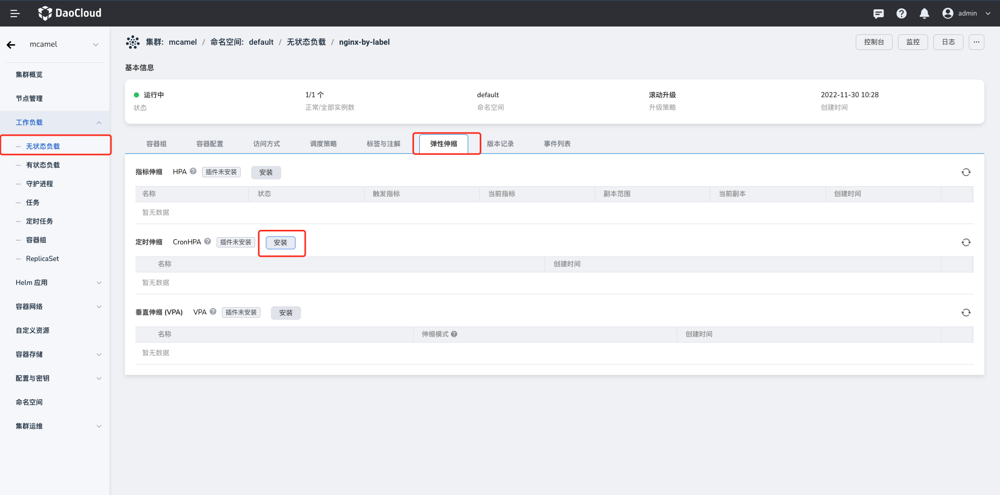

# 安装 kubernetes-cronhpa-controller 插件

容器副本定时水平扩缩容策略（CronHPA）能够为周期性高并发应用提供稳定的计算资源保障，`kubernetes-cronhpa-controller` 则是实现 CronHPA 的关键组件。

本节介绍如何安装 `kubernetes-cronhpa-controller` 插件。

!!! note

    为了使用 CornHPA，不仅需要安装 `kubernetes-cronhpa-controller` 插件，还要[安装 `metrics-server` 插件](install-metrics-server.md)。

## 前提条件

安装 `kubernetes-cronhpa-controller` 插件之前，需要满足以下前提条件：

- 在[容器管理](../../intro/index.md)模块中[接入 Kubernetes 集群](../clusters/integrate-cluster.md)或者[创建 Kubernetes 集群](../clusters/create-cluster.md)，且能够访问集群的 UI 界面。

- 创建一个[命名空间](../namespaces/createns.md)。

- 当前操作用户应具有 [`NS Edit`](../permissions/permission-brief.md#ns-edit) 或更高权限，详情可参考[命名空间授权](../namespaces/createns.md)。

## 操作步骤

参考如下步骤为集群安装 `kubernetes-cronhpa-controller` 插件。

1. 在`集群列表`页面找到需要安装此插件的目标集群，点击该集群的名称，然后在左侧点击`工作负载` -> `无状态工作负载`，点击目标工作负载的名称。

2. 在工作负载详情页面，点击`弹性伸缩`页签，在 `CronHPA` 右侧点击 `安装`。

    

3. 阅读该插件的相关介绍，选择版本后点击`安装`按钮。推荐安装 `1.3.0` 或更高版本。

    

4. 参考以下说明配置参数。

    

    - 名称：输入插件名称，请注意名称最长 63 个字符，只能包含小写字母、数字及分隔符（“-”），且必须以小写字母或数字开头及结尾，例如 kubernetes-cronhpa-controller。
    - 命名空间：选择将插件安装在哪个命名空间，此处以 `default` 为例。
    - 版本：插件的版本，此处以 `1.3.0` 版本为例。
    - 就绪等待：启用后，将等待应用下的所有关联资源都处于就绪状态，才会标记应用安装成功。
    - 失败删除：如果插件安装失败，则删除已经安装的关联资源。开启后，将默认同步开启`就绪等待`。
    - 详情日志：开启后，将记录安装过程的详细日志。

    !!! note

        开启`就绪等待`和/或`失败删除`后，应用需要较长时间才会被标记为“运行中”状态。

5. 在页面右下角点击`确定`，系统将自动跳转至 `Helm 应用`列表页面。稍等几分钟后刷新页面作，即可看到刚刚安装的应用。

    !!! warning

    如需删除 `kubernetes-cronhpa-controller` 插件，应在 `Helm 应用`列表页面才能将其彻底删除。

    如果在工作负载的`弹性伸缩`页签下删除插件，这只是删除了该插件的工作负载副本，插件本身仍未删除，后续重新安装该插件时也会提示错误。

6. 回到工作负载详情页面下的`弹性伸缩`页签，可以看到界面显示 `插件已安装`。现在可以开始创建 CronHPA 策略了。

    
