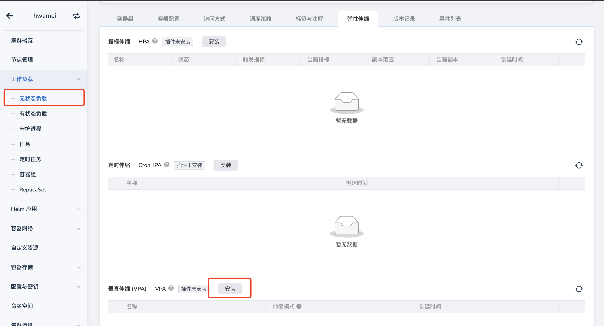
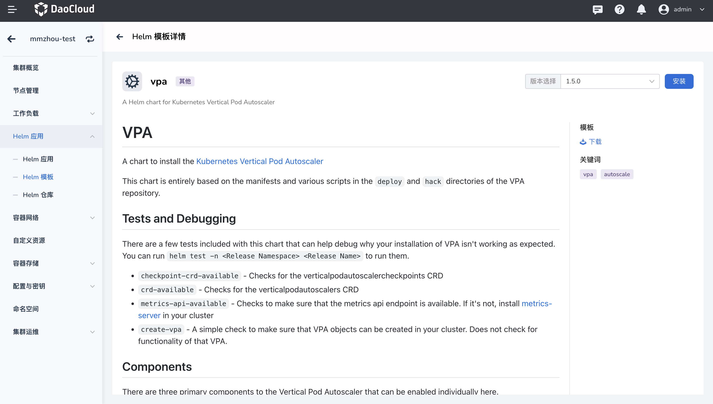
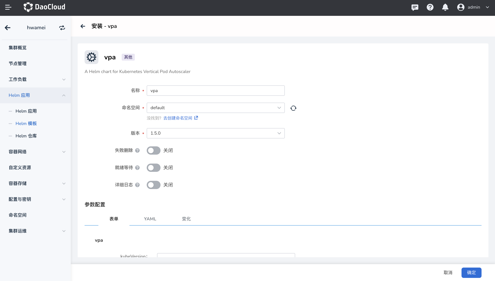
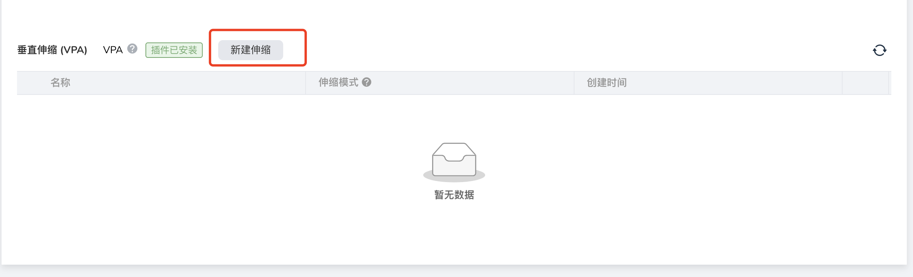

# 安装 vpa 插件

`vpa` 是用于实现容器垂直扩缩容策略（Vertical Pod Autoscaler）的关键组件。
通过使用垂直伸缩策略，能够让集群的资源配置更加合理，避免集群资源浪费。

本节介绍如何安装 `vpa` 插件。

!!! note

    使用容器的垂直伸缩策略（VPA），除了需要安装 `vpa` 插件，还需要安装 `metrics-server`插件。

## 前提条件

安装 `vpa` 插件前，需要满足以下前提条件：

- 容器管理模块[已接入 Kubernetes 集群](../clusters/integrate-cluster.md)或者[已创建 Kubernetes 集群](../clusters/create-cluster.md)，且能够访问集群的 UI 界面。

- 已完成一个[命名空间的创建](../namespaces/createns.md)。

- 当前操作用户应具有 [`NS Edit`](../permissions/permission-brief.md#ns-edit) 或更高权限，详情可参考[命名空间授权](../namespaces/createns.md)。

## 操作步骤

请执行如下步骤为集群安装 `vpa` 插件。

1. 在工作负载详情下的弹性伸缩页面，点击 `安装` 按钮，进入 `vpa` 插件安装界面。

    

2. 阅读 `vap` 插件相关介绍，选择版本后点击`安装`按钮。本文将以 `1.5.0` 版本为例进行安装，推荐您安装 `1.5.0` 及更高版本。

    

3. 在安装配置界面配置基本参数。

    

    - 名称：输入插件名称，请注意名称最长 63 个字符，只能包含小写字母、数字及分隔符（“-”）,且必须以小写字母或数字开头及结尾，例如 vpa。
    - 命名空间：选择插件安装的命名空间，此处以 `default` 为例。
    - 版本：插件的版本，此处以 `1.5.0` 版本为例。
    - 就绪等待：启用后，将等待应用下所有关联资源处于就绪状态，才会标记应用安装成功。
    - 失败删除：开启后，将默认同步开启就绪等待。如果安装失败，将删除安装相关资源。
    - 详情日志：开启安装过程日志的详细输出。

    !!! note

        开启`就绪等待`和/或`失败删除`后，应用需要经过较长时间才会被标记为“运行中”状态。

5. 点击`确定`按钮，完成 `vpa` 插件的安装，之后系统将自动跳转至 `Helm 应用`列表页面，稍等几分钟后，为页面执行刷新操作，即可看到刚刚安装的应用。

    !!! note

    删除 `vpa` 插件时，在 `Helm 应用`列表页面才能彻底删除该插件。如果仅在工作负载页面删除 `vpa`，这只是删除了该应用的工作负载副本，应用本身仍未删除，后续重新安装该插件时也会提示错误。

6. 回到工作负载详情页面下的弹性伸缩模块，我们可以看到界面显示 `插件已安装`。

    
