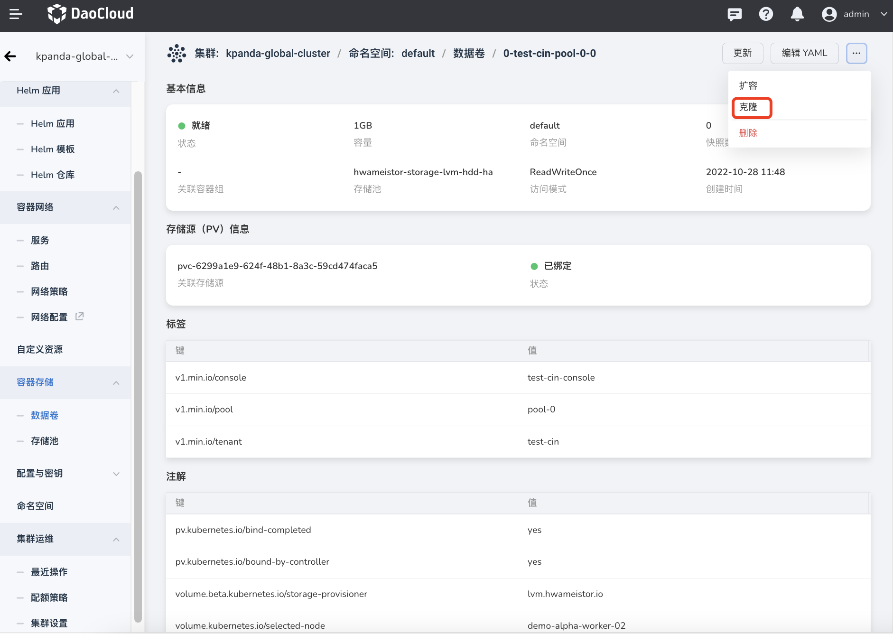
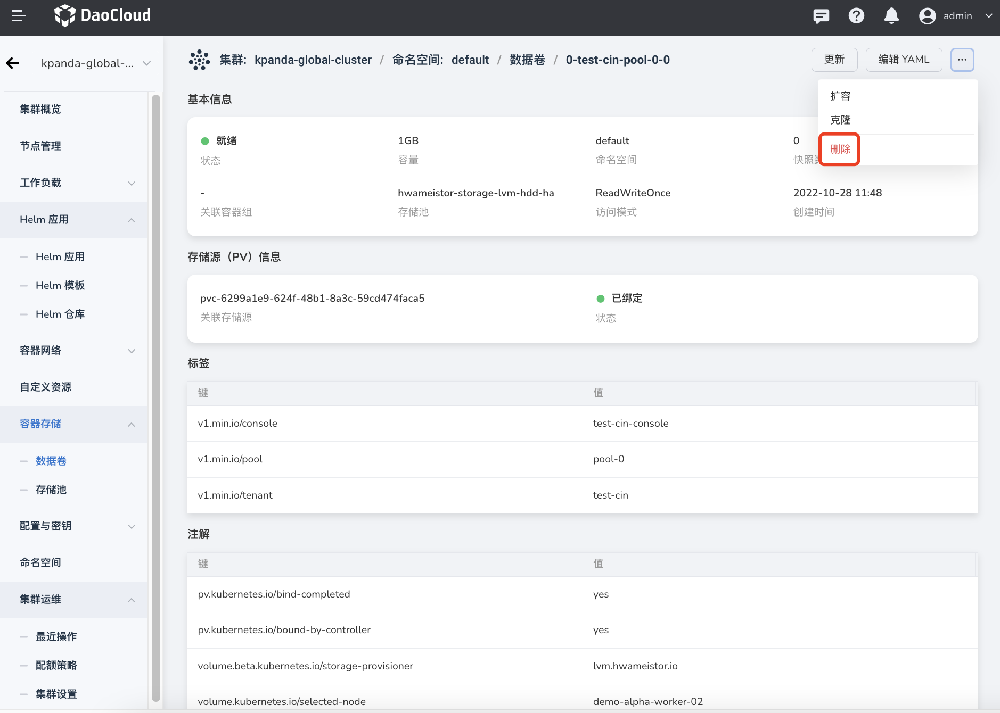

# 数据卷

数据卷（Volume）供用户创建的工作负载使用，是将工作负载数据持久化的一种资源对象，数据卷保存了可被 Pod 中容器访问的数据目录。

## 创建数据卷

目前支持通过 YAML 和表单两种方式创建数据卷，这两种方式各有优劣，可以满足不同用户的使用需求。

通过 YAML 创建步骤更少、更高效，但门槛要求较高，需要熟悉数据卷的 YAML 文件配置。

通过表单创建更直观更简单，根据提示填写对应的值即可，但步骤更加繁琐。

### YAML 创建

1. 在集群列表中点击目标集群的名称，然后在左侧导航栏点击`容器存储`->`数据卷`->`YAML 创建`。

    

2. 在弹框中输入或粘贴事先准备好的 YAML 文件，然后在弹框底部点击`确定`。

    

### 表单创建

1. 在集群列表中点击目标集群的名称，然后在左侧导航栏点击`容器存储`->`数据卷`->`创建数据卷`。

    

2. 填写基本信息。

    - 数据卷名称、命名空间、存储池、访问模式在创建之后不可更改。
    - 使用存储池：在已有的存储池中动态创建新的数据卷，并设置数据卷容量。
    - 使用快照：基于数据卷的快照创建新的数据卷，创建时无法修改数据卷容量，如需扩容，请在创建完成后操作。

        

## 查看数据卷

1. 在集群列表中点击目标集群的名称，然后在左侧导航栏点击`容器存储`->`数据卷`。

    - 该页面可以查看当前集群中的所有数据卷，以及各个数据卷的状态、容量、命名空间等信息。

    - 支持按照数据卷名称、状态、命名空间、创建时间进行顺序或逆序排序。

        

2. 点击数据卷的名称，可以查看该数据卷的基本配置、存储源信息、标签、注解等信息。

    

## 扩容数据卷

数据卷是否支持扩容，主要取决于底层的 CSI 存储插件是否支持扩容。

1. 进入克隆页面：有两种方式

    - 在数据卷列表页面，找到需要扩容的数据卷，在右侧的操作栏下选择`扩容`。

        

    - 点击数据卷的名称，进入数据卷的详情页面后，在页面右上角点击操作按钮选择`扩容`。

        

2. 输入新的容量，然后点击`确定`。

    

## 克隆数据卷

通过克隆数据卷，可以基于被克隆数据卷的配置，重新创建一个新的数据卷。

1. 进入克隆页面：有两种方式

    - 在数据卷列表页面，找到需要克隆的数据卷，在右侧的操作栏下选择`克隆`。

        

    - 点击数据卷的名称，进入数据卷的详情页面后，在页面右上角点击操作按钮选择`克隆`。

        

2. 直接使用原配置，或者按需进行修改，然后在页面底部点击`确定`。

    - 仅支持修改数据的名称、命名空间、容量、标签和注解。
    - 不支持修改创建方式、存储池、访问模式。如需修改这些配置，需要重新创建一个数据卷。

        

## 更新数据卷

有两种途径可以更新数据卷。支持通过表单或 YAML 文件更新数据卷。

- 在数据卷列表页面，找到需要更新的数据卷，在右侧的操作栏下选择`更新`即可通过表单更新，选择`编辑 YAML` 即可通过 YAML 更新。

    

- 点击数据卷的名称，进入数据卷的详情页面后，在页面右上角选择`更新`即可通过表单更新，选择`编辑 YAML` 即可通过 YAML 更新。

    

## 删除数据卷

有两种途径可以删除数据卷。支持通过表单或 YAML 文件更新数据卷。

- 在数据卷列表页面，找到需要删除的数据，在右侧的操作栏下选择`删除`。

    

- 点击数据卷的名称，进入数据卷的详情页面后，在页面右上角点击操作按钮，选择`删除`。

    
