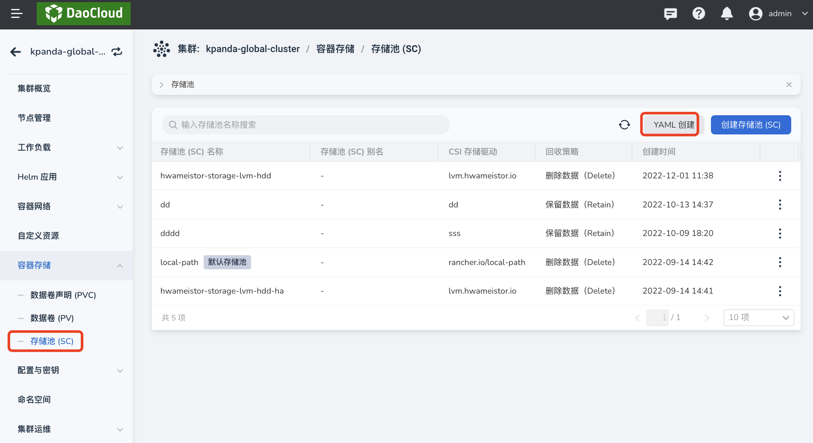
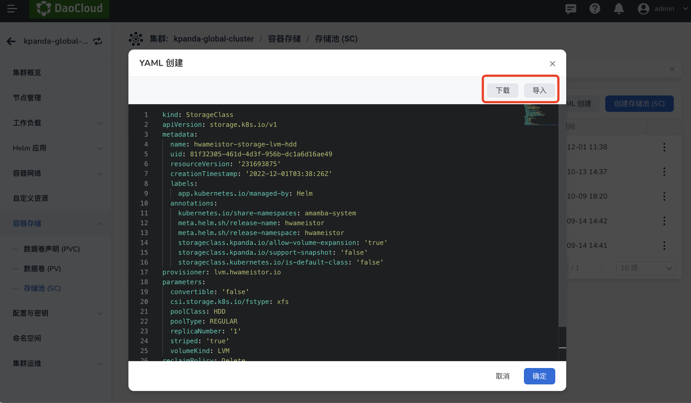
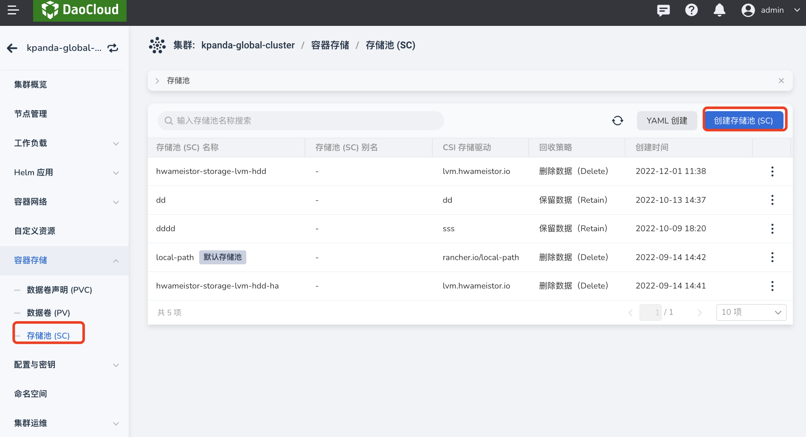
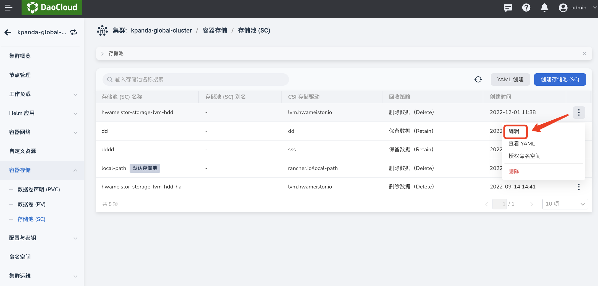
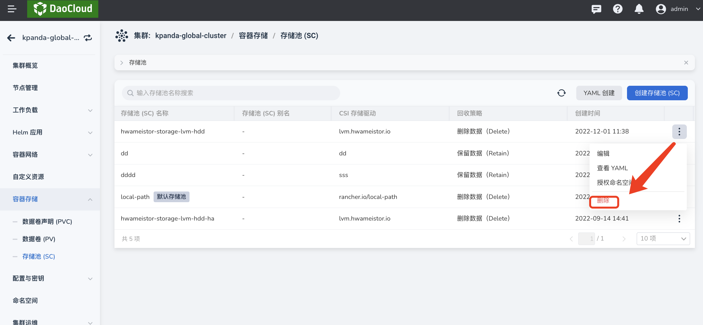

# 存储池(SC)

存储池指将许多物理磁盘组成一个大型存储资源池，本平台支持接入各类存储厂商后创建块存储池、本地存储池、自定义存储池，然后为工作负载动态配置数据卷。

## 创建存储池(SC)

目前支持通过 YAML 和表单两种方式创建存储池，这两种方式各有优劣，可以满足不同用户的使用需求。

- 通过 YAML 创建步骤更少、更高效，但门槛要求较高，需要熟悉存储池的 YAML 文件配置。

- 通过表单创建更直观更简单，根据提示填写对应的值即可，但步骤更加繁琐。

### YAML 创建

1. 在集群列表中点击目标集群的名称，然后在左侧导航栏点击`容器存储`->`存储池(SC)`->`YAML 创建`。

    

2. 在弹框中输入或粘贴事先准备好的 YAML 文件，然后在弹框底部点击`确定`。

    > 支持从本地导入 YAML 文件或将填写好的文件下载保存到本地。

    

### 表单创建

1. 在集群列表中点击目标集群的名称，然后在左侧导航栏点击`容器存储`->`存储池(SC)`->`创建存储池(SC)`。

    

2. 填写基本信息，然后在底部点击`确定`。

    - 存储池名称、驱动、回收策略在创建后不可修改。
    - CSI 存储驱动：基于标准 Kubernetes 的容器存储接口插件，需遵守存储厂商规定的格式，例如`rancher.io/local-path`。

        - 有关如何填写不同厂商提供的 CSI 驱动，可参考 Kubernetes 官方文档[存储类](https://kubernetes.io/zh-cn/docs/concepts/storage/storage-classes/#provisioner)。
        - DaoCloud 自主开源的存储 [HwameiStor](https://github.com/hwameistor/hwameistor) 的格式应为 `lvm.hwameistor.io`。

    - 回收策略：删除数据卷时，保留数据卷中的数据或者删除其中的数据。
    - 快照/扩容：开启后，基于该存储池的数据卷/数据卷声明才能支持扩容和快照功能，但 **前提是底层使用的存储驱动支持快照和扩容功能**。

        

## 更新存储池(SC)

在存储池列表页面，找到需要更新的存储池，在右侧的操作栏下选择`编辑`即可通过更新存储池。

!!! info

    选择`查看 YAML` 可以查看该存储池的 YAML 文件，但不支持编辑。

## 删除存储池(SC)

在存储池列表页面，找到需要删除的存储池，在右侧的操作栏下选择`删除`。

