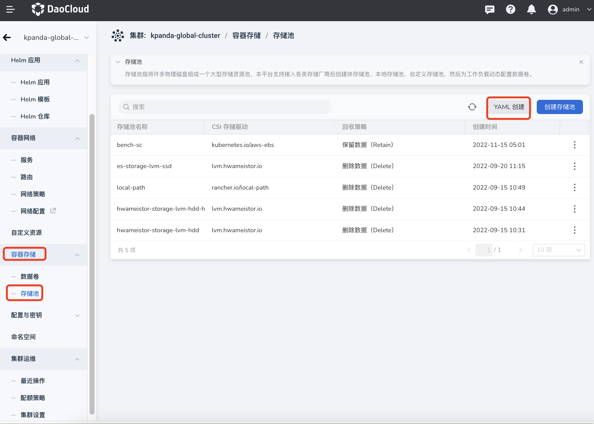
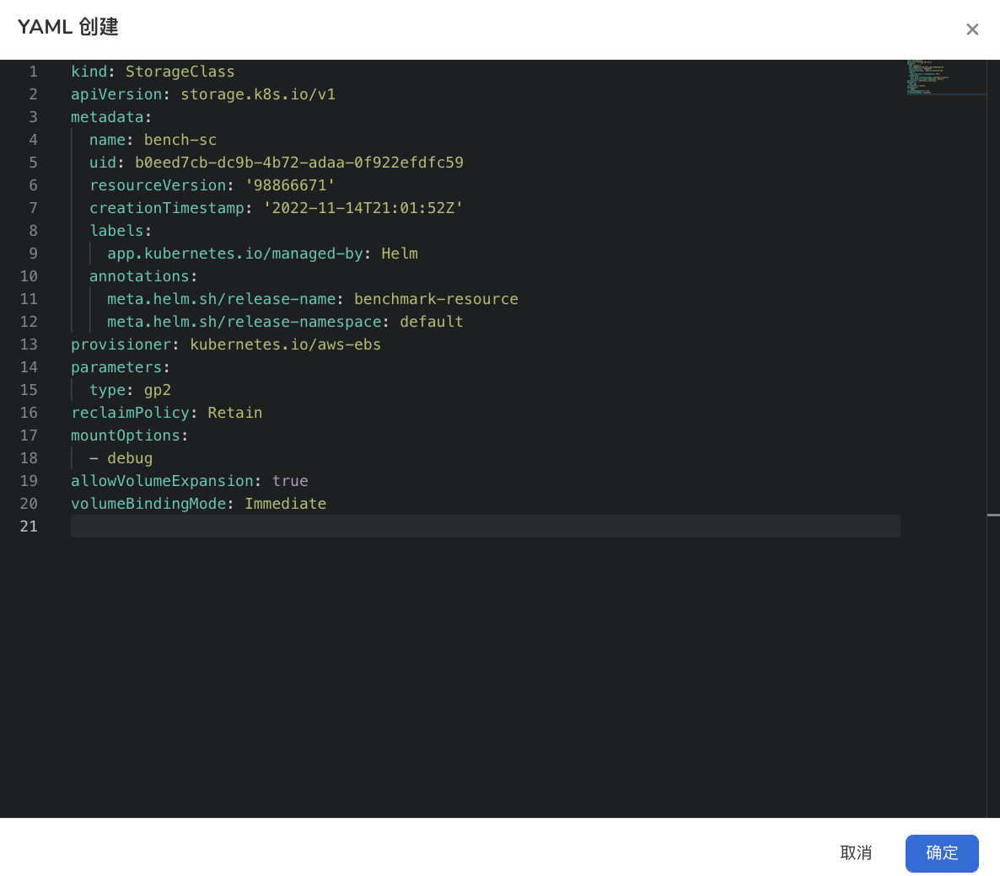
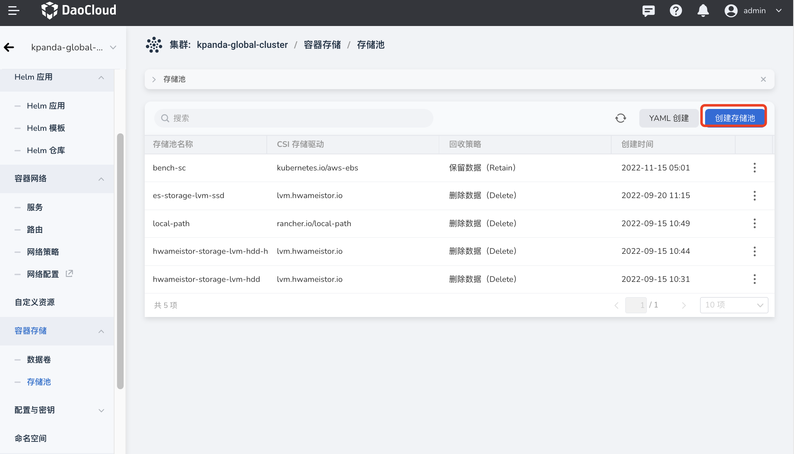
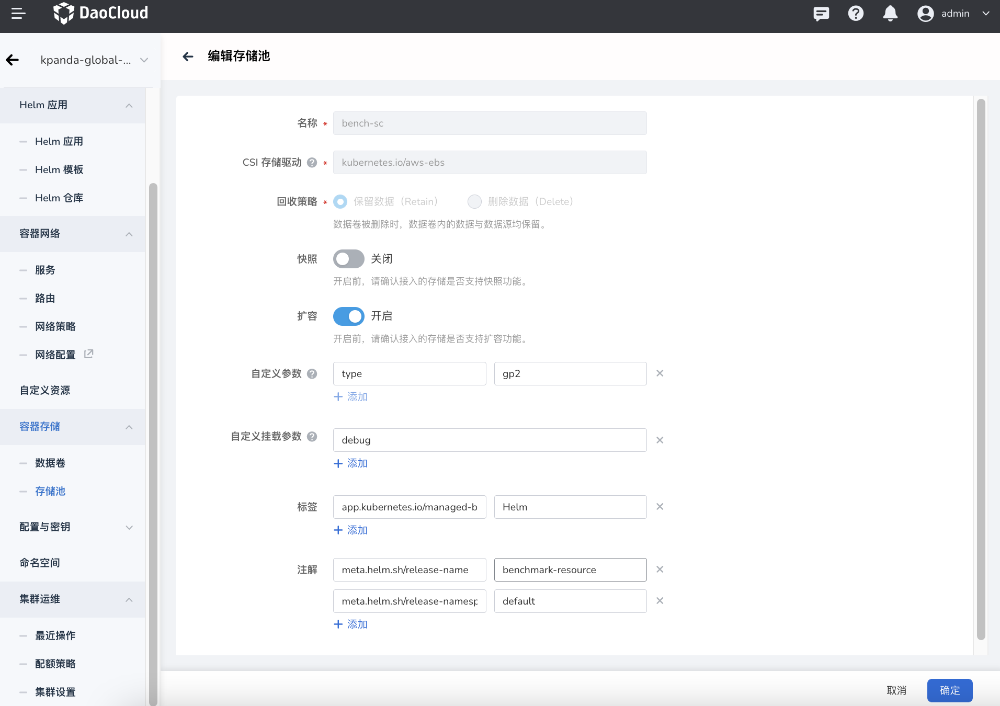
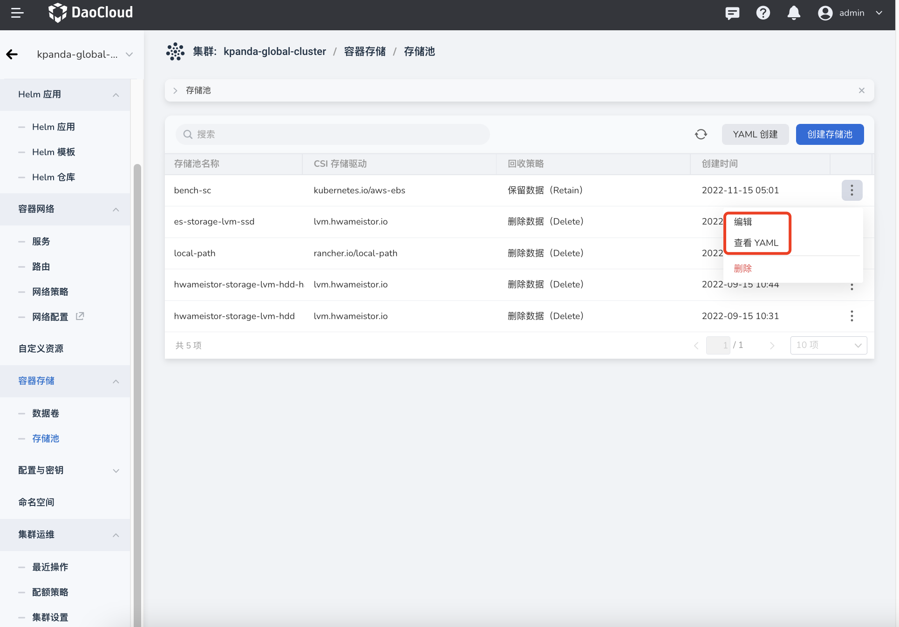
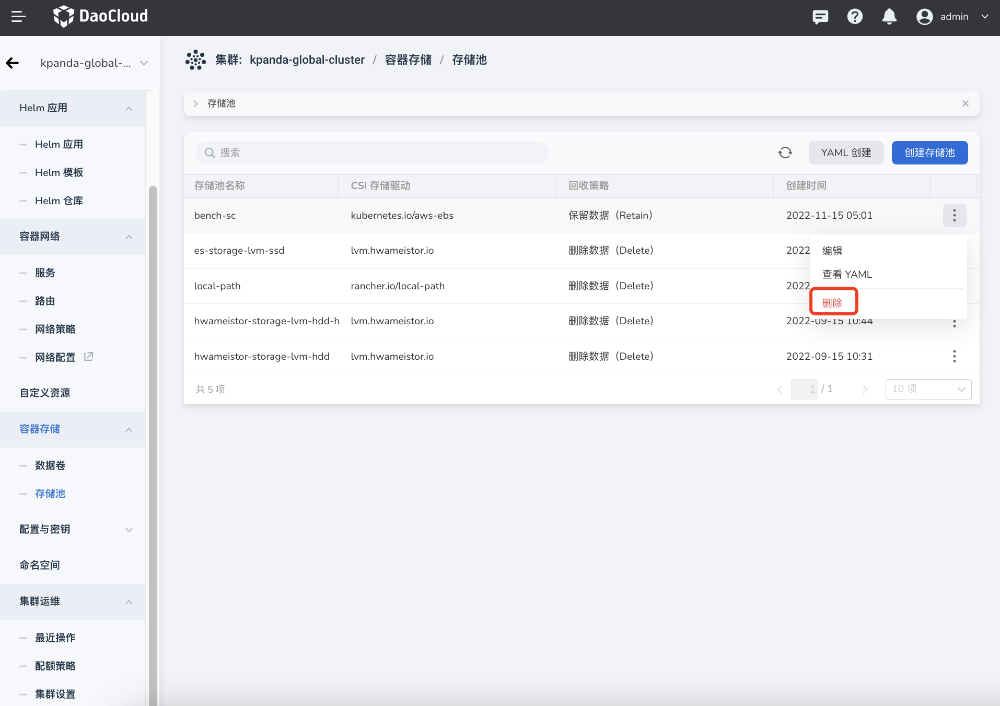

# 存储池

存储池指将许多物理磁盘组成一个大型存储资源池，本平台支持接入各类存储厂商后创建块存储池、本地存储池、自定义存储池，然后为工作负载动态配置数据卷。

## 创建存储池

目前支持通过 YAML 和表单两种方式创建存储池，这两种方式各有优劣，可以满足不同用户的使用需求。

通过 YAML 创建步骤更少、更高效，但门槛要求较高，需要熟悉存储池的 YAML 文件配置。

通过表单创建更直观更简单，根据提示填写对应的值即可，但步骤更加繁琐。

### YAML 创建

1. 在集群列表中点击目标集群的名称，然后在左侧导航栏点击`容器存储`->`存储池`->`YAML 创建`。

    

2. 在弹框中输入或粘贴事先准备好的 YAML 文件，然后在弹框底部点击`确定`。

    

### 表单创建

1. 在集群列表中点击目标集群的名称，然后在左侧导航栏点击`容器存储`->`存储池`->`创建存储池`。

    

2. 填写基本信息。

    - CSI 存储驱动：基于标准 Kuberneters 的 容器存储接口（Container Storage Interface）插件
    - 回收策略：删除数据卷时，将数据卷内的数据与数据源一同删除，还是保留数据与数据源。

        

## 更新存储池

在存储池列表页面，找到需要更新的存储池，在右侧的操作栏下选择`编辑`即可通过更新存储池。

!!! info

    选择`查看 YAML` 可以查看该存储池的 YAML 文件，但不支持编辑。

## 删除存储池

在存储池列表页面，找到需要删除的存储池，在右侧的操作栏下选择`删除`。

