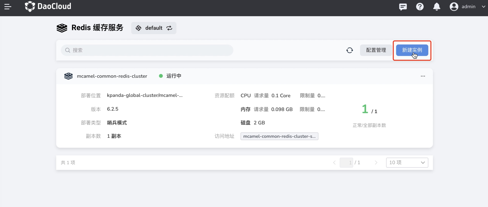
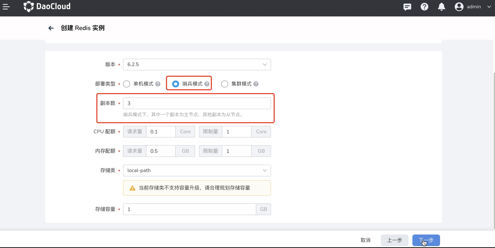
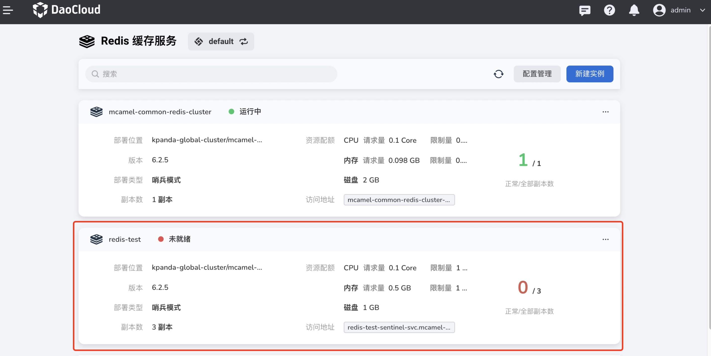
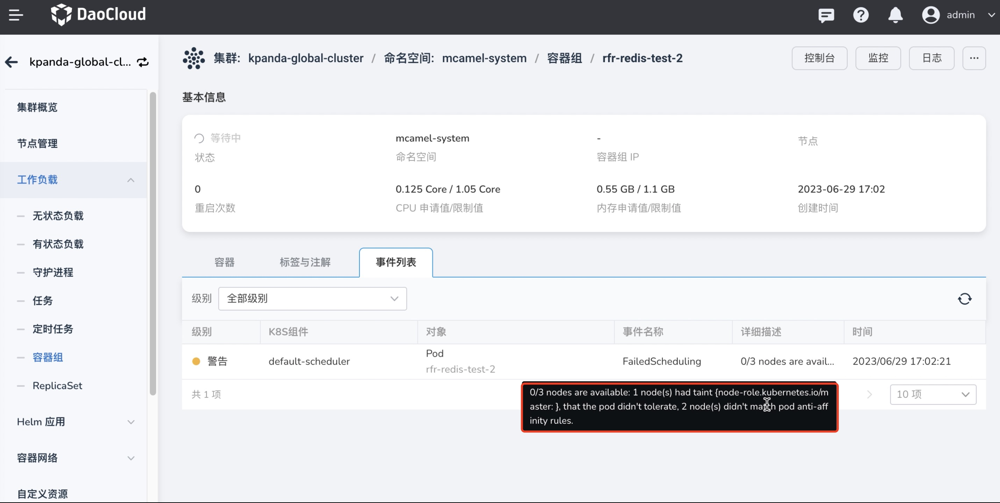

---
hide:
  - toc
---

# 工作负载反亲和性

在中间件的实例管理中，`工作负载反亲和性`可以提供以下几方面的作用：

- **性能优化** 通过使用工作负载反亲和，可以将中间件的实例分配到不同的工作负载上，避免资源竞争和争用。这样可以确保每个实例都有足够的资源可用，提高性能和可靠性。

- **故障隔离** 如果某个中间件工作负载上的实例发生故障或性能下降，工作负载反亲和可以确保其他工作负载上的实例不受影响。通过将中间件实例分散在不同的工作负载上，可以限制故障的扩散范围，避免单点故障，并提高系统的鲁棒性。

- **扩展性和弹性** 工作负载反亲和可以使中间件实例在不同的工作负载上快速扩展和收缩。当负载增加时，新的实例可以动态地分配到可用的工作负载上，从而实现水平扩展。而当负载下降时，实例可以被移除，以节省资源。

- **资源隔离** 通过使用工作负载反亲和，可以将中间件实例分配到不同的工作负载上，避免实例之间的资源竞争。这样可以确保每个实例都有足够的资源可用，避免因为一个实例的资源占用过高影响其他实例。

综上所述，通过合理配置`工作负载反亲和性`规则，可以有效提升中间件在系统中的可靠性和性能表现。

下面以 `Redis` 为例，展示`工作负载反亲和性`的效果。

1. 创建一个新的 `Redis` 实例；

    

1. 设置为三副本的`哨兵模式`；

    

1. 在`服务设置`页面启用`工作负载反亲和性`；

   - 操作符选择 `In`,标识该条规则必须被满足`；
   - `拓扑域`即为节点标签，用于划分一个使用该反亲和策略的节点范围，这里采用默认值；
   - `Pod 选择器`用于选择执行该反亲和策略的 Pod，这里设置为工作负载名称，该标签默认存在于所有 Redis pod 中。

      

1. 完成创建。

    

切换至[容器管理]模块查看相关 `Pod` 信息， 可见两个 Redis `Pod` 分别运行于不同的集群节点上，第三个 Pod 则处于等待状态；

查看 Pod: rfr-redis-test-2 的事件日志，可见由于反亲和规则，第三个 Pod 无法创建。

