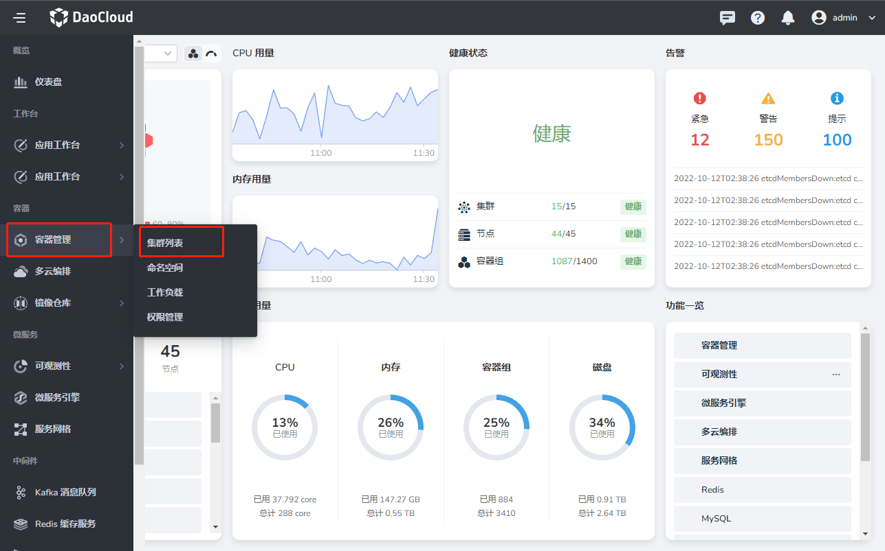
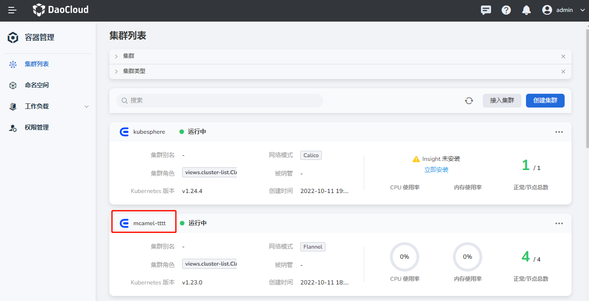
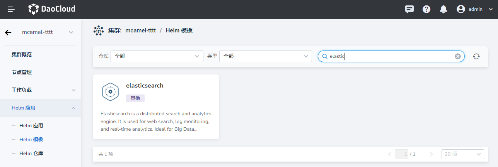
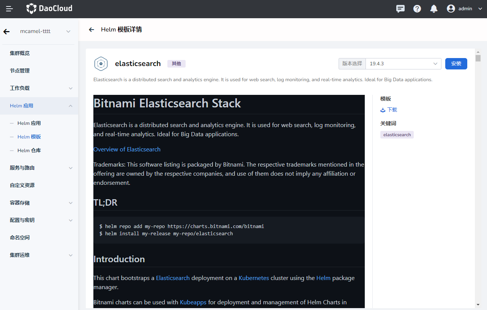
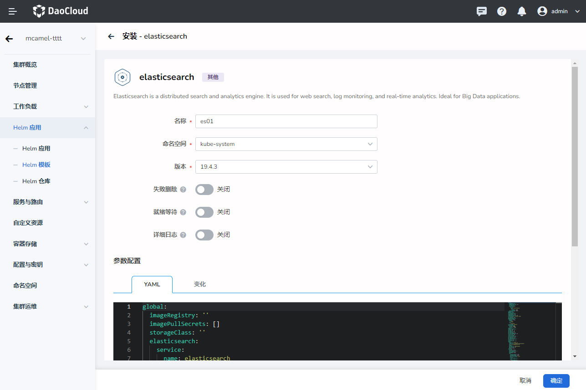
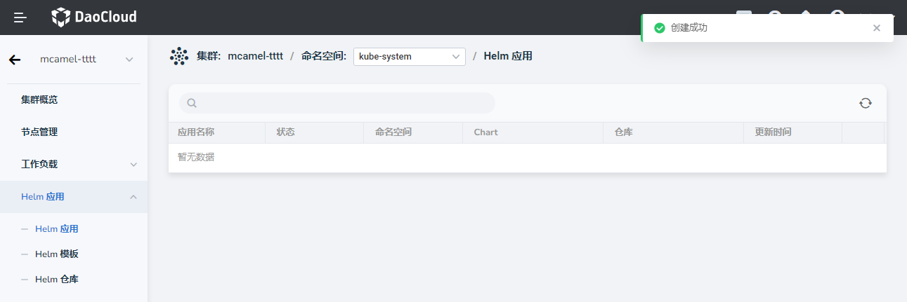
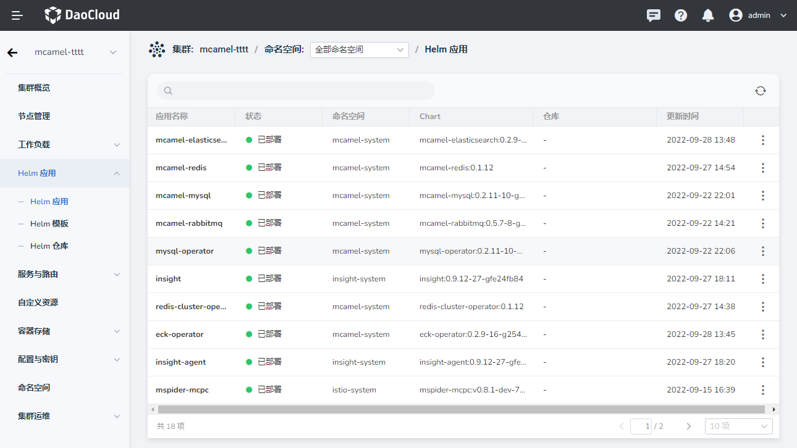
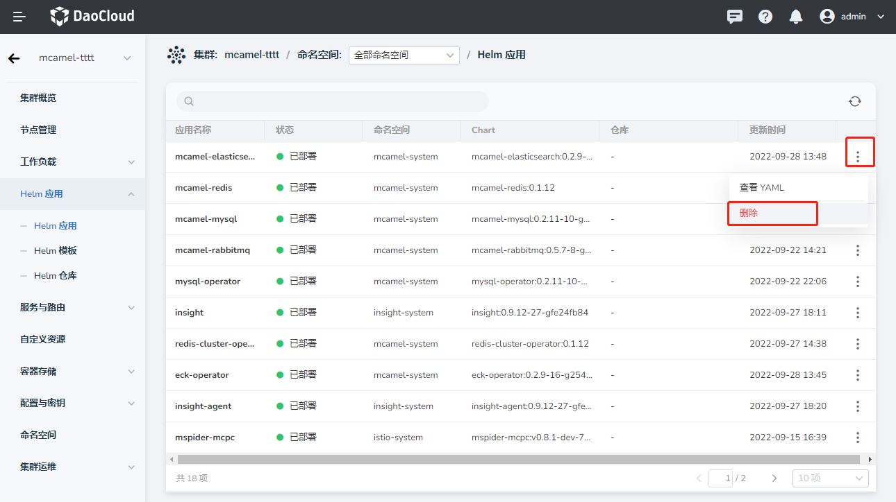
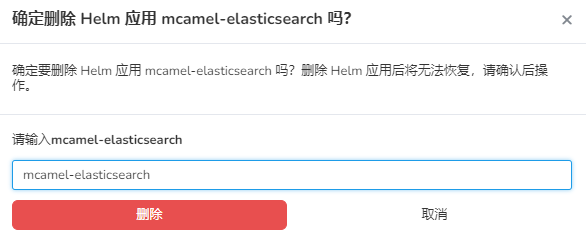

# 安装 Elasticsearch

因为 Elasticsearch 分属于 DCE 5.0 的应用层，所以需要先准备一个 DCE 环境。

按照以下步骤安装 Elasticsearch。

## 安装 elasticsearch-operator

1. 在左侧导航栏点击`容器管理` -> `集群列表`。

    

2. 选择要安装 Elasticsearch 的集群，点击集群名称。

    

3. 在左侧导航栏点击 `Helm 应用` -> `Helm 模板`，在搜索框中输入 `elasticsearch`，敲击回车键，点击 elasticsearch 磁贴卡片。

    

4. 选择合适版本后，点击`安装`按钮。也可以遵循黑色区域的文字提示，从命令行安装。

    

5. 输入合适的名称，选择命名空间和版本后，点击`确定`。也可以在底部配置 YAML 来安装。

    

    

6. 系统返回 `Helm 应用`列表，屏幕提示创建成功，刷新页面后刚刚创建的应用位于第一个。

    

## 安装 mcamel-elasticsearch

1. 配置仓库。

    ```shell
    helm repo add mcamel-release https://release.daocloud.io/chartrepo/mcamel
    helm repo update
    ```

2. 查看版本。

    ```shell
    helm search repo mcamel-release/mcamel-elasticsearch --versions
    NAME                                    CHART VERSION   APP VERSION     DESCRIPTION                
    mcamel-release/mcamel-elasticsearch     0.2.3           0.2.3           A Helm chart for Kubernetes
    ```

3. 安装和升级。

    ```shell
    helm upgrade --install mcamel-elasticsearch --create-namespace -n mcamel-system --cleanup-on-fail \
    --set global.mcamel.imageTag=v0.2.3 \
    --set global.imageRegistry=release.daocloud.io \
    mcamel-release/mcamel-elasticsearch \
    --version 0.2.3
    ```

    参数说明：

    ```shell
    --set ui.image.tag: 指定前端镜像版本
    --set ghippo.createCrd: 注册ghippo路由,默认开启
    --set insight.serviceMonitor.enabled: 开启监控,默认开启
    --set insight.grafanaDashboard.enabled: 开启监控面板,默认开启

    # 全局参数
    --set global.mcamel.imageTag: 镜像版本
    --set global.imageRegistry: 镜像仓库地址
    ```

## 卸载

卸载时先卸载 mcamel-elasticsearch，再删除 elasticsearch-operator，释放相关资源。

### 卸载 mcamel-elasticsearch

```shell
helm uninstall mcamel-elasticsearch -n mcamel-system
```

### 删除 elasticsearch-operator

1. 在 Helm 应用列表中，点击最右侧的 `⋮`，在弹出菜单中选择`删除`。

    

2. 在弹窗中输入要删除的名称，确认无误后，点击`删除`。

    

## 安装参数说明

| 键 | 类型 | 默认值 | 说明 |
|-----|------|---------|-------------|
| apiServer.affinity | object | `{}` |  |
| apiServer.image.pullPolicy | string | `"IfNotPresent"` |  |
| apiServer.image.registry | string | `"release.daocloud.io"` |  |
| apiServer.image.repository | string | `"mcamel/mcamel-elasticsearch-apiserver"` |  |
| apiServer.image.tag | string | `"v0.0.1"` |  |
| apiServer.imagePullSecrets | list | `[]` |  |
| apiServer.livenessProbe.enabled | bool | `true` |  |
| apiServer.livenessProbe.failureThreshold | int | `3` |  |
| apiServer.livenessProbe.initialDelaySeconds | int | `30` |  |
| apiServer.livenessProbe.periodSeconds | int | `30` |  |
| apiServer.livenessProbe.scheme | string | `"HTTP"` |  |
| apiServer.livenessProbe.successThreshold | int | `1` |  |
| apiServer.livenessProbe.timeoutSeconds | int | `5` |  |
| apiServer.nodeSelector | object | `{}` |  |
| apiServer.podAnnotations | object | `{}` |  |
| apiServer.podSecurityContext | object | `{}` |  |
| apiServer.readinessProbe.enabled | bool | `true` |  |
| apiServer.readinessProbe.failureThreshold | int | `3` |  |
| apiServer.readinessProbe.initialDelaySeconds | int | `30` |  |
| apiServer.readinessProbe.periodSeconds | int | `30` |  |
| apiServer.readinessProbe.scheme | string | `"HTTP"` |  |
| apiServer.readinessProbe.successThreshold | int | `1` |  |
| apiServer.readinessProbe.timeoutSeconds | int | `5` |  |
| apiServer.replicaCount | int | `1` |  |
| apiServer.resources | object | `{}` |  |
| apiServer.securityContext | object | `{}` |  |
| apiServer.service.grpcPort | int | `8090` |  |
| apiServer.service.grpcProtocol | string | `"TCP"` |  |
| apiServer.service.grpcTargetPort | int | `8090` |  |
| apiServer.service.httpPort | int | `8080` |  |
| apiServer.service.httpProtocol | string | `"TCP"` |  |
| apiServer.service.httpTargetPort | int | `8080` |  |
| apiServer.service.type | string | `"ClusterIP"` |  |
| apiServer.tolerations | list | `[]` |  |
| ghippo.createCrd | bool | `false` |  |
| ghippo.version | string | `"v0.1.0"` |  |
| global.imagePullSecrets | list | `[]` |  |
| global.imageRegistry | string | `""` |  |
| global.mcamel.imageTag | string | `""` |  |
| insight.grafanaDashboard.enabled | bool | `false` |  |
| insight.grafanaDashboard.metadataLabels | string | `"insight"` |  |
| insight.serviceMonitor.enabled | bool | `false` |  |
| insight.serviceMonitor.metadataLabels | string | `"insight"` |  |
| insight.serviceMonitor.name | string | `"mcamel-elasticsearch"` |  |
| insight.serviceMonitor.selectorMatchLabels | string | `"elasticsearch"` |  |
| ui.affinity | object | `{}` |  |
| ui.enabled | bool | `true` |  |
| ui.image.pullPolicy | string | `"IfNotPresent"` |  |
| ui.image.registry | string | `"release.daocloud.io"` |  |
| ui.image.repository | string | `"mcamel/mcamel-elasticsearch-ui"` |  |
| ui.image.tag | string | `"v0.2.0"` |  |
| ui.imagePullSecrets | list | `[]` |  |
| ui.nodeSelector | object | `{}` |  |
| ui.podAnnotations | object | `{}` |  |
| ui.podLabels | object | `{}` |  |
| ui.replicaCount | int | `1` |  |
| ui.resources | object | `{}` |  |
| ui.service.port | int | `80` |  |
| ui.service.type | string | `"ClusterIP"` |  |
| ui.tolerations | list | `[]` |  |