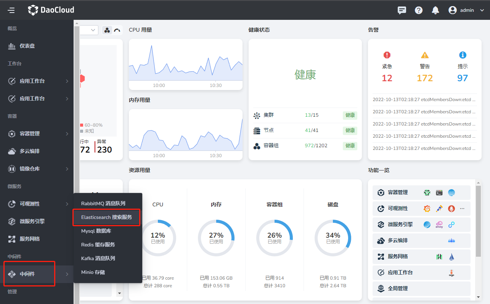
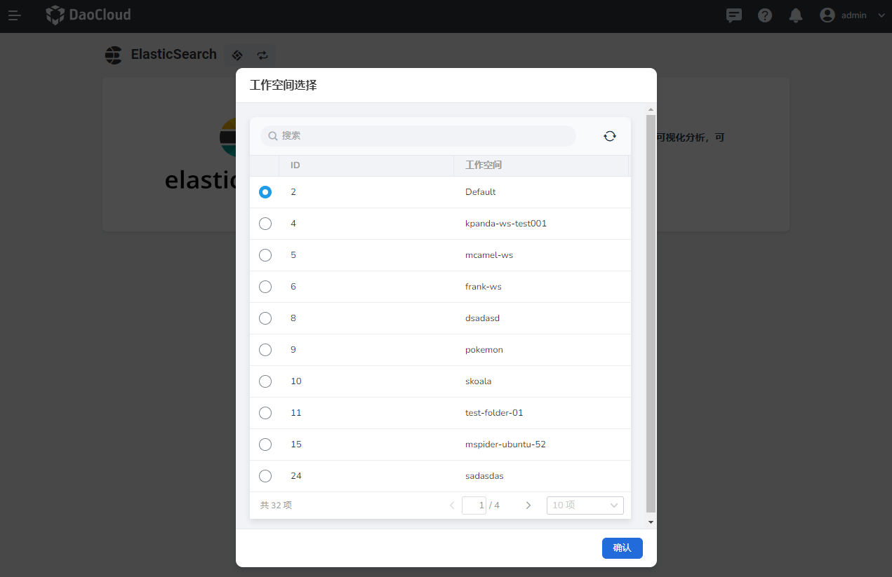
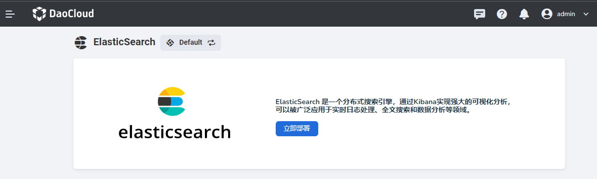

---
hide:
  - toc
---

# 首次使用 Elasticsearch

请提前联系管理员在`容器管理` -> `Helm 应用`[安装好 easticsearch-operator](./install.md) 后，执行以下操作。

1. 在左侧导航栏中选择`中间件` -> `Elasticsearch 搜索服务`。

    

2. 在弹窗中选择一个工作空间后，点击`确认`。

    

    !!! note

        如果未出现弹窗，可手动点击左上角图标选择一个工作空间。

3. 点击`立即部署`即可开始部署 Elasticsearch 实例。

    
