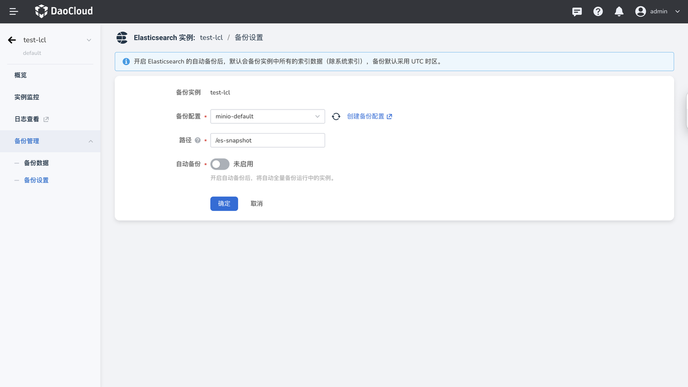
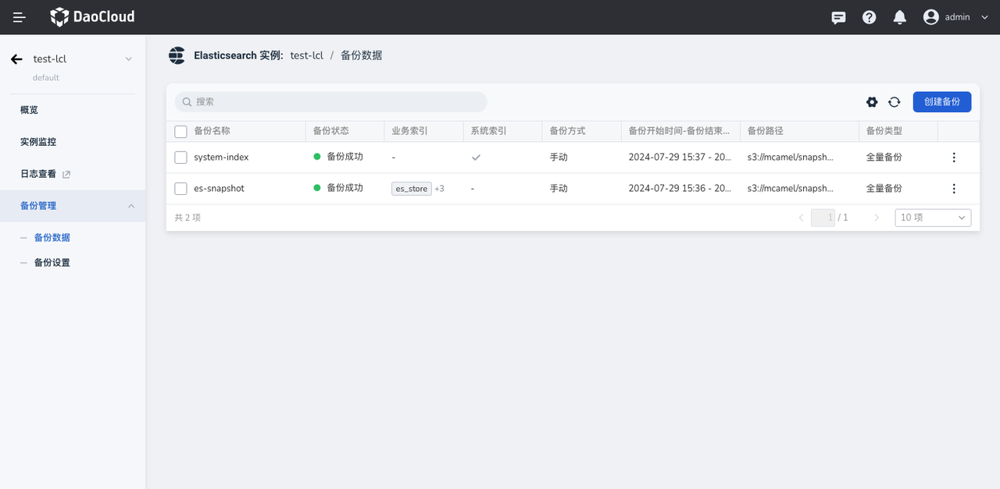
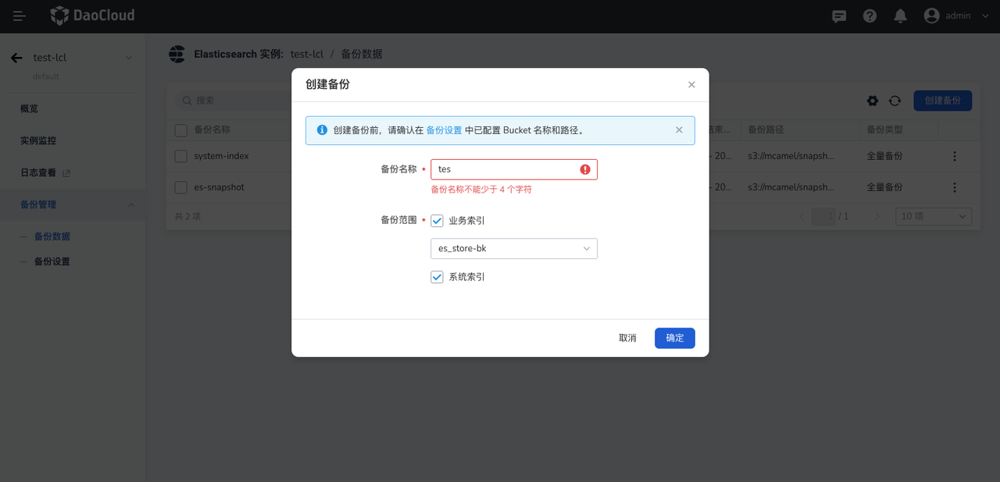
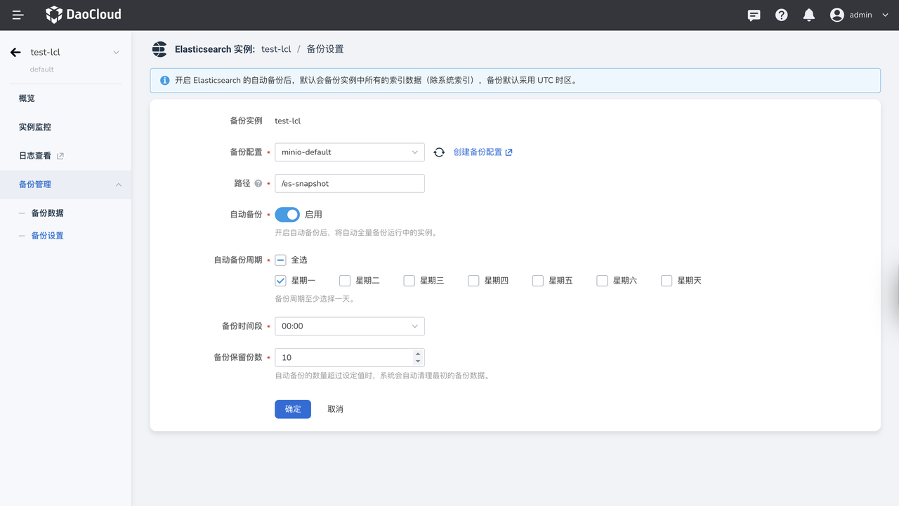
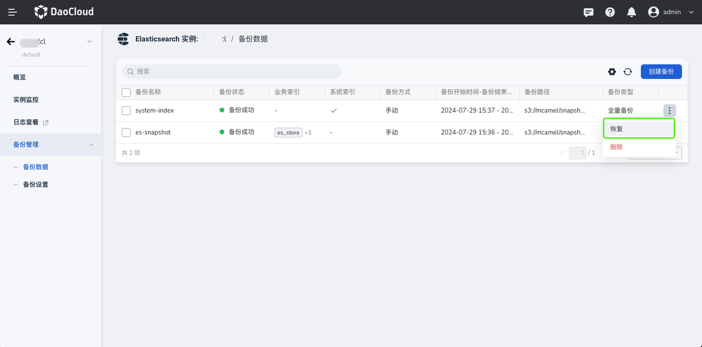
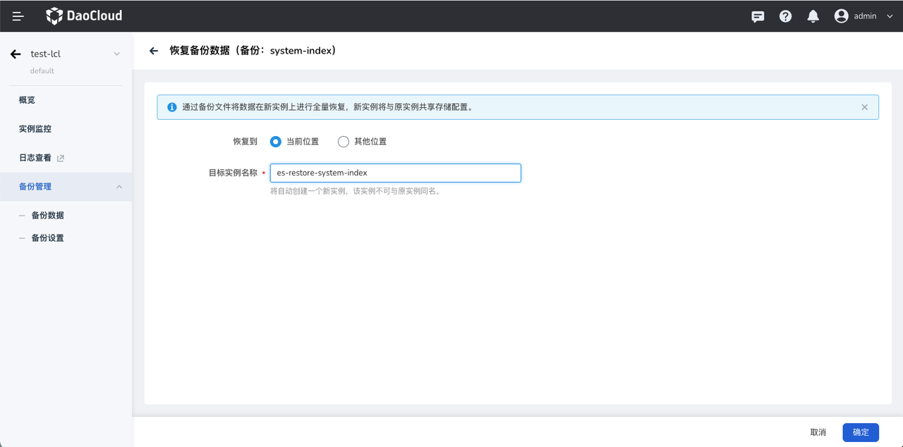

# Elasticsearch 备份和恢复

Elasticsearch 的备份恢复功能可以帮助您备份整个集群或者单个索引的数据，以便在需要时进行恢复。您可以设置自动快照策略定期备份数据，或手动备份选择备份的索引。

实例的第一个备份快照是实例中数据的完整拷贝，后续所有的备份快照保留的是已存快照和新备份快照之间的增量，因此首次备份耗时较长（具体时长与数据量相关），后续快照备份会比较快。

## 备份配置和方法

### 配置备份路径

1. 点击左侧导航栏进入备份管理 > 备份设置
2. 选择已添加工作空间中的 `S3 备份`，填写备份路径。

    !!! info

        手动备份和自动备份均依赖此处的备份配置。

    

### 手动创建备份

1. 点击左侧导航栏进入备份管理 > 备份数据，查看该实例的已有备份数据。

    

2. 点击列表右上角的创建备份按钮，填写备份名称、选择预备份的索引。

    - 支持全选或多选备份的是业务索引。勾选系统索引后，默认备份全被的系统索引。

    

## 开启自动备份

1. 点击左侧导航栏进入备份管理 > 备份设置。
2. 开启自动备份的开关，选择备份周期、备份时间以及自动备份保留的份数。

    !!! info

        自动备份默认仅备份所有的业务索引。

    

## 恢复备份数据

1. 点击左侧导航栏进入备份管理 > 备份数据，选择想要恢复的备份数据，点击操作列的 … ，点击恢复。

    

2. 填写恢复后的实例名称，并选择恢复到当前实例的位置或选择恢复到其他集群、命名空间。

    
