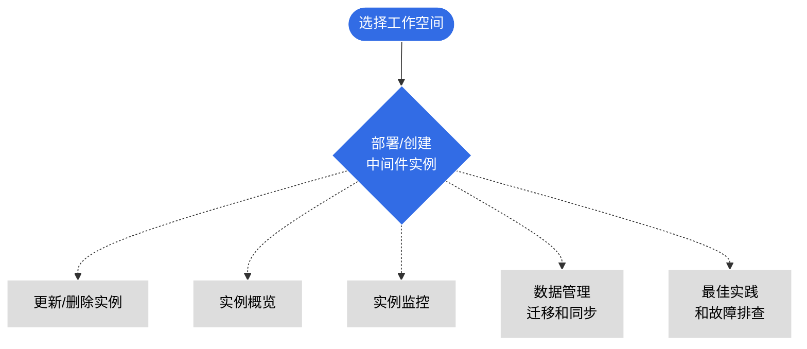

---
hide:
  - toc
---

# 中间件数据服务

DCE 5.0 针对实际应用场景，精选了一些经典的中间件来处理数据，能够满足各类应用场景的开发和维护。
您可以按需安装/启用这些中间件，即插即用。

!!! tip

    提升数据库性能，实现高可用和强大的扩展性，尽在 DCE 5.0 容器化赋能的中间件！

- :simple-elasticsearch:{ .lg .middle } __Elasticsearch 搜索服务__

    ---

    这是目前全文搜索引擎的首选，它可以快速地存储、搜索和分析海量数据。

    - [什么是 Elasticsearch](./elasticsearch/intro/index.md)
    - [ES 集群容量规划](./elasticsearch/user-guide/cluster-capacity-plan.md)
    - [创建/更新/删除 ES 实例](./elasticsearch/user-guide/create.md)
    - [跨节点迁移 ES 数据](./elasticsearch/user-guide/migrate-es.md)
    - [ES 故障排查](./elasticsearch/faq/common-question-es.md)

- :simple-minio:{ .lg .middle } __MinIO 对象存储__

    ---

    一款热门、轻量、开源的对象存储方案，完美兼容 AWS S3 协议，友好支持 K8s。

    - [什么是 MinIO](./minio/intro/index.md)
    - [创建/更新/删除 MinIO 实例](./minio/user-guide/create.md)
    - [查看 MinIO 日志](./minio/user-guide/logs.md)
    - [MinIO 实例监控](./minio/user-guide/insight.md)
    - [MinIO 身份管理](./minio/user-guide/user-management.md)

- :simple-mysql:{ .lg .middle } __MySQL 数据库__

    ---

    这是应用最广泛的关系数据库，具有高吞吐、低延迟、可扩展等特性。

    - [MySQL 功能说明](./mysql/intro/features.md)
    - [创建/更新/删除 MySQL 实例](./mysql/user-guide/create.md)
    - [查看 MySQL 日志](./mysql/user-guide/logs.md)
    - [MySQL 故障排查](./mysql/faq/quick-check.md)

- :simple-mongodb:{ .lg .middle } __MongoDB 数据库__

    ---

    MongoDB 是一种面向文档的 NoSQL 数据库管理系统，它以灵活的数据模型和可扩展性而闻名。

    - [什么是 MongoDB](./mongodb/intro/index.md)
    - [创建/更新/删除 MongoDB 实例](./mongodb/user-guide/create.md)
    - [查看 MongoDB 日志](./mongodb/user-guide/logs.md)

- :simple-postgresql:{ .lg .middle } __PostgreSQL 数据库__

    ---

    DCE 5.0 采用容器化技术将 PostgreSQL 实例打包在一个独立的环境中运行。

    - [什么是 PostgreSQL](./postgresql/intro/index.md)
    - [创建/更新/删除 PostgreSQL 实例](./postgresql/user-guide/create.md)
    - [查看 PostgreSQL 日志](./postgresql/user-guide/logs.md)
    - [PostgreSQL 反亲和设置](./postgresql/user-guide/antiaffinity.md)

- :simple-redis:{ .lg .middle } __Redis 缓存服务__

    ---

    这是一种内存数据库缓存服务，兼容了 Redis 和 Memcached 两种内存数据库引擎的优点。

    - [什么是 Redis](./redis/intro/index.md)
    - [创建/更新/删除 Redis 实例](./redis/user-guide/create.md)
    - [查看 Redis 日志](./redis/user-guide/logs.md)
    - [跨集群数据同步](./redis/best-practice/index.md)

- :simple-rabbitmq:{ .lg .middle } __RabbitMQ 消息队列__

    ---

    这是基于高级消息队列协议 (AMQP) 构建的消息代理软件（亦称面向消息的中间件），常用于交易数据的传输管道。

    - [什么是 RabbitMQ](./rabbitmq/intro/index.md)
    - [创建/更新/删除 RabbitMQ 实例](./rabbitmq/user-guide/create.md)
    - [查看 RabbitMQ 日志](./rabbitmq/user-guide/logs.md)
    - [RabbitMQ 数据迁移](./rabbitmq/user-guide/migrate.md)
    - [RabbitMQ 自定义插件](./rabbitmq/faq/add-plugin.md)

- :simple-apachekafka:{ .lg .middle } __Kafka 消息队列__

    ---

    这是支持流式数据处理等多种特性的分布式消息流处理中间件，常用于消息传输的数据管道。

    - [什么是 Kafka](./kafka/intro/index.md)
    - [创建/更新/删除 Kafka 实例](./kafka/user-guide/create.md)
    - [查看 Kafka 日志](./kafka/user-guide/logs.md)
    - [Kafka 实例监控](./kafka/user-guide/insight.md)
    - [Kafka 参数配置](./kafka/user-guide/config.md)

## 中间件学习路径

!!! info

    上述中间件的文档结构大致相同，您可以参考以下学习路径。

