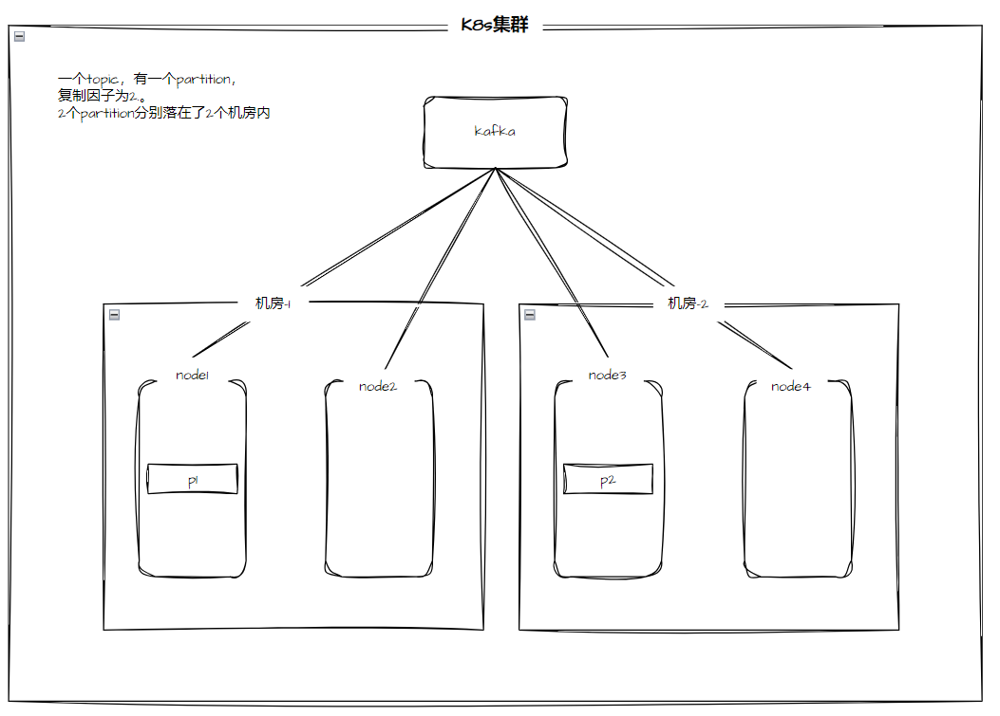

# Kafka 双机房部署灾备方案

## 背景

在生产上线时，为了保证业务的持续不中断，通常使用双机房的部署方案达到一个机房故障时，另一个机房中的应用仍然能够继续提供服务。对于 Kafka 而言，在双机房的部署下，希望一个 partition 的副本尽可能的处在不同的机房。此处 Kafka 仍然部署在同一个集群中，集群中的节点处于不同的机房。

## Rack awareness（机架感知）功能介绍

`Rack awareness` 特性会将 同一 partition 的 replica 分散到不同的 rack 上。该特性扩展了 kafka 为 broker-failure 所提供的保证，使其可以覆盖 rack-failure，减少了同一 rack 上所有 broker 同时失败会导致的数据丢失的风险。该特性也可以应用到其他 broker grouping 上，例如 aws 上的 EC2 可用区，可以通过 broker.rack 指定某个 broker 属于某个特定的 rack。

当新建/修改 topic 或重分布 replica 时，kafka 会考虑 broker.rack 配置，确保 replica 分散到尽量多的 rack 上，一定注意，是尽量在 rack 间，而不是 broker 间，平分 replica。一个 partition 将横跨 min(racks, replication-factor) 个不同的 rack。

- 不配置 broker.rack 时，分配 replica 到 broker 的算法确保每个 broker 上 leader 的个数（partition 的 leader 的个数）是相同的，而不论 broker 在 racks 间如何分布。这确保了 balanced throughput，即各个 broker 的吞吐是一样的。

- 配置 broker.rack 时，需要在 rack 之间平分所有 replica，也就是“不管在 rack 上分配了几个 broker，反正 replica 是按着 rack 无脑平分的”。正因为此，如果 rack 被分配了不同个数的 broker，则，较少 broker 的 rack（其 replica 并不少）将使用更多的 storage，会把更多的资源用到 replication 上，这些 broker 的负担就会更重，当然负载也不均衡，所以，明智的做法是为每个 rack 配置同样数量的 broker。

举个例子，假设 2 个 rack，6 个 broker，100 个 replica（包括主和从），replica 会在 rack 间无脑平分，因此，rack1 和 rack2 各自分配 50 个 replica：

1. 如果 rack1 和 rack2 都分配 3 个 broker，则：rack1 上的每一个 broker 分配 50/3个replica，rack2上的每一个broker分配 50/3个replica。

2. 如果 rack1 分配 5 个 broker，rack2 分配 1 个 broker，则：rack1 上的每一个 broker 分配 50/5个replica，rack2上的每一个broker分配 50/1个replica。也就是：具有较少broker的rack2其replica一点都不少，所以这些broker负担会更重，当然负载也不均衡。所以，明智的做法是为每个rack配置同样数量的broker。

## 双机房部署架构



## 操作步骤

1. 登录目标集群的控制台，执行以下操作，分别为在不同机房的的节点打标签（Label）。

    ```shell
    kubectl label node master01 topology.kubernetes.io/zone=east #这里的 east 可以换成自定义的机房名称

    kubectl label node worker01 topology.kubernetes.io/zone=west #这里的 east 可以换成自定义的机房名称
    ```

2. 修改 Kafka CR，在 CR 资源上配置 rack 特性。

    ```yaml
    apiVersion: kafka.strimzi.io/v1beta2
    kind: Kafka
    metadata:
      name: test-rack
    spec:
      kafka:
        rack:
          topologyKey: topology.kubernetes.io/zone  # 这里的 value 应该为第一步中所打 label 的 key
        version: 3.1.0
        replicas: 4
        listeners:
          - name: plain
            port: 9092
            type: internal
            tls: false
          - name: tls
            port: 9093
            type: internal
            tls: true
        config:
          offsets.topic.replication.factor: 3
          transaction.state.log.replication.factor: 3
          transaction.state.log.min.isr: 2
          default.replication.factor: 3
          min.insync.replicas: 2
          inter.broker.protocol.version: "3.1"
        storage:
          class: local-path
          size: 1Gi
          type: persistent-claim
      zookeeper:
        replicas: 1
        storage:
          class: local-path
          size: 1Gi
          type: persistent-claim
      entityOperator:
        topicOperator: {}
        userOperator: {}
    ```

- 部署完成后，Kafka 对应容器组的调度分布如下所示：

    ```shell
    test-rack-kafka-0                            1/1     Running   0             89m    10.244.2.117   worker01   <none>           <none>
    test-rack-kafka-1                            1/1     Running   0             89m    10.244.0.109   master01   <none>           <none>
    test-rack-kafka-2                            1/1     Running   0             89m    10.244.2.118   worker01   <none>           <none>
    test-rack-kafka-3                            1/1     Running   0             12m    10.244.0.111   master01   <none>           <none>
    ```

- kafka-operator 会自动为每个 kafka 的容器组添加 `preferredDuringSchedulingIgnoredDuringExecution` 亲和性配置，如下代码所示：

```yaml
podAntiAffinity:
      preferredDuringSchedulingIgnoredDuringExecution:
        - weight: 100
          podAffinityTerm:
            labelSelector:
              matchLabels:
                strimzi.io/cluster: test-rack
                strimzi.io/name: test-rack-kafka
            topologyKey: topology.kubernetes.io/zone
```

- 进入 kafka 容器组检查内部的配置文件同样自动添加 broker.rack 配置，如下代码所示：

    ```shell
    [kafka@test-rack-kafka-2 custom-config]$ cat server.config
    ##############################
    ##############################
    # This file is automatically generated by the Strimzi Cluster Operator
    # Any changes to this file will be ignored and overwritten!
    ##############################
    ##############################
    
    ##########
    # Broker ID
    ##########
    broker.id=2
    node.id=2
    
    ##########
    # Rack ID
    ##########
    broker.rack=${STRIMZI_RACK_ID}  // cat /opt/kafka/init/rack.id
    ```

## 测试用例

```shell
--- topic下1个partition,复制因子为4，均匀分布在每个kafka的节点上
./bin/kafka-topics.sh --create --bootstrap-server localhost:9092 --replication-factor 4 --partitions 1 --topic test-1
 
[kafka@test-rack-kafka-1 kafka]$ ./bin/kafka-topics.sh --describe --bootstrap-server localhost:9092 --topic test-1
1Topic: test-1  TopicId: -CNSnHsCT9eG7znhr5CYxA PartitionCount: 1       ReplicationFactor: 4    Configs: min.insync.replicas=2,message.format.version=3.0-IV1
        Topic: test-1   Partition: 0    Leader: 1       Replicas: 1,0,3,2       Isr: 1,0,3,2
 
---topic下1个partition,复制因子为2，分别分布在west(0)和east(3)上，"机房"上的分布是均匀的
./bin/kafka-topics.sh --create --bootstrap-server localhost:9092 --replication-factor 2 --partitions 1 --topic test-1
 
[kafka@test-rack-kafka-1 kafka]$ ./bin/kafka-topics.sh --describe --bootstrap-server localhost:9092 --topic test-2
Topic: test-2   TopicId: u_KNAaLjT3atQy_DTkmZfQ PartitionCount: 1       ReplicationFactor: 2    Configs: min.insync.replicas=2,message.format.version=3.0-IV1
        Topic: test-2   Partition: 0    Leader: 0       Replicas: 0,3   Isr: 0,3
 
---topic下2个partition,复制因子为3，"机房"上的分布不是均匀的，保证每个"机房"都有一个
./bin/kafka-topics.sh --create --bootstrap-server localhost:9092 --replication-factor 3 --partitions 2 --topic test-3
 
[kafka@test-rack-kafka-1 kafka]$ ./bin/kafka-topics.sh --describe --bootstrap-server localhost:9092 --topic test-3
Topic: test-3   TopicId: qBlTqRh6RCGS4vSukegMzg PartitionCount: 2       ReplicationFactor: 3    Configs: min.insync.replicas=2,message.format.version=3.0-IV1
        Topic: test-3   Partition: 0    Leader: 2       Replicas: 2,3,1 Isr: 2,3,1
        Topic: test-3   Partition: 1    Leader: 1       Replicas: 1,2,0 Isr: 1,2,0
 
---topic下10个partition,复制因子为4，"机房"上的分布是均匀的
./bin/kafka-topics.sh --create --bootstrap-server localhost:9092 --replication-factor 4 --partitions 10 --topic test-4
 
[kafka@test-rack-kafka-2 kafka]$  ./bin/kafka-topics.sh --describe --bootstrap-server localhost:9092 --topic test-4
Topic: test-4   TopicId: GDEe60DNST61gGCQX4OhLw PartitionCount: 10      ReplicationFactor: 4    Configs: min.insync.replicas=2,message.format.version=3.0-IV1
        Topic: test-4   Partition: 0    Leader: 1       Replicas: 1,2,0,3       Isr: 1,2,0,3
        Topic: test-4   Partition: 1    Leader: 0       Replicas: 0,1,3,2       Isr: 0,1,3,2
        Topic: test-4   Partition: 2    Leader: 3       Replicas: 3,0,2,1       Isr: 3,0,2,1
        Topic: test-4   Partition: 3    Leader: 2       Replicas: 2,3,1,0       Isr: 2,3,1,0
        Topic: test-4   Partition: 4    Leader: 1       Replicas: 1,0,3,2       Isr: 1,0,3,2
        Topic: test-4   Partition: 5    Leader: 0       Replicas: 0,3,2,1       Isr: 0,3,2,1
        Topic: test-4   Partition: 6    Leader: 3       Replicas: 3,2,1,0       Isr: 3,2,1,0
        Topic: test-4   Partition: 7    Leader: 2       Replicas: 2,1,0,3       Isr: 2,1,0,3
        Topic: test-4   Partition: 8    Leader: 1       Replicas: 1,2,0,3       Isr: 1,2,0,3
        Topic: test-4   Partition: 9    Leader: 0       Replicas: 0,1,3,2       Isr: 0,1,3,2
```