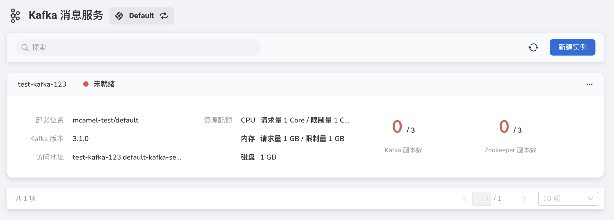
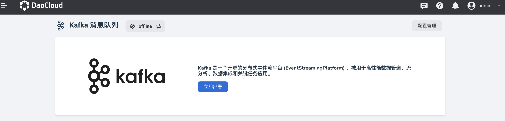
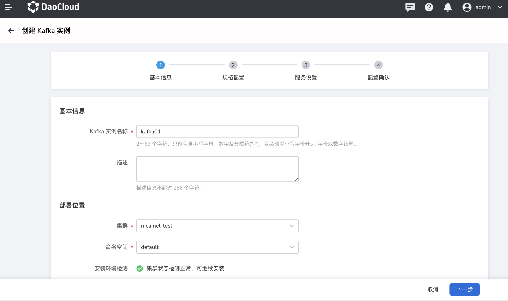
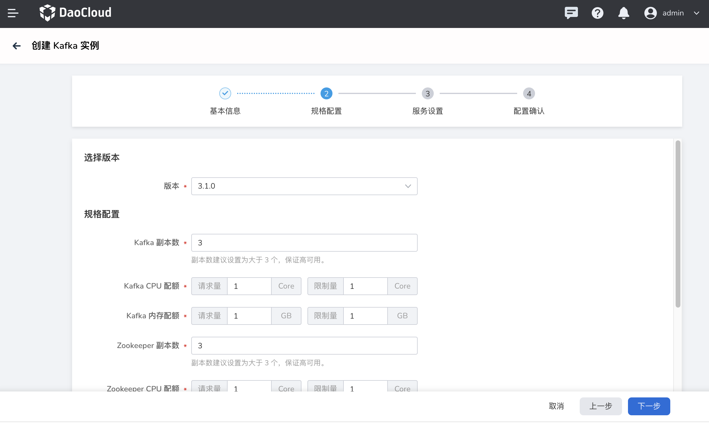
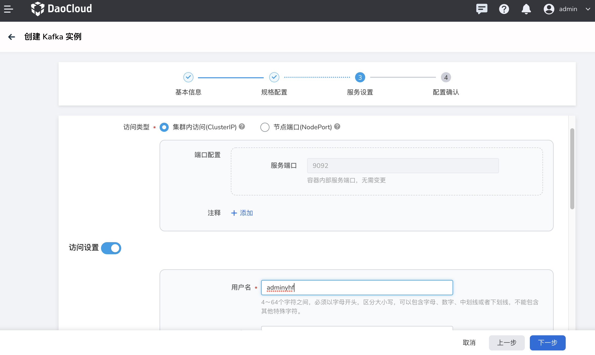
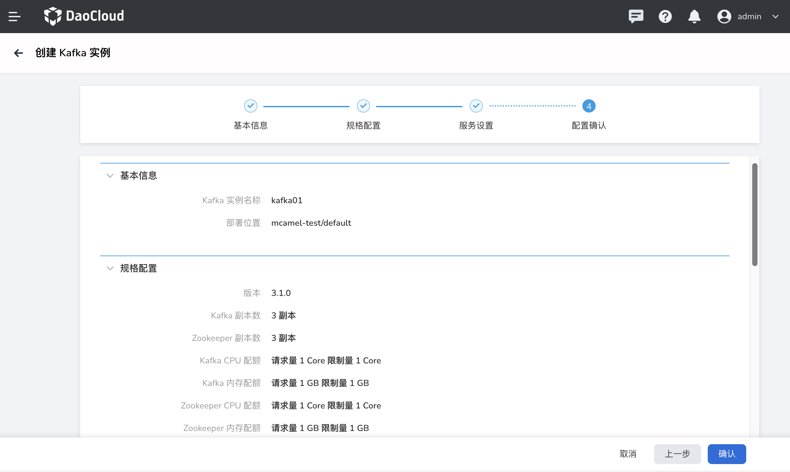
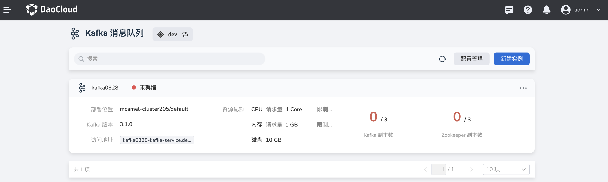

---
hide:
  - toc
---

# 创建 Kafka

在 Kafka 消息队列中，执行以下操作创建 Kafka 实例。

1. 在 Kafka 消息队列页面，点击右上角的 __新建实例__ 按钮。

    

    !!! tip

        初次部署时，可以点击 **立即部署** 。

        

2. 在 __创建 Kafka 实例__ 页面中，设置基本信息后，点击 __下一步__ 。

    

3. 配置规格后，点击 __下一步__ 。

    - 版本：Kafka 的版本号，当前仅支持 Kafka 3.1.0。
    - 副本数：支持 1、3、5、7 副本数。
    - 资源配额：根据实际情况选择规则。
    - 存储卷：选择 Kafka 实例的存储卷和储存空间总量。

    

4. 服务设置后，点击 __下一步__ 。

    - 服务设置：
        - 集群内访问（ClusterIP）
        - 节点端口（Nodeport）
        - 负载均衡（LoadBalancer）
    - 访问设置：
        - 访问账户配置：连接 Kafka 实例的用户名、密码
        - CMAK 资源配置：副本数、CPU 和内存配额
        - 访问类型配置：节点端口（Nodeport）、负载均衡（LoadBalancer）
    - 高级设置：按需配置

    

5. 确认实例配置信息无误，点击 __确定__ 完成创建。

    

6. 在实例列表页查看实例是否创建成功。刚创建的实例状态为 __未就绪__ ，等几分钟后该状态变为 __运行中__ 。

    

!!! note

    另外 DCE 5.0 的 Kafka 提供了参数模板来简化实例的创建。
    您可以使用这些预设的[参数模板](./template.md)来创建实例。
