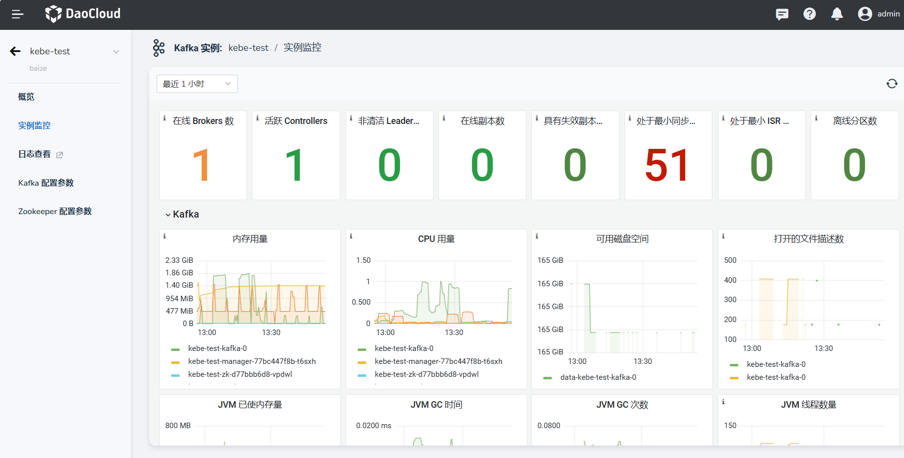

---
hide:
  - toc
---

# 实例监控与日志查看

本节说明如何进行 Kafka 实例监控并查看日志。

## 实例监控

Kafka 内置了 Prometheus 和 Grafana 监控模块。

1. 在消息队列页面，点击某个实例名称进入到实例详情页面。

    

2. 在左侧导航栏，点击 __实例监控__ ，可以接入监控模块。

    

<!-- 各项监控指标的具体含义稍后补充 (@justedennnnn)。 -->

## 日志查看

通过访问每个 Kakfa 的实例详情页面，可以查看 Kakfa 的日志。

1. 在消息队列页面，选择想要查看的实例，点击名称进入到实例详情页面。

2. 在左侧导航栏，点击 __日志查看__ 即可进入到日志查看页面（[Insight](../../../insight/intro/index.md) 日志查看）。

### 日志查看说明

在日志查看页面，我们可以很方便的进行日志查看，常用操作说明如下：

* 支持 自定义日志时间范围，在日志页面右上角，可以方便地切换查看日志的时间范围（可查看的日志范围以 可观测系统设置内保存的日志时长为准）
* 支持 关键字检索日志，左侧检索区域支持查看更多的日志信息
* 支持 日志量分布查看，中上区域柱状图，可以查看在时间范围内的日志数量分布
* 支持 查看日志的上下文，点击右侧 __上下文__ 图标即可
* 支持 导出日志

